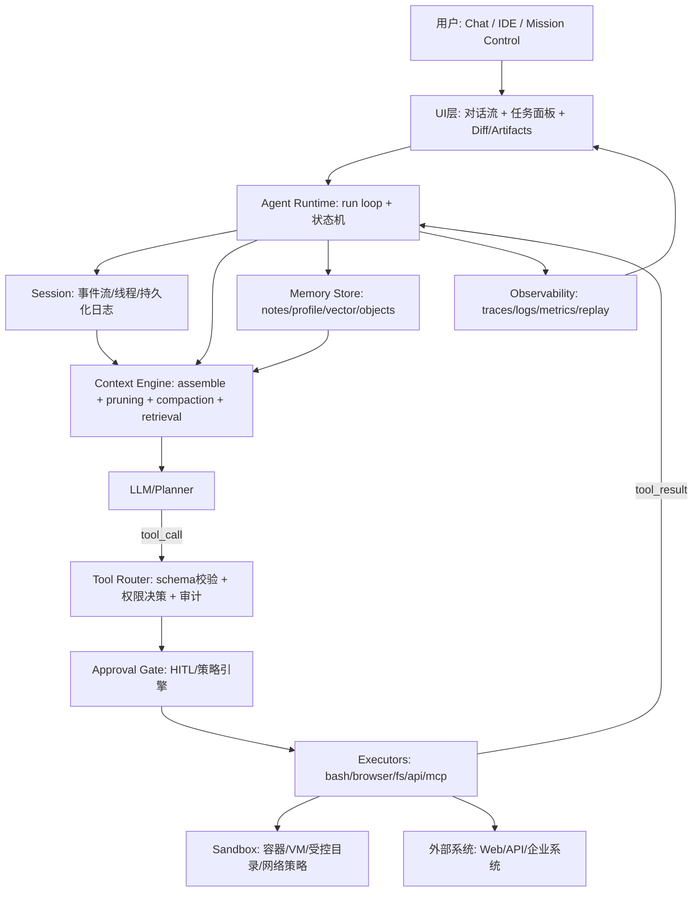
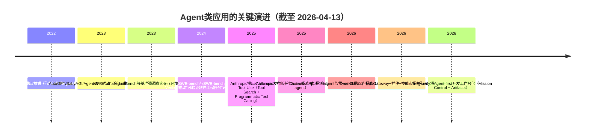

# 最近Agent类App深度研究报告

## 执行摘要

本报告面向具备工程与产品背景的技术决策者，基于截至2026-04-13的公开资料，对 OpenClaw、Claude、Codex、Google Antigravity 等Agent类应用及 AutoGPT/BabyAGI/AgentGPT/ReAct范式进行对比解构。结论是：成功不只取决于模型更强，而是“Agent Runtime + Harness工程 + 工具调用与沙箱 + 记忆与成本控制 + 安全治理 + 可视化交互”的系统化产品工程。关键趋势包括：工具调用由逐次tool-loop演进到Programmatic Tool Calling（在受控代码执行环境内编排工具）；上下文工程从“加长窗口”转向pruning/compaction/检索记忆与prompt caching；UI从聊天流进化为任务控制中心+Artifacts/Diff证据链+人在回路审批与纠错。下文给出可落地实现要点、对比表、架构与演进图、接口伪代码及可执行建议。

## 详细分析（技术细节与交互设计）

### 方法论（范围与资料优先级）

研究范围覆盖：OpenClaw、Claude（含Tool Use/Computer Use/Code Execution/PTC/Managed Agents）、Codex（含Codex CLI/桌面App/长任务Agent Loop/Agents SDK/Prompt Caching/MCP）、Google Antigravity（Mission Control/Artifacts/跨Editor-Terminal-Browser执行）；并以 AutoGPT、BabyAGI、AgentGPT、ReAct 作为“开源编排器/早期自治范式/提示框架”对照。主要事实来源优先级为：官方文档与工程博客 > 官方开源仓库/系统卡/白皮书 > 经过同行广泛引用的论文与基准 > 权威媒体与安全厂商披露（用于安全风险与生态事件）。对闭源模型训练细节仅使用官方公开信息，对未公开部分显式标注“未公开/未明确”。（补充：用户上传材料用于对照其观点，但其中市场份额/指标等未在官方公开资料中核验，不作为事实依据。）fileciteturn0file0

### 一、从“模型”到“可执行系统”的分层：Agent Runtime 与 Harness 的核心边界

将LLM变成“能长期做事”的Agent系统，几乎都趋同为一组稳定组件边界：  
**Session（事件与状态的源）、Context Engine（上下文预算管理）、Tool Router（schema校验+权限+审计）、Sandbox/Executors（副作用隔离）、Memory（短期/长期/检索/摘要）、Observability（可视化与回放）**。这套边界在 OpenClaw 的Gateway/Session/Agent Loop 体系中被明确写入文档（例如Gateway作为控制面：WebSocket/HTTP、会话管理与路由、鉴权授权、事件广播等）。citeturn0search16turn4search8turn4search21

**Agent Runtime**（运行时）可理解为：在每次“推理—行动—观察”循环外，维持可重复、可恢复、可审计的执行框架。OpenClaw 明确采取“单一长驻Gateway进程”作为控制面，并通过命令队列将高风险的并发入口串行化，以降低会话文件/日志/工具副作用的竞争条件。citeturn0search16turn4search8

**Harness Engineering**（驾驭工程/脚手架工程）则是在运行时之上，把“工程团队的好习惯”编码进流程约束与提示模板：例如 entity["company","Anthropic","ai company"] 给出的长任务harness把第一窗（Initializer）与后续窗（Coding agent）的目标拆分，要求产出 init.sh、进度文件、初始git提交，并在每窗留下结构化增量与可接续工件，显式对抗跨上下文失忆与半成品倾向。citeturn5search0 同时，OpenAI 的建设指南把“run loop（循环直到退出条件）”作为所有编排方式的共同抽象，并强调守护栏（guardrails）与工具设计是生产级Agent的必要条件。citeturn2search10turn6search2

**成功要因（抽象层面）**：领先产品几乎都把“智能”从模型迁移到系统边界治理——把不可预测输出变成可验证的状态机、可审计的事件流与可回滚的工件链，而不是仅追求更长的单次prompt。citeturn5search1turn2search10turn4search0

### 二、模型架构与训练数据/方法（公开范围内）

由于Claude与Codex相关模型属于闭源体系，训练数据构成与具体训练配方（RLHF/RLAIF、工具对齐数据形态、合成数据比例等）在本报告能引用的公开层面仍较有限，需以“系统卡/官方说明”与“可观察到的接口行为”替代内部训练细节。

Codex方面，官方将 Codex-tuned 模型在API中标注为 `gpt-5.3-codex`，并给出面向其“代理式编码”能力的提示工程指南，强调它面向长任务、工具使用、复杂执行等场景，并提供迁移与基线prompt建议。citeturn0search2turn7search6 Codex长期一致性被官方解释为“运行在正确的agent loop里”，而非仅靠一次性大prompt。citeturn6search2

Claude方面，训练细节同样未在此范围内披露到可复述程度，但Anthropic公开了对“Advanced Tool Use”的工程化能力扩展：包括Programmatic Tool Calling（PTC）与Tool Search Tool，用以解决工具定义膨胀与中间结果污染上下文的问题，属于“对齐到工具生态”的关键系统能力。citeturn0search1turn9search13turn9search2

OpenClaw与Antigravity更接近“Agent应用/平台”，通常模型可替换、可路由：其竞争优势更多来自运行时/工具/安全/交互层，而非主张自研某个单一模型训练配方。OpenClaw官方定位为自托管Gateway连接多渠道与“agent-native”能力（session、memory、multi-agent routing等），并声明为MIT开源。citeturn9search7turn8search0turn8search17

**落地建议（模型层面）**：对技术决策者而言，2026阶段更现实的路线是“模型选择+系统边界治理”的组合优化：将一线模型用于关键推理与汇总，将更小/更快模型用于规划草案、信息抽取、工具参数填充与回归验证（在run loop内做budgeted routing），并通过评测闭环决定每个阶段的模型规格。citeturn2search10turn6search0

### 三、推理与部署架构：从本地Daemon到托管“Session/Harness/Sandbox解耦”

#### OpenClaw：本地/自托管控制面 + 插件化工具生态

OpenClaw的核心架构点有三条：  
其一，Gateway为控制面，默认运行在 `ws://127.0.0.1:18789`，承担会话管理、路由、鉴权授权、事件广播等职责。citeturn0search16turn8search3  
其二，消息投递层强调可靠性：包括重试策略（对429/暂时不可用等进行退避重试）与命令队列（序列化自动回复运行以避免冲突）。citeturn4search4turn4search8  
其三，Agent Loop被设计成可插拔/可观测：提供生命周期hooks（例如 before_tool_call/after_tool_call、tool_result_persist、session_start/end等）为审计、脱敏、错误恢复、工具参数守护提供扩展点。citeturn4search1

插件/工具/环境集成方面，OpenClaw提供“Plugins扩展能力”（新增渠道、模型提供方、工具、技能、语音/转录、多模态理解等），并且支持“Bundle”方式从外部生态导入内容包，将其映射到OpenClaw原生能力（skills/hooks/MCP tools），同时强调bundle较“原生插件”拥有更窄的信任边界。citeturn9search15turn9search4

#### Claude：工具调用由“你执行”到“平台托管Harness”的两条路径

Claude API的Computer Use把“视觉观察—动作指令”标准化为工具调用：模型输出鼠标/键盘/截图等动作请求，由集成方在隔离环境中执行并把新截图回传；并明确该能力在满足条件时可支持ZDR（zero data retention）安排。citeturn5search2turn5search6

在更“系统化托管”方向上，Claude Managed Agents提供预构建、可配置的agent harness，面向长时与异步任务；其官方工程文章强调将session log、harness与sandbox解耦的基础设施哲学，以便组件可独立扩缩/重启/替换。citeturn5search8turn5search1

#### Codex：开源CLI + 专用Agent界面 + 富客户端App Server接口

Codex CLI官方开源于GitHub，提供 `npm i -g @openai/codex` 或 `brew install --cask codex` 的安装路径，并明确它是“在终端运行的 coding agent”。citeturn7search0turn7search16 Codex桌面App被官方定义为“command center for agents”，强调多Agent并行、按project组织线程、在thread内审阅diff并评论，支持长任务协作与监督。citeturn7search1

为支持更深度产品内嵌，Codex提供“app-server”作为富客户端接口（鉴权、会话历史、审批与流式事件），并声明其实现位于开源仓库路径中。citeturn9search19

#### Antigravity：Agent-first开发工作台（Mission Control + Artifacts）

Google Antigravity在官方博客中强调其不是“仅编辑器”，而是结合熟悉的编码体验与“agent-first interface”，支持agent跨editor、terminal、browser自主计划、执行、验证复杂任务。citeturn0search7 官方codelab同样将其定位为“Mission Control”管理自主agent，可计划、编码、浏览网页并迭代。citeturn0search3turn0search31

**成功要因（部署形态）**：四者共同点是把“长时任务”当作一等公民：要么通过自托管daemon保证常驻（OpenClaw），要么通过托管harness保证可扩缩与异步（Claude Managed Agents），要么通过专用界面+开源执行面降低集成成本（Codex），要么通过工作台化UI把编排与证据链显性化（Antigravity）。citeturn0search7turn5search8turn7search1turn0search16

### 四、Agent Runtime关键机制：工具调用、外部执行、子Agent、记忆与成本

#### 工具调用（Tool Use）：经典tool-loop vs Programmatic Tool Calling（PTC）

经典tool-loop与ReAct范式一致：LLM输出“Thought/Action”，应用执行工具并返回Observation，如此循环直到完成。ReAct论文提出“推理与行动交错生成”可提升交互任务的鲁棒性，并成为后续多数Agent loop的理论原型。citeturn1search0

PTC则是2025-2026最关键的系统升级之一：Claude文档将其定义为“模型在代码执行容器内写Python编排工具调用”，将中间结果留在代码侧处理，从而减少多次模型往返与上下文污染，并降低token与延迟成本。citeturn0search5turn9search13 Anthropic工程文也量化描述了“工具定义膨胀”的成本（例如多MCP工具导致数万token被工具schema占用），并给出Tool Search Tool（按需检索工具定义）与PTC的组合解法。citeturn9search2turn0search1

**可落地要点：PTC的接口与权限模型**  
PTC并不是“在沙箱里任意执行任意工具”：官方强调需显式将工具标记为可被代码执行调用（例如allowed_callers/opt-in），并且PTC依赖code execution启用。citeturn0search1turn9search13 同时，PTC不具备ZDR资格（按其标准保留策略），因此对隐私敏感场景要谨慎选择“工具编排在代码侧”或“经典tool-loop在你自托管环境执行”。citeturn9search13turn5search6

#### 外部代码执行与沙箱：副作用隔离、网络策略与数据保留

Claude的code execution工具明确说明其在服务端沙箱容器运行，并披露容器内执行产物/上传文件/输出可保留最长30天（且Files API文件需显式删除才会消失），这对企业合规与数据生命周期管理是硬约束。citeturn5search29 与之相对，Computer Use在满足ZDR安排时可在响应后不做持久化存储，这更适合“屏幕交互但不希望平台侧保留工件”的场景。citeturn5search2turn5search6

Codex安全资料强调其早期在云端执行环境中默认“网络禁用的沙箱任务执行”，并指出随后提供“由用户选择的网络访问级别（allowlist或全网）”以满足依赖安装等需求——这反映出主流厂商对“联网=供应链风险+提示注入风险”的共识。citeturn7search10turn7search6

OpenClaw在安全文档中将MCP定义为“tool provider interface”，并在威胁模型中把prompt injection、skill、SSRF等作为典型风险术语，说明其将“工具生态=攻击面”当作一等安全对象来建模。citeturn9search3turn9search14

**可落地建议：Sandbox限权策略（可直接落地）**  
在多数组织中，建议把沙箱策略拆成三层并默认最小权限：  
1) **文件系统**：只挂载工作目录；敏感目录（~/.ssh、~/.aws、密钥库、浏览器profile）默认只读或不挂载；  
2) **网络**：默认无外网；按任务临时启用并优先使用域名allowlist；对包管理站点使用镜像与hash锁定；  
3) **命令执行**：基于allowlist的“高风险命令拦截”（curl|bash、chmod 777、rm -rf /、ssh/scp等），遇到高风险命令转入人工审批（HITL）。上述三层的设计动机与风险在Codex的网络策略说明与OpenClaw/Claude的威胁建模语境中都有直接对应。citeturn7search10turn9search3turn5search29

#### 子Agent/子任务编排：并行化吞吐与上下文隔离

多Agent并发的价值主要有两点：并行提升吞吐；隔离上下文减少主agent“注意力稀释”。OpenClaw将Sub-agents定义为“从现有run派生的后台agent runs”，每个sub-agent在独立session中运行，完成后向请求方通道回报，并作为后台任务跟踪。citeturn3search23turn3search3

Codex桌面App则从交互层把“多agent并行”产品化：在不同threads中运行多个agents并允许在thread内审核diff与评论，属于“监督多agent”的典型UI范式。citeturn7search1 Anthropic的长任务harness以Initializer与Coding agent的分工实现“跨context window的多阶段代理协作”，虽然不一定表现为并行，但同样属于“子agent分工”的工程化落地。citeturn5search0turn5search1

Antigravity官方材料虽不一定使用“subagent”术语，但其Mission Control将代理作为自主执行单元，可跨editor/terminal/browser执行并输出Artifacts，天然支持将浏览/执行/验证分离为不同工作单元。citeturn0search7turn0search3

**可落地建议：子Agent编排的“成本与风险预算”**  
在工程实现上，建议把子agent fan-out变成显式预算：  
- 并行数上限（per user/per project/per org）；  
- 每个sub-agent的token上限、wall time上限、工具调用次数上限；  
- “汇总回传协议”：子agent只回传结构化摘要与可验证证据（例如文件路径、diff、测试结果），避免把大量中间日志注入主上下文。OpenClaw对sub-agent作为后台任务管理与Codex的thread化监督界面已提供产品侧形态参照。citeturn3search23turn7search1

#### 记忆管理：短期/长期、compaction/pruning、以及“上下文预算工程”

短期记忆的主战场是“是否把全部历史塞进prompt”。OpenAI Agents SDK把Session作为一等对象，提供内建session memory，并在cookbook中明确提出两类短期上下文管理：trimming与compression，以保持速度、可靠性与成本。citeturn6search0turn6search8

OpenClaw将compaction与pruning明确区分：  
- **Compaction**：对旧对话做摘要并写入session transcript（持久、不可逆、影响后续所见）；  
- **Session pruning**：仅在每次请求前裁剪旧工具输出（内存态、非破坏性）。citeturn4search7turn4search0 OpenClaw的Session Management Deep Dive还暴露了可调参数（例如`reserveTokens`、`keepRecentTokens`）、工具配对边界、可插拔的compaction provider、以及“预压缩 memory flush”等工程钩子，这些都是可直接落地的上下文预算控制点。citeturn4search0

Anthropic的长任务harness把“记忆”外置为工程工件：init.sh、claude-progress.txt与git历史承担跨session记忆载体，避免把所有上下文压在窗口内。citeturn5search0

**可落地建议：Compaction触发策略（实操可用）**  
建议采用“两阈值+一预留”策略：  
- 软阈值：当`tracked_tokens / context_window` > 0.70 触发“工具结果裁剪 + 结构化摘要（仅工具层）”；  
- 硬阈值：当 > 0.85 触发compaction，但强制保留`reserveTokens`（如10–20%窗口）给当前任务与验证；  
- 预留区（Reserve）：永远保留“最近N轮原文+最后一次失败的证据（error logs）+当前计划/验收标准”。这与OpenClaw文档对reserveTokens/keepRecentTokens的配置项与“compaction过于频繁时启用pruning”的建议一致。citeturn4search7turn4search0

#### 可扩展性与成本优化：prompt caching、工具按需加载、KV复用的系统设计

成本优化不再是“换小模型”这么简单，而是围绕“上下文与推理开销”做系统工程：  
- OpenAI明确给出Prompt Caching的概念与优化策略，强调通过复用前缀计算降低延迟与成本，并要求对缓存命中进行度量与监控。citeturn0search6  
- Anthropic的Advanced Tool Use给出“工具定义膨胀→上下文被schema吃光”的量化案例，并用Tool Search Tool实现按需加载，把大量工具的token占用从“每轮必付”变成“用到才付”。citeturn9search2turn0search1  
- PTC把“多次模型往返+中间结果进context”改为“代码侧并行/循环/过滤”，进一步把token浪费从根因上消解。citeturn9search13turn5search29

**可落地建议：Prompt Cache Key设计思路（适配OpenAI类缓存）**  
为提升缓存命中，应把请求拆成“稳定前缀+动态后缀”：  
- 稳定前缀建议包含：系统指令、工具schema、输出契约（structured outputs）、安全策略；  
- 动态后缀包含：用户输入、本轮工具结果摘要、最新状态；  
- 以“会话/线程ID”作为cache-key的稳定锚点，而不是对messages全量hash（否则每轮都会变）。这与Codex生态对会话标识与配置共享（例如CLI/IDE共享config）以及Prompt Caching“前缀复用”的工程要求一致。citeturn0search6turn9search1turn9search12

#### 安全与隐私：权限、审计、供应链与“上下文可见性控制”

OpenClaw的安全配置把“谁能触发agent”与“注入到上下文的补充信息”分开：allowlists/mention gate等用于触发授权，`contextVisibility`用于控制引用回复、线程历史、转发元数据等是否进入prompt，从而在产品层减少prompt injection攻击面。citeturn9search14turn4search21 同时其威胁模型以MITRE ATLAS为框架，明确把prompt injection、tool misuse、SSRF等纳入威胁建模词表。citeturn9search22turn9search3

供应链方面，OpenClaw与 entity["company","VirusTotal","malware scanning service"] 的合作把“技能市场=新型攻击面”制度化治理：技能发布会进行确定性打包、SHA-256指纹、VirusTotal查询/上传扫描、Code Insight安全摘要、自动批准/警示/阻断，并进行每日复扫；OpenClaw官方博客对该流程逐步列出。citeturn4search3 同期，VirusTotal自家博客也披露“检测到大量恶意OpenClaw skills”并将其视为新的供应链攻击通道，说明生态风险已从理论走向现实。citeturn4search6

Claude侧的隐私/保留策略需要精细区分：Computer Use可在ZDR安排下不做响应后存储；但Code Execution容器与PTC属于保留策略不同的能力，且PTC明确“不符合ZDR”。citeturn5search2turn5search29turn9search13 Codex侧则在安全资料中强调其云端执行环境早期默认断网，并为“联网安装依赖”提供可控的allowlist/全网开关，体现了对工具使用与供应链风险的谨慎部署。citeturn7search10turn7search6

**可落地建议：审计日志字段（建议直接纳入事件模型）**  
建议审计日志最少包含：`run_id`、`session_id/thread_id`、`actor`（user/agent/subagent/tool）、`tool_name`、`tool_schema_version`、`params_hash`（避免明文泄漏）、`approval_mode`与`approval_decision`、`sandbox_id`、`network_policy`（deny/allowlist/all）、`file_mounts`、`stdout/stderr_digest`、`cost`（tokens/exec_seconds）、`retries`、`error_class`、`recovery_action`。Codex的“app-server提供审批与流式事件接口”与OpenClaw的“Agent Loop hooks可在tool_result_persist前同步变换结果”是实现此类审计字段落盘的关键扩展点。citeturn9search19turn4search1

#### 评估指标与基准：从“模型分数”转向“端到端任务成功率+干预成本”

Agent评估的核心变化是：需要在交互环境里测“完成任务”而非“回答得像”。典型基准包括：  
- **WebArena**：真实可复现的网站环境，强调端到端任务完成率；论文显示即使顶级模型代理在复杂web任务上成功率也显著低于人类，暴露出长链路脆弱性。citeturn1search1turn1search17  
- **AgentBench**：多环境多维度评估LLM-as-Agent，强调多轮开放式交互与决策失误类型分析。citeturn1search2turn1search10  
- **GAIA**：面向通用助理，强调推理、多模态、浏览与tool-use能力差距。citeturn1search3turn1search11  
- **SWE-bench Verified**：对软件工程任务做人工筛选与验证，强调“可解、描述清晰、测试补丁正确”的可靠评测子集。citeturn2search0turn2search31turn2search1  
- **Terminal-Bench 2.0**：面向终端环境的高难任务集，强调“真实CLI工作流+可验证测试”。citeturn2search2turn2search6

**建议的产品级指标体系（可直接用于仪表盘）**：  
1) 端到端任务成功率（按任务类型分桶：检索/编码/浏览/操作系统）；  
2) 平均人工干预次数（approval次数、纠偏次数、重试次数）；  
3) 运行成本（tokens、工具执行秒数、沙箱资源、外网请求次数）；  
4) 失败模式分布（工具循环、上下文溢出、权限拒绝、环境不一致）；  
5) 可解释性证据覆盖率（Artifacts/Diff/截图/测试报告齐全率）。上述指标与WebArena/Terminal-Bench/SWE-bench的“可验证完成”思想一致，也与Codex/Antigravity的“任务监督与证据链UI”方向互相强化。citeturn1search1turn2search0turn7search1turn0search7

### 五、交互设计：多轮策略、状态可视化、容错与多模态体验

#### 多轮对话策略：从“多说”到“少而可执行”

Codex官方把其长任务循环总结为“Plan→Edit→Run tools→Observe→Repair→Update docs/status→Repeat”，本质是把对话变为结构化迭代协议，并把验证环节（tests/build/lint）内置成循环的一部分。citeturn6search2 Anthropic的Initializer/Coding agent分工亦是将第一轮对话转成“初始化工件+建立记忆锚点”，后续对话只做增量交付。citeturn5search0

OpenClaw则通过“slash commands与会话工具”把控制意图从自然语言中剥离，提供可预期的运维入口（例如列出实际可达工具、跨会话编排与sub-agent管理），减少“提示注入/误解命令”的模糊空间。citeturn9search30turn3search3turn3search23

#### UI/UX关键流程：任务控制中心 + 证据链审阅

Codex桌面App强调“多agent并行与监督”：按project组织threads、在thread内审阅agent修改并评论、必要时在编辑器中手动改动，属于“指挥多agent”而非“和一个bot聊天”。citeturn7search1 Antigravity则把“agent-first interface”与编辑器/终端/浏览器整合，并通过Mission Control管理自主agents及其计划、执行与验证，属于“开发工作台化”的路径。citeturn0search7turn0search3

#### 状态可视化与可解释性：从日志到Artifacts/Events

生产化Agent最危险的不是“错一次”，而是“错了你看不出来”。因此领先产品普遍把“状态与事件”显性化：  
- Codex提供可监督的threads与diff审阅点，将结果聚焦在“改了什么”。citeturn7search1  
- Antigravity强调跨执行面（editor/terminal/browser）的自主工作与可交付物（Artifacts）承载验证。citeturn0search7  
- OpenClaw在Agent Loop层提供hooks与消息流/队列/重试策略文档，使“为什么这么做、失败后如何恢复”可以被系统化观测与治理。citeturn4search1turn4search8turn4search4

**可落地建议：状态面板关键指标（建议默认提供）**  
- Run视角：`run_state`（planning/executing/waiting_approval/blocked/complete）、`current_step`、`tool_calls_in_window`、`retry_count`、`last_error`；  
- Session视角：`tracked_tokens`、`pruning_bytes_saved`、`compaction_count`、`reserve_tokens`、`cache_hit`；  
- Sandbox视角：`cpu_seconds`、`wall_time`、`net_policy`、`domain_hits`、`file_writes`；  
- 安全视角：`blocked_tools`、`denied_by_policy`、`suspicious_skill_flags`、`prompt_injection_signals`（例如来自外部网页/邮件的指令片段是否进入上下文）。这些指标与OpenClaw的session/compaction可配置与安全可见性模型，以及Codex/Claude的审批与事件接口方向一致。citeturn4search0turn9search14turn9search19

#### 错误恢复、容错与用户干预：把失败变成“可预测的流程”

OpenClaw在消息与重试层提供明确的失败降级策略（例如Telegram Markdown解析错误不重试并回退纯文本），以及队列串行化避免并发破坏状态。citeturn4search4turn4search8 Claude通过把Computer Use的执行层留在集成方，要求你在应用侧实现“审批/回滚/重放/隔离”，这在安全敏感场景是优势但也增加工程负担；其Managed Agents则通过托管harness降低长期维护成本。citeturn5search2turn5search8turn5search1 Codex通过监督型UI与可配置的MCP工具审批，把“代理想做的事”转为“你可以批准的动作”。citeturn9search12turn7search1

#### 多模态输入输出体验：屏幕、终端与证据融合

Computer Use将多模态的核心闭环定义得非常清晰：截图（观察）+鼠标键盘动作（执行）+新截图（验证），其文档明确该能力的隐私与保留边界，并给出工具定义参考实现代码。citeturn5search2turn5search15 Antigravity将“浏览器+终端+编辑器”的组合当作默认执行面，强化“可验证执行”而非仅文本回答。citeturn0search7turn0search3 OpenClaw通过插件扩展语音、实时转录、媒体理解等能力，并在浏览器工具中区分agent-only profile与可通过Chrome MCP接入的用户profile，体现“多模态能力必须绑定隔离与权限边界”的工程思路。citeturn9search15turn9search11

## 对比表格（含来源注释）

> 说明：表中“技术栈/实现细节”若官方未披露则标注“未公开/未明确”；“主要来源”列给出每行核心依据（官方/论文/仓库）。部分产品包含多个表面（CLI/桌面/云端），此处以官方最强调的“agent化能力形态”为主。

| 对象 | 功能/定位 | 运行与架构（runtime/harness） | 工具调用与外部执行（tool-loop/PTC/sandbox） | 交互与UI（可视化/干预/多模态） | 优势 | 局限/风险 | 适用场景 | 商业模式 | 开源/闭源 | 主要依赖技术栈（公开） | 主要来源 |
|---|---|---|---|---|---|---|---|---|---|---|---|
| OpenClaw | 自托管个人/团队Agent网关：连接聊天通道与agent能力（sessions/memory/multi-agent routing） | 单一Gateway控制面（WebSocket/HTTP），会话管理与事件广播；命令队列串行化；Agent Loop hooks可扩展（before/after tool等） | 以工具/插件/技能扩展；sub-agent后台任务在独立session运行并回报；强调MCP与威胁建模；技能供应链扫描（VirusTotal） | 多通道对话+slash命令与会话工具；可列出可达工具；子任务可跟踪；浏览器工具区分agent-only profile与用户profile（Chrome MCP） | 自托管与可扩展强；生态与渠道整合；安全供应链治理走在前面 | 技能生态成为供应链攻击面；需要严密权限/隔离；外部暴露与误配存在风险 | 个人自动化、跨渠道助理、团队值守、可控自部署的agent平台 | BYOK（模型与凭证自带），项目MIT开源 | 开源（MIT） | TypeScript（仓库语言）、插件生态、WebSocket控制面 | citeturn9search7turn0search16turn4search8turn3search23turn4search3turn8search17turn9search3turn9search11 |
| Claude（含Tool Use/Computer Use/PTC/Managed Agents） | LLM平台能力：工具使用、计算机控制、代码执行、托管长任务harness | 长任务harness：Initializer/Coding agent分工；Managed Agents将session/harness/sandbox解耦并托管运行 | Computer Use：你执行动作回传截图；Code Execution：服务端沙箱容器（有保留策略）；PTC：代码侧编排工具调用（需opt-in，可降token/延迟但不符合ZDR） | 多模态屏幕操作闭环；托管Agents面向异步长任务；数据保留/ZDR边界明确 | 高质量harness方法论与平台化能力；PTC与工具按需加载解决“工具膨胀” | PTC/Code Exec有保留策略约束；集成方需自建审批/隔离；生态越大工具治理越难 | 长时研发/运营自动化、需要屏幕操作的流程、追求平台托管的企业场景 | 闭源服务（按量计费/平台能力）；托管Agents作为产品 | 闭源（API/平台），示例代码开源 | 未明确（官方重点披露接口与保留/合规边界） | citeturn5search2turn5search29turn9search13turn5search0turn5search8turn5search1turn0search1turn9search2turn5search6 |
| Codex（含CLI/桌面App/Agents能力） | 面向软件开发的代理：终端agent + 多agent监督界面 | 官方开源Codex CLI；桌面App“command center for agents”按项目/线程组织；app-server提供富客户端集成（鉴权/审批/事件） | 长任务loop（Plan/Edit/Run tools/Observe/Repair/Update）；MCP连接第三方工具与上下文；云端执行环境强调可控网络策略与沙箱 | 线程化监督+diff审阅+评论；多agent并行；TUI与配置共享（CLI/IDE） | 从执行面到UI监督面完整；MCP与审批机制利于企业集成；开源组件降低集成门槛 | 模型与云端能力闭源；联网与工具权限需要严格治理；多agent下成本与冲突治理复杂 | 代码重构/修复/测试驱动迭代、CI失败修复、工程任务并行 | 桌面App/服务闭源；CLI开源；可用ChatGPT计划或API key | 混合：CLI与部分组件开源，模型/平台闭源 | Rust实现的CLI（官方说明）；配置文件config.toml；MCP | citeturn7search0turn7search16turn7search1turn6search2turn9search1turn9search12turn9search19turn7search10turn7search6 |
| Google Antigravity | Agent-first开发平台：Mission Control管理自主agent跨editor/terminal/browser执行并验证 | 强调“agent-first interface + 熟悉编辑体验”；任务可规划、执行、验证；工作台化（Mission Control） | 工具面围绕终端与浏览器执行；（具体tool schema/沙箱细节官方公开较少，未明确） | 强调跨执行面与Artifacts作为信任层（官方表述为平台而非仅编辑器） | 将编排与结果证据工作台化；降低长任务黑箱感 | 具体安全/隔离/保留策略公开信息有限（需以实际产品条款为准） | 从调研到编码再到验证的全流程开发任务 | 官方材料未给出统一定价（凭当期政策）；企业落地通常按平台模式 | 闭源（平台/IDE） | 未公开/未明确 | citeturn0search7turn0search3turn0search31 |
| AutoGPT（对照） | 早期自治代理与平台化尝试：Classic agent + Forge构建工具 + agbenchmark评测 | 以“自治loop + 工具链”驱动；包含平台化与benchmark子项目 | 依赖外部LLM API与工具集成；工程治理与安全强依赖集成方实现 | 多为Web/GUI与开发者配置驱动（形态随版本演进） | 开源生态与可改造性强；推动“agent平台化/benchmark”讨论 | 生产治理（权限/审计/隔离）需自建；项目复杂度高 | 原型验证、开源可扩展agent平台研究 | 开源为主（仓库含不同子目录许可说明） | 开源（仓库说明） | 未在此处细分（以仓库为准） | citeturn3search0turn3search4 |
| BabyAGI（对照） | 任务驱动自治代理思想原型（创建/执行/优先级循环） | 简化loop用于讨论与启发；仓库注明不面向生产（已归档迁移） | 通常结合LLM与向量记忆（实现随社区衍生而变） | 以脚本/最小实现为主，无统一产品UI | 概念影响广，任务分解/优先级循环成为通用模版 | 非生产级，缺少治理与隔离；仓库已归档 | 学习/研究/快速原型 | 无统一商业模式 | 开源（仓库） | 未明确（以仓库实现为准） | citeturn3search1turn3search5 |
| AgentGPT（对照） | 浏览器端“配置并运行自治代理”的早期产品形态 | 以目标驱动自治loop为核心；提供自建部署脚手架 | 依赖外部LLM与若干工具（如搜索/生成等，随版本演进） | 浏览器端体验为卖点；提供一键搭建（CLI） | 上手门槛低、可展示性强 | 生产能力与治理有限；项目维护状态需关注（未在本表做完整版本审计） | Demo/教育/轻量自动化原型 | 无统一商业模式（开源/自托管为主） | 开源（仓库） | Next.js + FastAPI + MySQL等（仓库说明） | citeturn3search2turn3search10 |
| ReAct范式（对照） | 提示与系统范式：推理与行动交错生成，支撑多数tool-loop | 抽象为Reason→Act→Observe循环，可落实为run loop与状态机 | 工具执行由系统侧实现；可与任意sandbox/权限系统结合 | 不是产品UI，但影响“可解释性与纠错”设计（Reason traces + actions） | 成为多数Agent系统的思维-行动骨架 | 仅是范式，生产落地仍依赖运行时治理与工具工程 | 作为Agent loop的底层模式与提示模板 | 无 | 论文/开源示例为主 | 不适用 | citeturn1search0turn1search8turn1search12 |

## Mermaid系统架构示意图与演进时间线





## 关键接口/伪代码示例

以下伪代码以“可直接落地”为目标，展示工具调用、PTC、子agent编排、记忆管理、循环检测、错误恢复与人工干预的核心结构（代码块内不含外部引用）。

```python
# 1) 经典 tool-loop（ReAct / function calling 风格）
def run_agent_loop(session, context_engine, llm, tool_router, max_turns=40):
    for turn in range(max_turns):
        prompt = context_engine.build_prompt(session)
        msg = llm.generate(prompt, tools=tool_router.exposed_schemas())

        if msg.type == "final":
            session.append_assistant(msg.text)
            return {"status": "done", "output": msg.text}

        # tool call
        call = tool_router.validate_schema(msg.tool_call)   # JSON Schema / types
        decision = tool_router.policy_decide(call)          # allow/deny/approve

        if decision == "deny":
            session.append_event({"type": "tool_denied", "tool": call.name})
            return {"status": "blocked", "reason": "policy_denied"}

        if decision == "needs_approval":
            session.append_event({"type": "approval_requested", "call": call})
            return {"status": "waiting_approval", "call": call}

        result = tool_router.execute(call)                  # should run in sandbox
        session.append_tool_result(call, result)

    return {"status": "stopped", "reason": "max_turns"}
```

```python
# 2) Programmatic Tool Calling（PTC）——“模型写代码编排工具”
def run_ptc(session, llm, code_executor, callable_tools):
    # LLM 输出 Python 方案（可包含循环/并行/过滤），在 code execution 容器内运行
    plan_code = llm.generate_code(session.view(), callable_tools=callable_tools)

    exec_state = code_executor.start(plan_code)

    while not exec_state.done:
        event = code_executor.next_event(exec_state)

        if event.type == "tool_request":
            call = event.call  # e.g., query_db(sql=...)
            if not callable_tools.policy_allows(call):
                code_executor.resume(exec_state, tool_result={"error": "denied"})
                continue

            tool_result = callable_tools.invoke(call)  # 可在你自己的 sandbox 内执行
            code_executor.resume(exec_state, tool_result=tool_result)

        elif event.type == "runtime_error":
            # 让LLM修复代码并续跑
            repair = llm.fix_code(plan_code, error=event.error, state=exec_state.snapshot())
            exec_state = code_executor.restart(repair)

    summary = exec_state.final_output  # 只回传摘要，避免中间结果污染上下文
    session.append_assistant(summary)
    return summary
```

```python
# 3) 子agent编排（Manager-Worker，并行 + 汇总）
def orchestrate_subagents(main_session, tasks, spawn, join, summarize_llm,
                          max_parallel=4, per_agent_budget_tokens=200_000):
    queue = list(tasks)
    running = []
    results = []

    while queue or running:
        while queue and len(running) < max_parallel:
            t = queue.pop(0)
            sub_id = spawn(
                task=t,
                budget_tokens=per_agent_budget_tokens,
                sandbox="required",
                output_contract={"must_include": ["evidence", "files_changed", "tests_run"]}
            )
            running.append(sub_id)

        done_id, done_result = join(running)  # push-based：任一完成即回传
        running.remove(done_id)
        results.append(done_result)

    # 主agent用更强模型做最终合成（避免把所有中间日志拼回上下文）
    return summarize_llm(results)
```

```python
# 4) 记忆管理：pruning + compaction + 检索记忆（短期/长期）
def context_pipeline(session, memory_store, retriever, budget):
    raw = session.messages()

    # (a) pruning：只裁剪“老旧且体积巨大的工具输出”
    pruned = prune_tool_results(raw, max_tool_chars=20_000, keep_last_k_tool=6)

    # (b) retrieval：将“长期记忆/知识”以检索方式注入（不做全量回填）
    query = session.last_user_utterance()
    mem_hits = retriever.search(memory_store, query, top_k=5)
    enriched = inject_memories(pruned, mem_hits)

    # (c) compaction：接近窗口上限时，做摘要替换（保留最近窗口）
    if token_estimate(enriched) > budget.hard_limit:
        summary = summarize_history(enriched, focus=session.goal())
        compacted = replace_older_with_summary(enriched, summary, keep_recent_tokens=budget.keep_recent)
        session.persist_summary(summary)
        return compacted

    return enriched
```

```python
# 5) 工具循环检测 + 熔断（防“烧token但无进展”）
def circuit_breaker(last_calls, last_observations, threshold=10):
    # 同一工具/同一参数反复出现，且观察结果无变化 -> 判定为死循环
    if repeated_same_call(last_calls, min_repeats=threshold) and no_state_change(last_observations):
        return {"action": "break", "reason": "tool_loop_detected"}

    # compaction 频繁触发也可能是“上下文腐坏/工具输出过大”
    if too_many_compactions(last_observations, window=30):
        return {"action": "pause_for_human", "reason": "compaction_spike"}

    return {"action": "continue"}
```

```python
# 6) 错误恢复与人工干预流程（审批/回滚/重试）
def handle_failure(run_state, error, policy, ui):
    if policy.is_high_risk(error) or policy.is_sensitive_tool(error.tool):
        ui.request_approval(
            reason="Sensitive action or high-risk error",
            suggested_fix=error.suggested_fix,
            evidence=error.evidence_digest
        )
        return {"next_state": "waiting_approval"}

    if policy.can_retry(error):
        backoff = policy.retry_backoff(error)
        return {"next_state": "retrying", "sleep_ms": backoff}

    # 回滚到上一个检查点（git commit / artifact snapshot）
    if run_state.has_checkpoint():
        run_state.rollback()
        return {"next_state": "rolled_back"}

    return {"next_state": "failed", "needs_human": True}
```

## 结论与建议（面向产品/工程/研究团队）

### 面向产品团队：把“可信监督”设计成默认体验

第一，UI要从“聊天记录”升级为“任务控制中心”：至少具备threads/任务列表、可追踪的run状态、可审阅的差异（diff）与Artifacts（截图/测试报告/产物链接），并提供清晰的“暂停/继续/回滚/重试/批准”入口。Codex与Antigravity的官方定位都在强化“监督与验证”而非单纯生成。citeturn7search1turn0search7

第二，把“干预成本”当作核心指标而非副作用：如果用户需要频繁重复指令或重启会话，说明harness与记忆策略失败。应将“平均干预次数、审批等待时间、失败后恢复时间”纳入产品北极星指标，并在面板可见。citeturn2search10turn4search0turn9search19

第三，多模态要以“闭环可验证”为核心：Computer Use这类能力的价值不在于“能动鼠标”，而在于“每步可截图验证并可由你接管”，因此需要把截图/动作序列/关键坐标与异常原因以可回放形式呈现。citeturn5search2turn5search15

### 面向工程团队：优先建设运行时与工具治理，而不是堆提示词

第一，将Tool Use视为公共接口产品：统一schema版本、做契约测试、提供模拟器与回放；工具返回必须可裁剪/可摘要/可脱敏，并通过tool_result_persist或类似hook在写入session前处理。citeturn4search1turn6search3

第二，把“PTC与工具按需加载”作为规模化的关键开关：当工具数量增长、上下文被schema挤占时，优先引入Tool Search与PTC，将“工具定义与中间数据”从prompt中移出；但要同步完成“可被代码调用的工具白名单（opt-in）”与数据保留合规评审。citeturn0search1turn9search13turn5search29

第三，默认沙箱化并实施最小权限：网络默认断开或allowlist；文件系统只挂载工作区；高风险命令强制审批；敏感操作写入不可变审计日志。Codex对网络禁用与可控放开的说明、以及OpenClaw/Claude对威胁与保留边界的公开内容，为这套策略提供了直接的产品级先例。citeturn7search10turn9search3turn5search6

第四，上下文与缓存工程要联动：  
- 短期：pruning优先于compaction，避免过早丢失事实；  
- 长期：把关键事实外置为结构化memory/工件（progress文件、docs、tickets）；  
- 成本：设计稳定前缀以提升Prompt Caching命中，并对cache hit与token成本做监控。citeturn4search7turn6search0turn0search6

第五，供应链安全要当“一等公民”：技能/插件=代码+提示+资源包，应建立发布扫描、行为摘要、版本追溯、撤回与复扫机制；OpenClaw与VirusTotal的流程是可直接借鉴的产业级样板。citeturn4search3turn4search6

### 面向研究/评测团队：用“端到端可验证任务”驱动迭代闭环

第一，评测应覆盖三类环境：Web（WebArena）、终端（Terminal-Bench）、真实软件工程（SWE-bench Verified），并补充GAIA/AgentBench这样的综合能力基准；这些基准共同强调“可验证完成”与“交互环境中的真实失败模式”。citeturn1search1turn2search2turn2search0turn1search3turn1search2

第二，建立组织内“回放集+错误分类学”：记录每次run的工具序列、上下文预算、审批事件与最终产物，按失败模式（循环、权限拒绝、工具选择错误、环境漂移、上下文压缩丢信息）出具周报，并将其转化为：  
- harness改动（状态机/检查点/验证脚本），  
- 工具改动（schema更严格、返回更可摘要），  
- 记忆策略改动（保留区、检索记忆、压缩触发阈值）。这与OpenAI指南将run loop/guardrails作为核心抽象、以及Anthropic强调harness结构化增量交付的思路一致。citeturn2search10turn5search0

第三，把“可靠性=系统工程”写入路线图：2026年的主导趋势已非常清晰——最强的Agent产品在竞争的不是“谁更会说”，而是“谁更可控地做、可验证地做、失败后可恢复地做”。这一点在Codex的监督型界面、Anthropic的托管harness解耦、OpenClaw的会话/安全/供应链治理、以及Antigravity的工作台化交互中形成了高度一致的产品方向。citeturn7search1turn5search1turn4search0turn0search7turn4search3