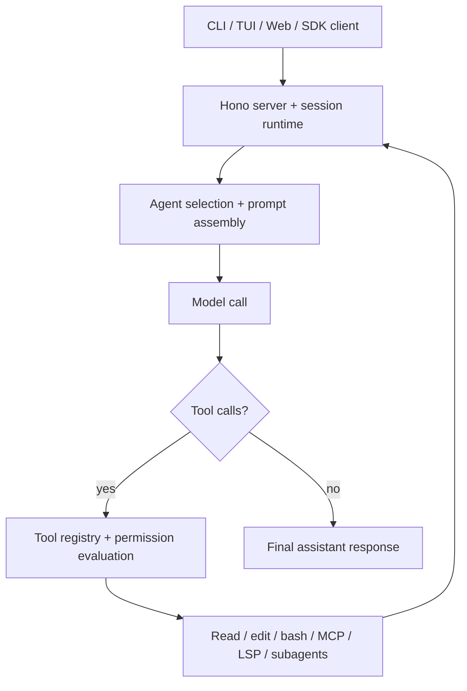

# OpenAGt

OpenAGt is an agentic coding system for running model-driven software tasks through a permission-aware tool loop across CLI, web, and server environments.

<!-- Badges: add CI / release / package / docs / license badges here -->

## Overview

OpenAGt is a local-first coding agent runtime built around persistent sessions, tool invocation, file mutation, shell execution, and subagent orchestration. It is designed for developers who want an interactive coding agent they can run from a terminal, drive through a browser, or integrate through a headless server and SDK.

In this project, "agentic coding" means:

- a user prompt becomes a session, not a one-shot completion
- the model runs inside an iterative agent loop
- the agent can invoke tools such as file reads, edits, shell commands, searches, MCP, and subagents
- tool results are fed back into the same session until the run converges or is interrupted
- risky actions are gated by a permission system instead of being silently executed

OpenAGt is a new project, but it intentionally references OpenCode:

- the runtime still exposes an `opencode` CLI compatibility alias
- config and extension discovery still recognize `.opencode/` and `opencode.jsonc`
- `OPENAGT_*` environment variables generally have `OPENCODE_*` compatibility aliases

That compatibility is part of the current codebase, not just historical trivia, so this README documents it explicitly.

## Key Features

- Primary and subagent modes. Built-in agents include `build`, `plan`, `general`, `explore`, `title`, `summary`, and `compaction`.
- Iterative agent loop. The session runtime repeatedly calls the model, executes tools, processes tool results, and continues until the session becomes idle.
- Tool-based coding workflow. Built-in tools include file read/edit/write, shell execution, web fetch/search, code search, TODO updates, MCP access, LSP access, and subagent task orchestration.
- Permission-aware execution. Actions are evaluated as `allow`, `ask`, or `deny` per tool and pattern.
- Safe/unsafe tool scheduling. Read/search-style tools can run concurrently; mutating tools are serialized and additionally blocked on overlapping paths.
- Model/provider abstraction. The runtime supports a large provider set through the AI SDK ecosystem and provider-specific auth plugins.
- Provider fallback. Requests can switch providers/models on retryable failures such as rate limits and server errors.
- Context management. The session layer includes compaction, pruning, summaries, retries, and overflow handling.
- Headless server plus SDK. The same runtime can be driven locally or via HTTP using the generated JavaScript SDK.
- Coordinator Runtime v1. Task-graph execution now supports dependency ordering, `write_scope` / `read_scope`, acceptance checks, and execution priority.
- Personal Agent Core v1. The backend now includes profile/workspace/session memory, inbox items, wakeups, and normalized multi-entry ingestion.
- Approval & Safety Envelope v1. Shell permission flows now expose structured `shell_safety` metadata with approval kind, boundary details, and policy reasons.
- Extensible surface area. Agents, commands, skills, plugins, MCP servers, and custom tools can all be added from config and local files.
- Session memory injection. Prompt assembly loads session memory into the system context. This is inferred from `loadMemory(sessionID)` in `packages/openagt/src/session/prompt.ts`; the user-facing memory workflow is not yet clearly documented.

## Demo / Example Workflow

One-off execution from source:

```bash
bun run --cwd packages/openagt src/index.ts run "Inspect the auth flow, propose a fix, and patch the bug"
```

Typical execution flow:

1. OpenAGt creates or resumes a session.
2. The selected primary agent builds the prompt from system instructions, config, skills, memory, and prior messages.
3. The model emits text, reasoning, and tool calls.
4. The runtime resolves the allowed tool set for the active agent and model.
5. Permission checks decide whether each tool call is allowed, denied, or requires approval.
6. Safe tools may run concurrently; mutating tools are serialized.
7. Tool output is appended to the same session.
8. The model is called again until it returns a final response or the session is stopped.

## Architecture

### High-Level System Design



### Main Components

- `packages/openagt/src/session`: session state, message model, prompt loop, compaction, retries, summaries, memory, run-state
- `packages/openagt/src/tool`: tool definitions, registry, scheduling, truncation, path conflict detection
- `packages/openagt/src/agent`: built-in and user-defined agent loading plus agent generation
- `packages/openagt/src/provider`: model/provider resolution, auth wiring, fallback logic
- `packages/openagt/src/permission`: rules, approval flow, pending requests, audit logging
- `packages/openagt/src/server`: Hono server, routes, events, auth middleware, UI serving
- `packages/openagt/src/plugin`: plugin loading and hook dispatch
- `packages/openagt/src/skill`: skill discovery and loading from local paths and configured URLs
- `packages/openagt/src/security`: shell review, prompt-injection scanning, PowerShell analysis
- `packages/openagt/src/sandbox`: sandbox broker and policy plumbing for experimental isolation modes

### Agent Loop / Execution Lifecycle

The core runtime lives in `packages/openagt/src/session/prompt.ts`.

At a high level:

1. Resolve the active session, message history, agent, and model.
2. Load system prompt material, skills, config-driven instructions, and session memory.
3. Resolve the tool set through `ToolRegistry.tools(...)`.
4. Call the model and stream assistant parts into the session.
5. Execute tool calls through the scheduler and permission service.
6. Handle retries, fallback, compaction, subtask dispatch, and completion.

This is not a separate planner service with a totally different executor process. It is a session-centric tool loop with:

- primary agents such as `build` and `plan`
- subagents such as `general` and `explore`
- task tools that let one agent delegate work to another

### Tool Use and Environment Interaction

Built-in tools are registered in `packages/openagt/src/tool/registry.ts`.

Current built-in capabilities include:

- `read`, `glob`, `grep`
- `edit`, `write`, `apply_patch`
- `bash`
- `webfetch`, `websearch`, `codesearch`
- `task`, `task_list`, `task_get`, `task_wait`, `task_stop`
- `todowrite`
- `skill`
- `lsp` and `plan` in experimental/flagged modes

Tool scheduling is implemented in two layers:

- `packages/openagt/src/tool/partition.ts` marks a subset of tools as concurrency-safe
- `packages/openagt/src/session/prompt/tool-resolution.ts` blocks overlapping file/path operations even when tools are otherwise safe

### Planning, Verification, and Self-Correction

The runtime supports several agentic patterns without pretending to do more than the code shows:

- Planning: the built-in `plan` agent exists and applies a more restrictive permission profile than `build`
- Subtasks: the `task` tool delegates work to subagents
- Verification: the agent can use `bash`, read/search tools, MCP, or LSP to inspect results
- Retry and fallback: provider fallback is implemented for retryable errors
- Self-correction: tool errors, permission rejections, fallback retries, and compaction all feed back into the same loop

Plan-specific workflow is partially feature-flagged. The plan agent is always defined, but some dedicated plan tooling is only enabled when experimental plan mode is active.

## Repository Structure

| Path | Purpose |
| --- | --- |
| `packages/openagt` | Core runtime, CLI, server, session engine, tools, providers, permissions |
| `packages/app` | Solid/Vite web client |
| `packages/sdk/js` | Generated JavaScript SDK used by the runtime and clients |
| `packages/openagt_flutter` | Flutter mobile MVP |
| `packages/console/*` | Console/control-plane services and web app |
| `packages/web` | Docs/site package |
| `packages/opencode` | Compatibility leftovers, not the main runtime |
| `.opencode/` | Local project examples for agents, commands, plugins, skills, tools, and themes |
| `docs/` | Additional technical analysis and supporting docs |

## Installation

Stable release assets are documented in [docs/install/stable.md](./docs/install/stable.md). The `v1.15.0` stable support matrix covers:

- `packages/openagt` CLI / TUI / headless server
- `packages/sdk/js` JavaScript SDK

Flutter is intentionally excluded from this release line.

### Prerequisites

- Bun 1.3+
- Git
- Flutter 3.41+ if you want to run the mobile client

### Dependencies

Install workspace dependencies:

```bash
bun install
```

Generate the JavaScript SDK before starting the runtime from source:

```bash
bun run --cwd packages/sdk/js script/build.ts
```

This step is required in a fresh clone because `packages/openagt` imports generated files from `packages/sdk/js/src/v2/gen`.

### Stable Assets

The stable release publishes these first-party assets:

- `openagt-windows-x64.zip`
- `OpenAGt-Setup-x64.msi`
- `openagt-linux-x64.tar.gz`
- `openagt-macos-arm64.tar.gz`
- `openagt-macos-x64.tar.gz`
- `SHA256SUMS.txt`

The compatibility alias `opencode` remains available in packaged builds as a wrapper entrypoint.

### Release Validation Status

The current `v1.15.0` release branch has passed these release-critical checks:

- `bun typecheck` in `packages/openagt`
- `bun run release:verify`
- focused runtime suites for `session`, `tool`, `agent`, `security`, `cli`, `installation`, `mcp`, `provider`, `pty`, `file`, `snapshot`, and the remaining package-local test groups

Known test gaps on the current branch:

- `tool.bash abort > captures stderr in output` is still skipped
- `Worktree > createFromInfo > creates and bootstraps git worktree` is still skipped
- `unicode filenames modification and restore` is still skipped

The single-command whole-package entrypoint `bun test --timeout 30000` is slower than the current outer CI timeout budget on this machine, so release validation is tracked through split package-local suites rather than that single aggregate invocation.

### Environment Variables

The runtime supports many environment variables. The most relevant for local development are:

| Variable | Purpose |
| --- | --- |
| `OPENAGT_CONFIG` | Use a specific config file |
| `OPENAGT_CONFIG_DIR` | Add an explicit config directory |
| `OPENAGT_CONFIG_CONTENT` | Inject config content directly |
| `OPENAGT_DISABLE_PROJECT_CONFIG` | Ignore project-local config discovery |
| `OPENAGT_SERVER_PASSWORD` | Protect `serve` / `web` server endpoints |
| `OPENAGT_SERVER_USERNAME` | Username for basic auth on the server |
| `OPENAGT_PERMISSION` | Inject permission rules via env |
| `OPENAGT_PURE` | Disable external plugins |
| `OPENAGT_ENABLE_QUESTION_TOOL` | Force-enable the question tool |
| `OPENAGT_ENABLE_EXA` | Enable Exa-backed search tools where applicable |
| `OPENAGT_EXPERIMENTAL` | Enable experimental feature bundle |
| `OPENAGT_EXPERIMENTAL_PLAN_MODE` | Enable plan-mode-specific tooling |
| `OPENAGT_DB` | Override database path |

Compatibility note:

- Most `OPENAGT_*` variables are mirrored by `OPENCODE_*` aliases in `packages/openagt/src/flag/flag.ts`.

### Setup Steps

```bash
git clone <this-repo>
cd OpenAG
bun install
bun run --cwd packages/sdk/js script/build.ts
```

Optional but useful:

```bash
bun run --cwd packages/openagt src/index.ts debug paths
```

That prints the effective data/config/cache/state directories for your environment.

## Quick Start

### Start the CLI / TUI

```bash
bun run --cwd packages/openagt src/index.ts
```

### Run a One-Off Task

```bash
bun run --cwd packages/openagt src/index.ts run "Summarize the repository structure"
```

### Start the Headless Server

```bash
set OPENAGT_SERVER_PASSWORD=change-me
bun run --cwd packages/openagt src/index.ts serve --port 4096
```

### Start the Web Flow

```bash
set OPENAGT_SERVER_PASSWORD=change-me
bun run --cwd packages/openagt src/index.ts web --port 4096
```

### Add Provider Credentials

```bash
bun run --cwd packages/openagt src/index.ts providers login
```

### New Runtime Surfaces

The current stable backend includes these additional public runtime surfaces:

- `coordinator.*`
- `inbox.*`
- `scheduler.*`
- `memory.updated`
- shell permission metadata with `shell_safety`

## Usage

### Basic Commands / Entry Points

The top-level CLI currently exposes these important commands:

| Command | Purpose |
| --- | --- |
| `openagt` | Start the default interactive TUI for a project |
| `openagt run [message..]` | Run a one-off agent session from the terminal |
| `openagt serve` | Start a headless server |
| `openagt web` | Start the server and open the web interface |
| `openagt session list` | List sessions |
| `openagt session delete <id>` | Delete a session |
| `openagt providers ...` | Manage provider credentials |
| `openagt mcp ...` | Manage MCP servers and OAuth auth |
| `openagt agent create` | Generate a new agent definition |
| `openagt debug ...` | Troubleshooting tools, config/path inspection, skill debug, etc. |

From source, use:

```bash
bun run --cwd packages/openagt src/index.ts --help
```

### Example Tasks

Run locally:

```bash
bun run --cwd packages/openagt src/index.ts run "Find duplicated auth code and propose a refactor"
```

Attach to a remote/local running server:

```bash
bun run --cwd packages/openagt src/index.ts run \
  --attach http://localhost:4096 \
  --password change-me \
  "Review the test failures and explain the root cause"
```

Use a specific agent or model:

```bash
bun run --cwd packages/openagt src/index.ts run \
  --agent build \
  --model openai/gpt-4o-mini \
  "Add logging around provider fallback"
```

### Common Workflows

Interactive coding:

```bash
bun run --cwd packages/openagt src/index.ts
```

Provider setup:

```bash
bun run --cwd packages/openagt src/index.ts providers login
bun run --cwd packages/openagt src/index.ts models
```

MCP setup:

```bash
bun run --cwd packages/openagt src/index.ts mcp add
bun run --cwd packages/openagt src/index.ts mcp list
```

Session inspection:

```bash
bun run --cwd packages/openagt src/index.ts session list
```

## Configuration

### Config File Discovery

Config resolution is compatibility-aware and currently more OpenCode-shaped than OpenAGt-shaped.

The runtime looks for:

- global config under the XDG config dir for `openagt`
- project-local `.openagt/` and `.opencode/` directories
- config filenames such as `opencode.jsonc`, `opencode.json`, and legacy `config.json`

This behavior is implemented in:

- `packages/openagt/src/config/paths.ts`
- `packages/openagt/src/config/config.ts`

So although this is an OpenAGt project, the current config file format is still effectively `opencode.jsonc`-compatible.

### Useful Config Areas

The main config schema supports, among other things:

- default model selection
- provider configuration and fallback chains
- agent overrides
- MCP server config
- permission rules
- plugin declarations
- skills paths/URLs
- compaction settings
- experimental sandbox config

Example:

```jsonc
{
  "model": "openai/gpt-4o-mini",
  "default_agent": "build",
  "permission": {
    "bash": "ask",
    "edit": {
      "*": "ask"
    }
  },
  "provider": {
    "openai": {
      "fallback": {
        "enabled": true,
        "chain": [
          {
            "provider": "anthropic",
            "model": "claude-3.5-haiku"
          }
        ]
      }
    }
  },
  "experimental": {
    "sandbox": {
      "enabled": true,
      "backend": "process"
    }
  }
}
```

### Agents, Commands, Skills, Tools, Plugins

The project can be customized from local Markdown and TypeScript/JavaScript files:

- agents: `{agent,agents}/**/*.md`
- modes: `{mode,modes}/*.md`
- commands: `{command,commands}/**/*.md`
- tools: `{tool,tools}/*.{ts,js}`
- plugins: `{plugin,plugins}/*.{ts,js}` plus configured plugin specs
- skills: `{skill,skills}/**/SKILL.md`

The repository root already contains examples under `.opencode/`.

## Tooling / Integrations

### Model Providers

The runtime depends on the AI SDK ecosystem plus provider-specific helpers. The dependency set includes support for providers such as:

- OpenAI
- Anthropic
- Google / Vertex
- Amazon Bedrock
- Azure OpenAI
- OpenRouter
- Groq
- Mistral
- Cohere
- Perplexity
- Together AI
- xAI
- Alibaba
- Cerebras
- DeepInfra
- GitLab AI
- Cloudflare Workers AI

Provider credentials are managed through:

```bash
bun run --cwd packages/openagt src/index.ts providers login
```

### MCP

The project has first-class MCP support:

- local command-based MCP servers
- remote MCP servers
- OAuth-capable remote MCP authentication flows

Available CLI flows:

```bash
bun run --cwd packages/openagt src/index.ts mcp add
bun run --cwd packages/openagt src/index.ts mcp list
bun run --cwd packages/openagt src/index.ts mcp auth
bun run --cwd packages/openagt src/index.ts mcp debug <name>
```

### LSP

There is LSP integration in the runtime, and an LSP tool can be exposed in experimental mode. This is wired through `packages/openagt/src/lsp` and gated in the tool registry.

### Plugins and Skills

Plugins hook into runtime events, auth flows, tool definitions, and other extension points. Skills provide Markdown-based task-specific instruction packs. Both are real extension mechanisms in this repo, not future placeholders.

## Safety / Permission Model

### Human-in-the-Loop Execution

OpenAGt is not a YOLO agent by default.

Permission rules are evaluated per tool/pattern as:

- `allow`
- `ask`
- `deny`

This is implemented in `packages/openagt/src/permission`.

Key behaviors:

- rules are merged from defaults, config, agent overrides, and session state
- the last matching rule wins
- denied calls fail immediately
- ask-mode calls emit a permission request and wait for a reply

The built-in `plan` agent uses a stricter profile than `build`, and is intended to reduce write access during planning.

### CLI Behavior

The `run` command is conservative:

- permission prompts are auto-rejected unless you explicitly approve them
- `--dangerously-skip-permissions` changes that behavior and should be treated as unsafe

### Shell Review and Command Safety

The security layer includes:

- shell danger heuristics for POSIX-style commands
- PowerShell dangerous cmdlet checks
- custom PowerShell token/AST analysis
- prompt-injection scanning and sanitization

This is real logic in the repo, but it is still heuristic protection, not a formal security proof.

### Server Security

`serve` and `web` warn if `OPENAGT_SERVER_PASSWORD` is not set. If you expose the server outside localhost, set credentials first.

### Sandbox

The runtime includes sandbox broker/policy code and experimental sandbox config. This is present in code, but actual isolation behavior is platform-dependent and should be treated as operationally sensitive.

## Limitations

- Naming is still in transition. Config files, directories, prompts, and aliases still retain significant `opencode` naming.
- Fresh clones require SDK generation before the core runtime starts cleanly from source.
- Some features are flag-gated or client-gated, including plan-specific tooling, Exa-backed search, and the LSP tool.
- The repo contains stale references to packages that are not present in this snapshot, such as `packages/desktop-electron`.
- Performance claims such as fixed token savings or fixed latency improvements are not benchmarked in-repo and should not be treated as established numbers.
- The Flutter client exists and is functional as an MVP, but it should not be assumed to be feature-complete.
- Session memory is clearly injected into prompt assembly, but the user-facing management model needs clearer maintainer documentation.

## Development

### Running Locally

Core runtime:

```bash
bun run --cwd packages/openagt src/index.ts
```

Web app:

```bash
bun run --cwd packages/app dev
```

Docs/site:

```bash
bun run --cwd packages/web dev
```

Flutter client:

```bash
cd packages/openagt_flutter
flutter pub get
flutter run
```

### Testing

Do not run tests from the repo root. The root `test` script intentionally exits with a guard.

Run package-local tests instead:

```bash
cd packages/openagt
bun test
```

### Linting / Type Checking

Repo-level lint:

```bash
bun lint
```

Recommended package-local type checking:

```bash
cd packages/openagt
bun typecheck
```

The repository guidance explicitly prefers package-local `bun typecheck` over invoking `tsc` directly.

## Extending the System

### Add Tools

You can add tools in two main ways:

- local TS/JS files under `.opencode/tool/` or `.opencode/tools/`
- plugin-provided `tool` exports

The tool registry scans `{tool,tools}/*.{ts,js}` in discovered config directories.

### Add Agents

Create agents interactively:

```bash
bun run --cwd packages/openagt src/index.ts agent create
```

Or add Markdown definitions manually under:

- `.opencode/agent/*.md`
- `.opencode/agents/**/*.md`

The loader also recognizes `.openagt`-style directories through config discovery.

### Add Commands

Commands are Markdown templates loaded from:

- `.opencode/command/*.md`
- `.opencode/commands/**/*.md`

These templates can target specific agents or models and can run as subtasks.

### Add Skills

Add skill packs under:

- `.opencode/skill/**/SKILL.md`
- `.opencode/skills/**/SKILL.md`

Additional skill sources can also be configured through `skills.paths` and `skills.urls`.

### Add Plugins

Plugins can be:

- declared in config via the `plugin` field
- loaded from local `.opencode/plugin(s)` directories
- disabled wholesale with `OPENAGT_PURE`

### Modify Prompts / Policies / Workflows

Important built-in prompt and policy code lives under:

- `packages/openagt/src/session/prompt.ts`
- `packages/openagt/src/session/prompt/*.txt`
- `packages/openagt/src/agent`
- `packages/openagt/src/permission`

If you want to change the agent workflow itself, those are the core files to read first.

## Troubleshooting

### "Cannot find module './gen/types.gen.js'"

Generate the SDK first:

```bash
bun run --cwd packages/sdk/js script/build.ts
```

### "Server is unsecured"

Set server credentials before using `serve` or `web` beyond localhost:

```bash
set OPENAGT_SERVER_PASSWORD=change-me
set OPENAGT_SERVER_USERNAME=openagt
```

### Config Is Not Being Picked Up

Check the effective config/search paths:

```bash
bun run --cwd packages/openagt src/index.ts debug paths
```

Remember that the current config discovery still looks for `opencode.jsonc`, `opencode.json`, and `.opencode/` content.

### MCP Auth Problems

Use the built-in diagnostics:

```bash
bun run --cwd packages/openagt src/index.ts mcp list
bun run --cwd packages/openagt src/index.ts mcp auth
bun run --cwd packages/openagt src/index.ts mcp debug <name>
```

### Provider Login Problems

```bash
bun run --cwd packages/openagt src/index.ts providers login
bun run --cwd packages/openagt src/index.ts providers list
```

## License

MIT. See [LICENSE](./LICENSE).
