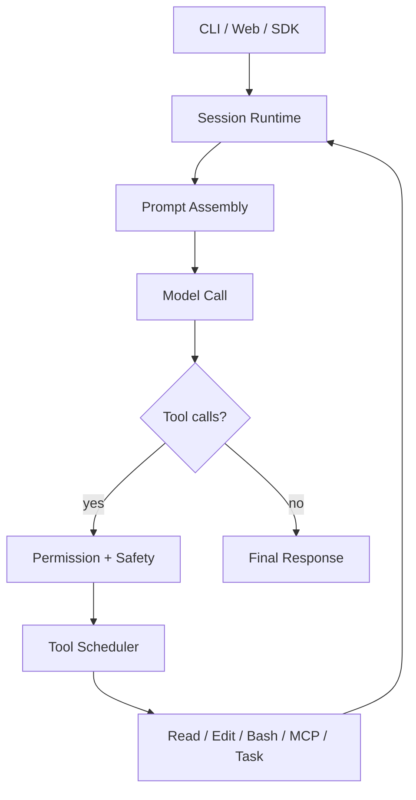
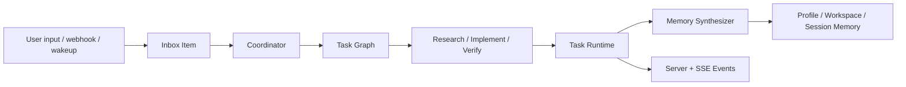

# OpenAGt

OpenAGt is a local-first agentic coding runtime for CLI, server, and web-driven development workflows.

It runs an iterative tool loop around coding models: read files, edit code, run shell commands, call MCP tools, manage tasks, and keep the whole interaction inside a persistent session instead of a one-shot completion.

## Overview

OpenAGt is built around four ideas:

- session-based agent execution instead of single completions
- permission-aware tool use instead of silent mutation
- backend-first orchestration for multi-step coding work
- compatibility with existing `opencode`-style workflows during the naming transition

Current stable scope:

- CLI / TUI
- headless server
- JavaScript SDK

Not in the current stable line:

- Flutter client distribution

Technical documentation:

- [Technical Architecture](C:\Users\Administrator\Desktop\OpenAG\docs\technical\architecture.md)
- [Windows Signing](C:\Users\Administrator\Desktop\OpenAG\docs\release\windows-signing.md)

## Release

Current stable release:

- [v1.15.0](https://github.com/Yecyi/OpenAGt/releases/tag/v1.15.0)

Published assets:

- `OpenAGt-Setup-x64.msi`
- `openagt-windows-x64.zip`
- `openagt-linux-x64.tar.gz`
- `openagt-macos-arm64.tar.gz`
- `openagt-macos-x64.tar.gz`
- `SHA256SUMS.txt`

Install details are also documented in [C:\Users\Administrator\Desktop\OpenAG\docs\install\stable.md](C:\Users\Administrator\Desktop\OpenAG\docs\install\stable.md).

## Core Technologies

The current stable runtime is centered around these backend capabilities:

- session runtime with iterative prompt and tool execution
- permission and safety envelope for shell and tool calls
- task graph orchestration through Coordinator Runtime v1
- durable profile, workspace, and session memory
- inbox, scheduler, and wakeup primitives for long-running agent behavior
- headless server plus generated JavaScript SDK
- cross-platform release packaging with Windows MSI and portable archives

## Key Features

- Iterative agent loop with persistent sessions
- File read, edit, patch, and write tools
- Shell execution with permission gating and structured safety metadata
- MCP, search, LSP, and task-based delegation surfaces
- Coordinator Runtime v1 for dependency-aware task graph execution
- Personal Agent Core v1 for profile, workspace, and session memory
- Inbox, wakeup, and scheduler primitives for long-running agent behavior
- Headless server and generated JavaScript SDK
- `opencode` compatibility alias for transition safety

## Flowchart

### Request Lifecycle



### Coordinator + Personal Agent



For a fuller architecture breakdown, see [Technical Architecture](C:\Users\Administrator\Desktop\OpenAG\docs\technical\architecture.md).

## Installation

### Windows

Preferred path:

- download `OpenAGt-Setup-x64.msi`
- install it
- open a **new** terminal
- run:

```powershell
openagt
```

Compatibility alias:

```powershell
opencode
```

Portable path:

- extract `openagt-windows-x64.zip`
- run `bin\openagt.exe` or `bin\openagt.cmd`

Important:

- current Windows assets are **not code-signed**
- Windows SmartScreen may show `Unknown publisher`
- technical signing workflow is documented separately in [Windows Signing](C:\Users\Administrator\Desktop\OpenAG\docs\release\windows-signing.md)

### macOS / Linux

Extract the matching archive and run:

```bash
./bin/openagt --help
./bin/opencode --help
```

### Verify Downloads

Validate downloaded assets against `SHA256SUMS.txt` before installation.

## Quick Start

### Run From Source

```bash
bun install
bun run --cwd packages/sdk/js script/build.ts
bun run --cwd packages/openagt src/index.ts --help
```

### Start Interactive CLI

```bash
bun run --cwd packages/openagt src/index.ts
```

### Run a One-Off Task

```bash
bun run --cwd packages/openagt src/index.ts run "Summarize the repository structure"
```

### Start the Server

```bash
set OPENAGT_SERVER_PASSWORD=change-me
bun run --cwd packages/openagt src/index.ts serve --port 4096
```

### Start the Web Flow

```bash
set OPENAGT_SERVER_PASSWORD=change-me
bun run --cwd packages/openagt src/index.ts web --port 4096
```

### Add Provider Credentials

```bash
bun run --cwd packages/openagt src/index.ts providers login
```

## Core Runtime Surfaces

The stable backend exposes these event families:

- `coordinator.*`
- `inbox.*`
- `scheduler.*`
- `memory.updated`

Shell permission requests also expose structured `shell_safety` metadata.

## Main Commands

| Command | Purpose |
| --- | --- |
| `openagt` | Start the default interactive CLI / TUI |
| `openagt run [message..]` | Run a one-off task |
| `openagt serve` | Start the headless server |
| `openagt web` | Start the server and web UI flow |
| `openagt session list` | List sessions |
| `openagt providers login` | Add or refresh provider credentials |
| `openagt mcp list` | Inspect MCP configuration |
| `openagt debug paths` | Print effective runtime paths |

## Repository Structure

| Path | Purpose |
| --- | --- |
| `packages/openagt` | Core runtime, CLI, server, tools, session engine |
| `packages/app` | Solid/Vite web client |
| `packages/sdk/js` | Generated JavaScript SDK |
| `packages/openagt_flutter` | Flutter mobile MVP |
| `packages/console/*` | Console and control-plane packages |
| `packages/web` | Docs/site package |
| `packages/opencode` | Compatibility leftovers, not the main runtime |
| `.opencode/` | Local examples for agents, commands, plugins, skills, tools, themes |
| `docs/` | Release docs, install docs, technical notes |

## Compatibility

The project still preserves transition compatibility with OpenCode:

- `opencode` remains a shipped CLI alias
- config discovery still recognizes `.opencode/`
- `OPENAGT_*` settings generally retain `OPENCODE_*` aliases

This is intentional and part of the current runtime behavior.

## Development

### Dependencies

```bash
bun install
bun run --cwd packages/sdk/js script/build.ts
```

The SDK generation step is required in a fresh clone.

### Running Locally

Core runtime:

```bash
bun run --cwd packages/openagt src/index.ts
```

Web app:

```bash
bun run --cwd packages/app dev
```

Docs/site:

```bash
bun run --cwd packages/web dev
```

Flutter MVP:

```bash
cd packages/openagt_flutter
flutter pub get
flutter run
```

### Testing

Do not run tests from the repo root.

Run package-local commands instead:

```bash
cd packages/openagt
bun typecheck
bun test
```

## Configuration and Environment

Useful runtime variables:

| Variable | Purpose |
| --- | --- |
| `OPENAGT_CONFIG` | Use a specific config file |
| `OPENAGT_CONFIG_DIR` | Add an explicit config directory |
| `OPENAGT_CONFIG_CONTENT` | Inject config content directly |
| `OPENAGT_DISABLE_PROJECT_CONFIG` | Ignore project-local config discovery |
| `OPENAGT_SERVER_PASSWORD` | Protect `serve` / `web` server endpoints |
| `OPENAGT_SERVER_USERNAME` | Basic auth username for the server |
| `OPENAGT_PERMISSION` | Inject permission rules via env |
| `OPENAGT_PURE` | Disable external plugins |
| `OPENAGT_EXPERIMENTAL` | Enable experimental feature bundle |
| `OPENAGT_EXPERIMENTAL_PLAN_MODE` | Enable plan-mode-specific tooling |
| `OPENAGT_DB` | Override database path |

## Extending OpenAGt

You can extend the runtime with:

- agents under `.opencode/agent` or `.opencode/agents`
- commands under `.opencode/command` or `.opencode/commands`
- skills under `.opencode/skill` or `.opencode/skills`
- tools under `.opencode/tool` or `.opencode/tools`
- plugins via config or local plugin directories

Core files to inspect first if you are changing workflow behavior:

- `packages/openagt/src/session/prompt.ts`
- `packages/openagt/src/tool`
- `packages/openagt/src/agent`
- `packages/openagt/src/permission`

## Troubleshooting

### SDK Generation Error

If you see missing generated SDK files:

```bash
bun run --cwd packages/sdk/js script/build.ts
```

### Server Is Unsecured

Set credentials before exposing `serve` or `web` outside localhost:

```bash
set OPENAGT_SERVER_PASSWORD=change-me
set OPENAGT_SERVER_USERNAME=openagt
```

### Config Is Not Being Picked Up

Check effective config and state paths:

```bash
bun run --cwd packages/openagt src/index.ts debug paths
```

### MCP Auth Problems

```bash
bun run --cwd packages/openagt src/index.ts mcp list
bun run --cwd packages/openagt src/index.ts mcp auth
bun run --cwd packages/openagt src/index.ts mcp debug <name>
```

### Provider Login Problems

```bash
bun run --cwd packages/openagt src/index.ts providers login
bun run --cwd packages/openagt src/index.ts providers list
```

## License

MIT. See [C:\Users\Administrator\Desktop\OpenAG\LICENSE](C:\Users\Administrator\Desktop\OpenAG\LICENSE).
