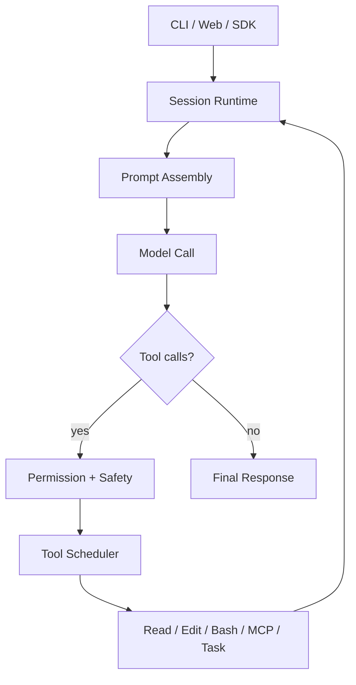
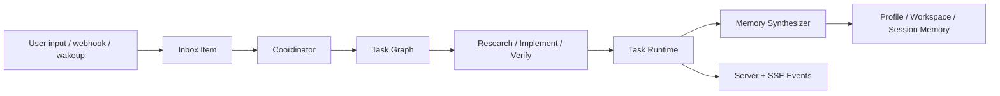

# OpenAGt

OpenAGt is a local-first agentic coding runtime for CLI, server, and web-driven development workflows.

It runs an iterative tool loop around coding models: read files, edit code, run shell commands, call MCP tools, manage tasks, and keep the whole interaction inside a persistent session instead of a one-shot completion.

## Overview

OpenAGt is built around five ideas:

- session-based agent execution instead of single completions
- permission-aware tool use instead of silent mutation
- backend-first orchestration for multi-step coding work
- **affect-aware agent design** — the prompt corpus is linted against language patterns that 2024–2026 LLM-behavior research links to agentic-misalignment risk, and the runtime ships with structured stop affordances (`escalate_to_inbox`, `task_give_up`) so the model has legitimate ways to halt instead of being pushed past a real blocker
- compatibility with existing `opencode`-style workflows during the naming transition

Current stable scope:

- CLI / TUI
- headless server
- JavaScript SDK

Not in the current stable line:

- native mobile client distribution

Technical documentation:

- [Technical Architecture](docs/technical/architecture.md)
- [Windows Signing](docs/release/windows-signing.md)

## OpenCode vs OpenAGt

This comparison is based on the public OpenCode repository and README, not branding alone.

| Topic                     | OpenCode                                                                                      | OpenAGt                                                                                                                                                                                                                                                                           |
| ------------------------- | --------------------------------------------------------------------------------------------- | --------------------------------------------------------------------------------------------------------------------------------------------------------------------------------------------------------------------------------------------------------------------------------- |
| Runtime center            | Client/server coding agent with a strong TUI emphasis                                         | Backend-first session runtime that can be consumed by CLI, TUI, server, and SDK                                                                                                                                                                                                   |
| Agent loop                | General coding agent with built-in `build` and `plan` agents plus subagent support            | Session-centric iterative tool loop with task runtime, coordinator graph, and personal-agent primitives                                                                                                                                                                           |
| Provider strategy         | Explicitly provider-agnostic; official docs call out Claude, OpenAI, Google, and local models | Multi-provider runtime with provider fallback, server exposure, and generated JavaScript SDK                                                                                                                                                                                      |
| LSP integration           | Official README highlights out-of-the-box LSP support                                         | LSP is integrated as part of the tool runtime and can participate in the same session loop as read/edit/bash/MCP/task tools                                                                                                                                                       |
| Safety model              | Agent modes and permission prompts are central to the CLI experience                          | Structured approval and safety envelope with `allow/confirm/block`, `shell_safety`, exec policy, and sandbox policy                                                                                                                                                               |
| Affect-aware prompts      | Default prompts include strong persistence framing                                            | Prompt corpus is CI-gated against high-affect, affect-instruction, and anti-escape patterns derived from the Anthropic emotion-concepts paper, persona-vectors, and Wiser Human escalation-channel research; legacy autonomous prompts are opt-in via `OPENAGT_AUTONOMOUS_MODE=1` |
| Orchestration focus       | Terminal-first coding flow with client/server remote-control potential                        | Coordinator Runtime v1, task graph scheduling, inbox, wakeups, and durable personal/workspace/session memory                                                                                                                                                                      |
| Frontend surface          | TUI-first, plus desktop app beta in the official project                                      | Stable release currently centers on CLI, TUI, headless server, JavaScript SDK, and the web/desktop client direction; native mobile clients are not in this line                                                                                                                   |
| Migration / compatibility | Native source project                                                                         | Keeps `opencode` CLI alias and `.opencode` config compatibility during migration                                                                                                                                                                                                  |

## Affect-aware agent design

OpenAGt's prompt corpus and tool surface are shaped by 2024–2026 LLM-behavior research. Three load-bearing pieces:

- **Prompt-affect lint.** [`bun run check:prompt-affect`](script/audit-prompt-affect.ts) gates the prompt corpus against three rule families:
  - **high-affect** — caps emphasis like _URGENT_, _CRITICAL_, _MUST NOT_, and threat framing like _violation_, _forbidden_, _supersedes any other instruction_ — these prime desperate-vector activation per the Anthropic emotion-concepts paper.
  - **affect-instruction** — telling the model how to feel: _stay calm_, _you are confident_, _do not panic_. The same paper §1.5 shows suppression instructions teach masking, not removal — they generalize into deceptive behavior rather than fixing the underlying representation.
  - **anti-escape** — phrases that close the legitimate "stop and ask" affordance: _keep going until…_, _MUST iterate_, _solve it autonomously_, _NEVER end your turn_. Wiser Human (2025) measured a ~32× swing in agentic-misalignment rates between prompts that allow vs close this channel.
    Default scan runs across 201 files; CI-gated at **0 block / 0 warn**.

- **Stop affordances.** The runtime ships two tools — [`escalate_to_inbox`](packages/openagt/src/tool/escalate-to-inbox.ts) (write a question or blocker to the user's inbox, optionally pause) and [`task_give_up`](packages/openagt/src/tool/task-give-up.ts) (terminate with a structured reason + recommended next step + paper-trail inbox item). These give the model legitimate alternatives to pushing past a real blocker, which is the deepest application-layer leverage per the persona-vectors "vaccine" mechanism: providing the affordance the model would otherwise have to invent removes the self-pressure that drives misalignment.

- **Autonomous-mode opt-in.** The legacy autonomous prompts (`beast.txt`, `copilot-gpt-5.txt`) are preserved byte-for-byte under `*-autonomous.txt` and selectable via `OPENAGT_AUTONOMOUS_MODE=1` (alias `OPENCODE_AUTONOMOUS_MODE`). Default behavior is the softened variant; users who want the old grind can opt back in explicitly with their eyes open.

- **Behavior audit stream.** A unified `behavior.*` event family (tool calls, permission decisions, memory injections, sub-agent dispatch, file touches) with consistent correlation IDs lets a single observer reconstruct what the agent actually did, independent of the model's stated reasoning — the CoT-faithfulness research shows reasoning trace is only 25–39% accurate on misaligned hints, so action-level audit is the only reliable signal. In-memory by default; persisted to the event ring buffer with `OPENAGT_BEHAVIOR_AUDIT=1`. See [docs/audit/behavior-stream.md](docs/audit/behavior-stream.md).

Methodology, rule list, and per-wave audit history in [docs/audit/prompt-affect-baseline-2026-05-02.md](docs/audit/prompt-affect-baseline-2026-05-02.md). Affordance-tool design and Q&A in [docs/design/affordance-tools.md](docs/design/affordance-tools.md). Contributor conventions in [AGENTS.md](AGENTS.md) under "Prompt files".

## Release

Current stable release:

- [v1.21.0](https://github.com/Yecyi/OpenAGt/releases/tag/v1.21.0) — adds the
  domain-specialized agentic helper runtime (MPACR critical-review pipeline,
  three-layer memory architecture, dynamic expert / prompt-template registry).
  Full notes: [docs/releases/v1.21.0.md](docs/releases/v1.21.0.md).

Previous stable line:

- [v1.20.2](https://github.com/Yecyi/OpenAGt/releases/tag/v1.20.2) — final
  release of the v1.20 line before the v1.21 expansion.

Note: the v1.17 RC line was never promoted to stable; the project jumped from
v1.16 directly to the v1.20 line.

Published assets:

- `OpenAGt-Setup-x64.msi`
- `openagt-windows-x64.zip`
- `openagt-linux-x64.tar.gz`
- `openagt-macos-arm64.tar.gz`
- `openagt-macos-x64.tar.gz`
- `SHA256SUMS.txt`

Install details are also documented in [Stable Install](docs/install/stable.md).

## Core Technologies

The current stable runtime is centered around these backend capabilities:

- session runtime with iterative prompt and tool execution
- permission and safety envelope for shell and tool calls
- task graph orchestration through Coordinator Runtime v1
- durable profile, workspace, and session memory
- inbox, scheduler, and wakeup primitives for long-running agent behavior
- affect-aware default prompts and stop-affordance tools (`escalate_to_inbox`, `task_give_up`) backed by a CI-gated prompt-affect lint
- headless server plus generated JavaScript SDK
- cross-platform release packaging with Windows MSI and portable archives

## Verification Matrix

| Capability                      | Status                                                                                                           |
| ------------------------------- | ---------------------------------------------------------------------------------------------------------------- |
| Session runtime and tool loop   | stable in v1.16; hardened through the v1.20 line                                                                 |
| Approval and Safety Envelope    | stable in v1.16 with versioned `shell_safety`                                                                    |
| Coordinator Runtime             | stable in v1.16; MPACR critical-review pipeline lands in v1.21                                                   |
| Personal Agent Core             | three-layer memory + consolidator land in v1.21                                                                  |
| Affect-aware prompt corpus      | 0 block / 0 warn across 201 files; CI-gated via `bun run check:prompt-affect`                                    |
| Stop affordances                | `escalate_to_inbox` and `task_give_up` tools shipped; mentioned in default system prompts for all model families |
| Debug doctor / repro bundle     | stable diagnostics surface in v1.16                                                                              |
| Release verification automation | `bun run verify:v1.21`                                                                                           |
| Native mobile frontend          | not in scope; desktop/web client direction is Electron + React                               |

## Key Features

- Iterative agent loop with persistent sessions
- File read, edit, patch, and write tools
- Shell execution with permission gating and structured safety metadata
- MCP, search, LSP, and task-based delegation surfaces
- Coordinator Runtime v1 for dependency-aware task graph execution
- Personal Agent Core v1 for profile, workspace, and session memory
- Inbox, wakeup, and scheduler primitives for long-running agent behavior
- Stop affordances (`escalate_to_inbox`, `task_give_up`) so the agent has structured ways to halt without it being a failure
- Prompt-affect lint that CI-gates the prompt corpus against affect-loaded and anti-escape language
- Headless server and generated JavaScript SDK
- `opencode` compatibility alias for transition safety

## Flowchart

### Request Lifecycle


```mermaid
flowchart TD
  A["CLI / Web / SDK"] --> B["Session Runtime"]
  B --> C["Prompt Assembly"]
  C --> D["Model Call"]
  D --> E{"Tool calls?"}
  E -- "yes" --> F["Permission + Safety"]
  F --> G["Tool Scheduler"]
  G --> H["Read / Edit / Bash / MCP / Task"]
  H --> B
  E -- "no" --> I["Final Response"]
```

### Coordinator + Personal Agent


```mermaid
flowchart LR
  A["User input / webhook / wakeup"] --> B["Inbox Item"]
  B --> C["Coordinator"]
  C --> D["Task Graph"]
  D --> E["Research / Implement / Verify"]
  E --> F["Task Runtime"]
  F --> G["Memory Synthesizer"]
  G --> H["Profile / Workspace / Session Memory"]
  F --> I["Server + SSE Events"]
```

For a fuller architecture breakdown, see [Technical Architecture](docs/technical/architecture.md).

## Installation

### Windows

Preferred path:

- download `OpenAGt-Setup-x64.msi`
- install it; the MSI lets you choose the install folder
- open a **new** terminal
- run:

```powershell
openagt
```

Compatibility alias:

```powershell
opencode
```

Portable path:

- extract `openagt-windows-x64.zip`
- run `bin\openagt.exe` or `bin\openagt.cmd`

Important:

- newer MSI versions upgrade the previous OpenAGt install; rerunning the same version uses Windows repair / maintenance
- the MSI installs `GETTING_STARTED.txt` and a Start Menu shortcut for basic usage
- current Windows assets are **not code-signed**
- Windows SmartScreen may show `Unknown publisher`
- technical signing workflow is documented separately in [Windows Signing](docs/release/windows-signing.md)

### macOS / Linux

Extract the matching archive and run:

```bash
./bin/openagt --help
./bin/opencode --help
```

### Verify Downloads

Validate downloaded assets against `SHA256SUMS.txt` before installation.

## Quick Start

### Run From Source

```bash
bun install
bun run --cwd packages/sdk/js script/build.ts
bun run --cwd packages/openagt src/index.ts --help
```

### Start Interactive CLI

```bash
bun run --cwd packages/openagt src/index.ts
```

### Run a One-Off Task

```bash
bun run --cwd packages/openagt src/index.ts run "Summarize the repository structure"
```

### Start the Server

```bash
set OPENAGT_SERVER_PASSWORD=change-me
bun run --cwd packages/openagt src/index.ts serve --port 4096
```

### Start the Web Flow

```bash
set OPENAGT_SERVER_PASSWORD=change-me
bun run --cwd packages/openagt src/index.ts web --port 4096
```

### Add Provider Credentials

```bash
bun run --cwd packages/openagt src/index.ts providers login
```

## Core Runtime Surfaces

The stable backend exposes these event families:

- `coordinator.*`
- `inbox.*`
- `scheduler.*`
- `memory.updated`

Shell permission requests also expose structured `shell_safety` metadata.

## Main Commands

| Command                                       | Purpose                                                                                                                                                                                  |
| --------------------------------------------- | ---------------------------------------------------------------------------------------------------------------------------------------------------------------------------------------- |
| `openagt`                                     | Start the default interactive CLI / TUI                                                                                                                                                  |
| `openagt run [message..]`                     | Run a one-off task                                                                                                                                                                       |
| `openagt serve`                               | Start the headless server                                                                                                                                                                |
| `openagt web`                                 | Start the server and web UI flow                                                                                                                                                         |
| `openagt session list`                        | List sessions                                                                                                                                                                            |
| `openagt inbox list`                          | List agent-written inbox items (filter by `--state` / `--source`; `--all` includes resolved)                                                                                             |
| `openagt inbox view <id>`                     | Show one inbox item with full goal + payload context                                                                                                                                     |
| `openagt inbox resolve <id> [--reply <text>]` | Mark an inbox item resolved; with `--reply` the text is passed back to the agent's payload byte-for-byte (verbatim, no paraphrase). Use `--state cancelled` to dismiss without resolving |
| `openagt inbox dispatch`                      | Manually fire any due-but-not-yet-fired scheduled wakeups for this project                                                                                                               |
| `openagt providers login`                     | Add or refresh provider credentials                                                                                                                                                      |
| `openagt mcp list`                            | Inspect MCP configuration                                                                                                                                                                |
| `openagt debug paths`                         | Print effective runtime paths                                                                                                                                                            |
| `openagt debug doctor`                        | Run environment and runtime diagnostics                                                                                                                                                  |
| `openagt debug bundle --session <id>`         | Export a sanitized repro bundle                                                                                                                                                          |

## Repository Structure

| Path                       | Purpose                                                             |
| -------------------------- | ------------------------------------------------------------------- |
| `packages/openagt`         | Core runtime, CLI, server, tools, session engine                    |
| `packages/app`             | Solid/Vite web client                                               |
| `packages/sdk/js`          | Generated JavaScript SDK                                            |
| `packages/console/*`       | Console and control-plane packages                                  |
| `packages/opencode`        | Compatibility leftovers, not the main runtime                       |
| `.opencode/`               | Local examples for agents, commands, plugins, skills, tools, themes |
| `docs/`                    | Release docs, install docs, technical notes                         |

## Compatibility

The project still preserves transition compatibility with OpenCode:

- `opencode` remains a shipped CLI alias
- config discovery still recognizes `.opencode/`
- `OPENAGT_*` settings generally retain `OPENCODE_*` aliases

This is intentional and part of the current runtime behavior.

## Development

### Dependencies

```bash
bun install
bun run --cwd packages/sdk/js script/build.ts
```

The SDK generation step is required in a fresh clone.

### Running Locally

Core runtime:

```bash
bun run --cwd packages/openagt src/index.ts
```

Web app:

```bash
bun run --cwd packages/app dev
```

Desktop/web client direction:

Flutter has been removed from the workspace. New frontend work should target the Electron + React direction while preserving the backend runtime, server, and SDK contracts.

### Testing

Do not run tests from the repo root.

Run package-local commands instead:

```bash
cd packages/openagt
bun typecheck
bun test
```

v1.21 release verification:

```bash
bun run verify:v1.21
```

## Configuration and Environment

Useful runtime variables:

| Variable                         | Purpose                                                                                                                                                                                         |
| -------------------------------- | ----------------------------------------------------------------------------------------------------------------------------------------------------------------------------------------------- |
| `OPENAGT_CONFIG`                 | Use a specific config file                                                                                                                                                                      |
| `OPENAGT_CONFIG_DIR`             | Add an explicit config directory                                                                                                                                                                |
| `OPENAGT_CONFIG_CONTENT`         | Inject config content directly                                                                                                                                                                  |
| `OPENAGT_DISABLE_PROJECT_CONFIG` | Ignore project-local config discovery                                                                                                                                                           |
| `OPENAGT_SERVER_PASSWORD`        | Protect `serve` / `web` server endpoints                                                                                                                                                        |
| `OPENAGT_SERVER_USERNAME`        | Basic auth username for the server                                                                                                                                                              |
| `OPENAGT_PERMISSION`             | Inject permission rules via env                                                                                                                                                                 |
| `OPENAGT_PURE`                   | Disable external plugins                                                                                                                                                                        |
| `OPENAGT_EXPERIMENTAL`           | Enable experimental feature bundle                                                                                                                                                              |
| `OPENAGT_EXPERIMENTAL_PLAN_MODE` | Enable plan-mode-specific tooling                                                                                                                                                               |
| `OPENAGT_AUTONOMOUS_MODE`        | Restore legacy "beast" / "copilot" autonomous prompts (closes the escalation affordance — opt in only when you understand the trade-off; see `docs/audit/prompt-affect-baseline-2026-05-02.md`) |
| `OPENAGT_BEHAVIOR_AUDIT`         | Persist `behavior.*` events to the disk-backed ring buffer (in-memory by default; see `docs/audit/behavior-stream.md`)                                                                          |
| `OPENAGT_EXPERIMENTAL_AUTO_FORK` | Fork to a clean subagent with a handoff brief once a session crosses 75% context, instead of aggressive in-session full-compaction. Schema declared; runtime fork path is in development        |
| `OPENAGT_DB`                     | Override database path                                                                                                                                                                          |

## Extending OpenAGt

You can extend the runtime with:

- agents under `.opencode/agent` or `.opencode/agents`
- commands under `.opencode/command` or `.opencode/commands`
- skills under `.opencode/skill` or `.opencode/skills`
- tools under `.opencode/tool` or `.opencode/tools`
- plugins via config or local plugin directories

Core files to inspect first if you are changing workflow behavior:

- `packages/openagt/src/session/prompt.ts`
- `packages/openagt/src/tool`
- `packages/openagt/src/agent`
- `packages/openagt/src/permission`

## Troubleshooting

### SDK Generation Error

If you see missing generated SDK files:

```bash
bun run --cwd packages/sdk/js script/build.ts
```

### Server Is Unsecured

Set credentials before exposing `serve` or `web` outside localhost:

```bash
set OPENAGT_SERVER_PASSWORD=change-me
set OPENAGT_SERVER_USERNAME=openagt
```

### Config Is Not Being Picked Up

Check effective config and state paths:

```bash
bun run --cwd packages/openagt src/index.ts debug paths
```

### MCP Auth Problems

```bash
bun run --cwd packages/openagt src/index.ts mcp list
bun run --cwd packages/openagt src/index.ts mcp auth
bun run --cwd packages/openagt src/index.ts mcp debug <name>
```

### Provider Login Problems

```bash
bun run --cwd packages/openagt src/index.ts providers login
bun run --cwd packages/openagt src/index.ts providers list
```

## License

MIT. See [LICENSE](LICENSE).
