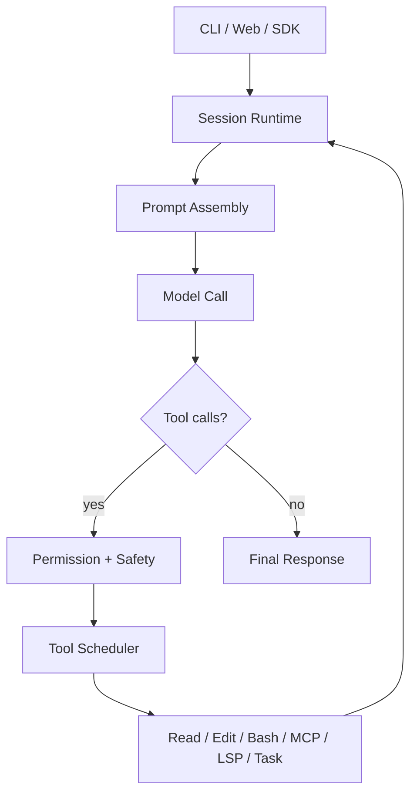
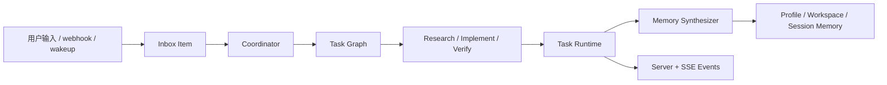

# OpenAGt

OpenAGt 是一个本地优先的 agentic coding 运行时，面向 CLI、TUI、headless server、Web 和 SDK 驱动的开发工作流。

它围绕编码模型建立持续会话式工具循环：读取文件、编辑代码、执行 Shell、调用 MCP/LSP、管理任务、派发 subagent，并把整个过程保存在持久 session 中，而不是一次性补全。

## 概览

OpenAGt 当前围绕四个核心方向构建：

- 以 session 为中心的 agent 执行，而不是单次 completion。
- 以权限和安全边界控制工具调用，而不是静默执行高风险操作。
- 以后端 runtime 为核心组织多步骤编码任务。
- 在命名迁移期保留 `opencode` 兼容入口和 `.opencode` 配置兼容。

当前稳定范围：

- CLI / TUI
- Headless server
- JavaScript SDK

当前稳定版不包含：

- Flutter 客户端发行版

技术文档：

- [技术架构](docs/technical/architecture.md)
- [Windows 签名说明](docs/release/windows-signing.md)

## OpenCode vs OpenAGt

下表基于 OpenCode 官方开源仓库和文档进行技术对比，而不是只看命名。

| 主题          | OpenCode                                                   | OpenAGt                                                                                               |
| ------------- | ---------------------------------------------------------- | ----------------------------------------------------------------------------------------------------- |
| 运行时中心    | Client/server coding agent，强调 TUI 体验                  | 后端优先的 session runtime，可被 CLI、TUI、server、SDK 复用                                           |
| Agent loop    | 通用编码 agent，内置 agent mode 和 subagent 能力           | 持久 session 工具循环，扩展 task runtime、coordinator graph、personal-agent primitives                |
| Provider 策略 | Provider-agnostic，支持 Claude、OpenAI、Google、本地模型等 | 多 provider runtime，支持 provider fallback、server 暴露和生成式 JavaScript SDK                       |
| LSP 集成      | 官方文档强调开箱即用 LSP                                   | LSP 作为工具运行时的一部分，与 read/edit/bash/MCP/task 进入同一 session loop                          |
| 安全模型      | Agent mode 与 permission prompt 是 CLI 体验核心            | 结构化 Approval & Safety Envelope：`allow/confirm/block`、`shell_safety`、exec policy、sandbox policy |
| 编排重点      | Terminal-first 编码流，保留 client/server 远程控制潜力     | Coordinator Runtime、任务图调度、Inbox、Wakeup、Profile/Workspace/Session 记忆                        |
| 前端形态      | TUI-first，官方项目也提供 desktop beta                     | 当前稳定版聚焦 CLI/TUI/headless server/SDK；Flutter 延后                                              |
| 迁移兼容      | 原生 OpenCode 项目                                         | 保留 `opencode` CLI alias 和 `.opencode` 配置兼容                                                     |

## 发布

当前稳定版本：

- [v1.16.0](https://github.com/Yecyi/OpenAGt/releases/tag/v1.16.0)

发布资产：

- `OpenAGt-Setup-x64.msi`
- `openagt-windows-x64.zip`
- `openagt-linux-x64.tar.gz`
- `openagt-macos-arm64.tar.gz`
- `openagt-macos-x64.tar.gz`
- `SHA256SUMS.txt`
- SBOM

安装说明见 [Stable Install](docs/install/stable.md)。

## 核心技术

OpenAGt v1.16 的稳定后端能力包括：

- 持久 session runtime 与迭代式工具循环
- Shell 与工具调用的权限审批、安全摘要和 `shell_safety.version = 1`
- Coordinator Runtime 的任务图、依赖校验、dispatch、retry、cancel
- Personal Agent Core 的 profile/workspace/session 记忆、inbox、scheduler、wakeup
- `openagt debug doctor` 与 `openagt debug bundle --session <id>`
- Headless server、SSE event envelope、生成式 JavaScript SDK
- 跨平台 release packaging、checksums、SBOM、Windows MSI

## Verification Matrix

| 能力                            | 状态                                                     |
| ------------------------------- | -------------------------------------------------------- |
| Session runtime 与工具循环      | v1.16 稳定                                               |
| Approval and Safety Envelope    | v1.16 稳定，带版本化 `shell_safety`                      |
| Coordinator Runtime             | v1.16 稳定覆盖 graph projection、dispatch、retry、cancel |
| Personal Agent Core             | 已实现，v1.16 稳定后端契约                               |
| Debug doctor / repro bundle     | v1.16 稳定诊断面                                         |
| Release verification automation | `bun run verify:v1.16`                                   |
| Flutter 前端                    | 路线图；先稳定后端契约                                   |

## Flowchart

### 请求生命周期



### Coordinator + Personal Agent



## 安装

### Windows

推荐方式：

1. 下载 `OpenAGt-Setup-x64.msi`。
2. 完成安装。
3. 打开一个新的终端。
4. 运行：

```powershell
openagt
```

兼容别名：

```powershell
opencode
```

便携方式：

1. 解压 `openagt-windows-x64.zip`。
2. 运行 `bin\openagt.exe` 或 `bin\openagt.cmd`。

注意：

- 如果 Windows 资产未签名，SmartScreen 可能显示 `Unknown publisher`。
- 签名细节见 [Windows 签名说明](docs/release/windows-signing.md)。

### macOS / Linux

解压对应平台压缩包后运行：

```bash
./bin/openagt --help
./bin/opencode --help
```

下载后请使用 `SHA256SUMS.txt` 校验资产完整性。

## 快速开始

### 从源码运行

```bash
bun install
bun run --cwd packages/sdk/js script/build.ts
bun run --cwd packages/openagt src/index.ts --help
```

### 启动交互 CLI

```bash
bun run --cwd packages/openagt src/index.ts
```

安装版可直接运行：

```bash
openagt
```

### 执行一次性任务

```bash
bun run --cwd packages/openagt src/index.ts run "Summarize the repository structure"
```

### 启动 Server

```bash
set OPENAGT_SERVER_PASSWORD=change-me
bun run --cwd packages/openagt src/index.ts serve --port 4096
```

### 启动 Web 流程

```bash
set OPENAGT_SERVER_PASSWORD=change-me
bun run --cwd packages/openagt src/index.ts web --port 4096
```

### 添加 Provider 凭据

```bash
bun run --cwd packages/openagt src/index.ts providers login
```

## 后端 Runtime Surface

稳定后端事件族：

- `coordinator.*`
- `inbox.*`
- `scheduler.*`
- `memory.updated`

SSE 事件 envelope 包含：

- `schema_version`
- `event_id`
- `trace_id`
- `timestamp`
- `type`
- `properties`

Shell 权限请求会携带结构化 `shell_safety` 元数据。

## 主要命令

| 命令                                  | 作用                       |
| ------------------------------------- | -------------------------- |
| `openagt`                             | 启动默认交互 CLI / TUI     |
| `openagt run [message..]`             | 执行一次性任务             |
| `openagt serve`                       | 启动 headless server       |
| `openagt web`                         | 启动 server 和 Web UI 流程 |
| `openagt session list`                | 列出 session               |
| `openagt providers login`             | 添加或刷新 provider 凭据   |
| `openagt mcp list`                    | 查看 MCP 配置              |
| `openagt debug paths`                 | 打印有效运行时路径         |
| `openagt debug doctor`                | 运行环境与 runtime 诊断    |
| `openagt debug bundle --session <id>` | 导出脱敏 repro bundle      |

## 仓库结构

| 路径                       | 作用                                                       |
| -------------------------- | ---------------------------------------------------------- |
| `packages/openagt`         | 核心 runtime、CLI、server、tools、session engine           |
| `packages/app`             | Solid/Vite Web 客户端                                      |
| `packages/sdk/js`          | 生成式 JavaScript SDK                                      |
| `packages/openagt_flutter` | Flutter MVP                                                |
| `packages/console/*`       | Console 与 control-plane 包                                |
| `packages/opencode`        | 兼容遗留目录，不是主 runtime                               |
| `.opencode/`               | 本地 agents、commands、plugins、skills、tools、themes 示例 |
| `docs/`                    | 发布、安装、技术文档                                       |

## 开发

### 依赖安装

```bash
bun install
bun run --cwd packages/sdk/js script/build.ts
```

fresh clone 后需要先生成 SDK。

### 测试

不要在仓库根目录直接运行测试。

```bash
cd packages/openagt
bun typecheck
bun test
```

v1.16 发布验证：

```bash
bun run verify:v1.16
```

## 配置与环境变量

| 变量                             | 作用                     |
| -------------------------------- | ------------------------ |
| `OPENAGT_CONFIG`                 | 指定配置文件             |
| `OPENAGT_CONFIG_DIR`             | 添加显式配置目录         |
| `OPENAGT_CONFIG_CONTENT`         | 直接注入配置内容         |
| `OPENAGT_DISABLE_PROJECT_CONFIG` | 忽略项目本地配置         |
| `OPENAGT_SERVER_PASSWORD`        | 保护 `serve` / `web`     |
| `OPENAGT_SERVER_USERNAME`        | server 基本认证用户名    |
| `OPENAGT_PERMISSION`             | 通过环境变量注入权限规则 |
| `OPENAGT_PURE`                   | 禁用外部插件             |
| `OPENAGT_EXPERIMENTAL`           | 启用实验特性包           |
| `OPENAGT_EXPERIMENTAL_PLAN_MODE` | 启用 plan-mode 特定工具  |
| `OPENAGT_DB`                     | 覆盖数据库路径           |

## 扩展 OpenAGt

你可以通过以下方式扩展系统：

- 在 `.opencode/agent` 或 `.opencode/agents` 下添加 agents。
- 在 `.opencode/command` 或 `.opencode/commands` 下添加 commands。
- 在 `.opencode/skill` 或 `.opencode/skills` 下添加 skills。
- 在 `.opencode/tool` 或 `.opencode/tools` 下添加 tools。
- 通过配置或本地目录加载 plugins。

## 故障排查

### SDK 生成错误

```bash
bun run --cwd packages/sdk/js script/build.ts
```

### Server 未加保护

```bash
set OPENAGT_SERVER_PASSWORD=change-me
set OPENAGT_SERVER_USERNAME=openagt
```

### 配置没有生效

```bash
bun run --cwd packages/openagt src/index.ts debug paths
bun run --cwd packages/openagt src/index.ts debug doctor
```

### MCP 认证问题

```bash
bun run --cwd packages/openagt src/index.ts mcp list
bun run --cwd packages/openagt src/index.ts mcp auth
bun run --cwd packages/openagt src/index.ts mcp debug <name>
```

### Provider 登录问题

```bash
bun run --cwd packages/openagt src/index.ts providers login
bun run --cwd packages/openagt src/index.ts providers list
```

## License

MIT. See [LICENSE](LICENSE).
