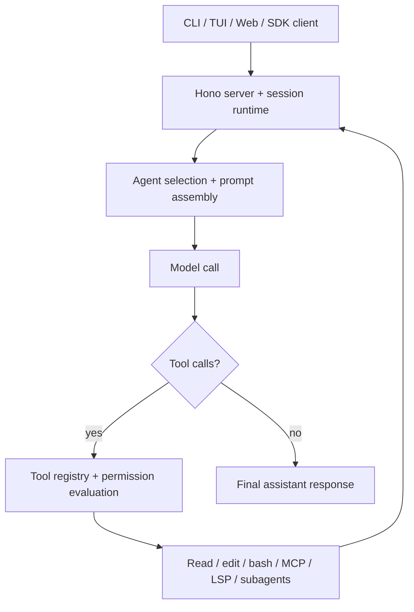

# OpenAGt

OpenAGt 是一个面向代码任务的 agentic coding 系统，通过带权限控制的工具循环，在 CLI、Web 和服务端环境中执行模型驱动的软件工作流。

<!-- Badges: add CI / release / package / docs / license badges here -->

## 概览

OpenAGt 是一个 local-first 的编码代理运行时，围绕持久化 session、工具调用、文件变更、Shell 执行和子代理编排构建。它面向希望在终端中交互使用、在浏览器中驱动，或通过无头服务与 SDK 集成编码代理的开发者。

在本项目中，“agentic coding” 的含义是：

- 用户输入会进入一个 session，而不是一次性补全
- 模型运行在一个迭代式 agent loop 中
- agent 可以调用文件读取、编辑、Shell、搜索、MCP、子代理等工具
- 工具结果会继续回流到同一个 session，直到任务收敛或被中断
- 高风险操作不会被静默执行，而是受权限系统约束

OpenAGt 是一个新项目，但当前代码库有意保留了对 OpenCode 的兼容与引用：

- runtime 仍然暴露 `opencode` CLI 兼容别名
- 配置与扩展发现机制仍会识别 `.opencode/` 和 `opencode.jsonc`
- `OPENAGT_*` 环境变量通常都保留 `OPENCODE_*` 的兼容别名

这些兼容行为是当前代码中的真实实现，不是历史注释，因此 README 会明确说明这一点。

## 核心特性

- 主代理与子代理模式。内置 agent 包括 `build`、`plan`、`general`、`explore`、`title`、`summary` 和 `compaction`。
- 迭代式 agent loop。session runtime 会反复调用模型、执行工具、处理结果，直到 session 进入 idle 状态。
- 基于工具的编码工作流。内置工具包括文件读取/编辑/写入、Shell 执行、Web 抓取与搜索、代码搜索、TODO 更新、MCP、LSP 与子代理任务编排。
- 权限感知执行。操作会按工具和模式被判定为 `allow`、`ask` 或 `deny`。
- 安全/非安全工具调度。读取/搜索类工具可并发执行；有副作用的工具会串行执行，并且对重叠路径额外阻塞。
- 模型与 provider 抽象。runtime 通过 AI SDK 生态和 provider 认证插件支持大量模型提供方。
- Provider fallback。遇到限流或服务端错误等可重试失败时，请求可切换到其他 provider/model。
- 上下文管理。session 层实现了 compaction、裁剪、summary、retry 和溢出处理。
- 无头服务与 SDK。相同 runtime 可在本地直接运行，也可通过 HTTP 和生成式 JavaScript SDK 驱动。
- 可扩展表面。agent、command、skill、plugin、MCP server 和自定义 tool 都可以通过配置与本地文件扩展。
- Session memory 注入。prompt 组装阶段会把 session memory 注入系统上下文。这一点根据 `packages/openagt/src/session/prompt.ts` 中的 `loadMemory(sessionID)` 推断成立，但面向用户的 memory 工作流文档仍需维护者补充确认。

## 演示 / 示例工作流

从源码执行一次性任务：

```bash
bun run --cwd packages/openagt src/index.ts run "Inspect the auth flow, propose a fix, and patch the bug"
```

典型执行流程：

1. OpenAGt 创建或恢复一个 session。
2. 当前主 agent 从系统指令、配置、skills、memory 和历史消息构造 prompt。
3. 模型输出文本、推理结果和 tool calls。
4. runtime 为当前 agent 和 model 解析允许使用的工具集合。
5. 权限检查决定每个工具调用是允许、拒绝还是需要审批。
6. 安全工具可并发执行；有副作用的工具会被串行化。
7. 工具输出被追加回同一个 session。
8. 模型继续被调用，直到返回最终回复或 session 被停止。

## 架构

### 高层系统设计



### 主要组件

- `packages/openagt/src/session`：session 状态、消息模型、prompt loop、compaction、retry、summary、memory、run-state
- `packages/openagt/src/tool`：tool 定义、注册表、调度、截断、路径冲突检测
- `packages/openagt/src/agent`：内置与用户自定义 agent 的加载和生成
- `packages/openagt/src/provider`：model/provider 解析、认证接线、fallback 逻辑
- `packages/openagt/src/permission`：规则、审批流程、待处理请求、审计日志
- `packages/openagt/src/server`：Hono server、路由、事件、认证中间件、UI 服务
- `packages/openagt/src/plugin`：plugin 加载与 hook 分发
- `packages/openagt/src/skill`：从本地路径和配置 URL 发现并加载 skills
- `packages/openagt/src/security`：Shell 审查、prompt injection 扫描、PowerShell 分析
- `packages/openagt/src/sandbox`：实验性隔离模式下的 sandbox broker 与策略接线

### Agent Loop / 执行生命周期

核心 runtime 位于 `packages/openagt/src/session/prompt.ts`。

高层流程如下：

1. 解析当前 session、消息历史、agent 和 model。
2. 加载系统 prompt 材料、skills、配置指令和 session memory。
3. 通过 `ToolRegistry.tools(...)` 解析工具集合。
4. 调用模型，并把 assistant parts 持续写入 session。
5. 通过调度器与权限服务执行工具调用。
6. 处理 retry、fallback、compaction、子任务分发与完成收尾。

这不是一个“独立 planner 服务 + 独立 executor 进程”的双进程结构，而是一个以 session 为中心的工具循环，内部包含：

- `build`、`plan` 等主 agent
- `general`、`explore` 等子 agent
- 允许一个 agent 把工作委托给另一个 agent 的 task 工具

### 工具调用与环境交互

内置工具注册在 `packages/openagt/src/tool/registry.ts`。

当前内置能力包括：

- `read`、`glob`、`grep`
- `edit`、`write`、`apply_patch`
- `bash`
- `webfetch`、`websearch`、`codesearch`
- `task`、`task_list`、`task_get`、`task_wait`、`task_stop`
- `todowrite`
- `skill`
- 在实验/特性开关模式下暴露的 `lsp` 与 `plan`

工具调度分两层实现：

- `packages/openagt/src/tool/partition.ts` 会标记一部分工具为可并发安全执行
- `packages/openagt/src/session/prompt/tool-resolution.ts` 即便在工具本身可并发时，也会继续阻止重叠文件/路径操作同时执行

### 规划、验证与自我纠错

runtime 已支持若干 agentic 模式，但 README 不会超出代码事实进行夸大：

- Planning：内置 `plan` agent 存在，并且默认权限配置比 `build` 更保守
- Subtasks：`task` 工具可把工作委托给子代理
- Verification：agent 可通过 `bash`、读/搜工具、MCP 或 LSP 来验证结果
- Retry and fallback：provider fallback 已针对可重试错误实现
- Self-correction：工具错误、权限拒绝、fallback 重试与 compaction 都会回流到同一个 loop 中

plan 专用工作流有一部分仍受 feature flag 控制。`plan` agent 始终存在，但某些专用规划工具只有在实验性 plan mode 开启后才可用。

## 仓库结构

| 路径 | 作用 |
| --- | --- |
| `packages/openagt` | 核心 runtime、CLI、server、session engine、tools、providers、permissions |
| `packages/app` | Solid/Vite Web 客户端 |
| `packages/sdk/js` | 生成式 JavaScript SDK，供 runtime 与客户端使用 |
| `packages/openagt_flutter` | Flutter 移动端 MVP |
| `packages/console/*` | 控制台 / control-plane 服务与 Web 应用 |
| `packages/web` | 文档 / 站点包 |
| `packages/opencode` | 兼容性遗留目录，不是主 runtime |
| `.opencode/` | 本地 project 级 agents、commands、plugins、skills、tools、themes 示例 |
| `docs/` | 额外技术分析与支持文档 |

## 安装

### 前置要求

- Bun 1.3+
- Git
- 如果要运行移动端客户端，需要 Flutter 3.41+

### 依赖安装

安装 workspace 依赖：

```bash
bun install
```

在从源码启动 runtime 之前，先生成 JavaScript SDK：

```bash
bun run --cwd packages/sdk/js script/build.ts
```

这是 fresh clone 后的必要步骤，因为 `packages/openagt` 会导入 `packages/sdk/js/src/v2/gen` 中的生成文件。

### 环境变量

runtime 支持大量环境变量。对本地开发最相关的包括：

| 变量 | 用途 |
| --- | --- |
| `OPENAGT_CONFIG` | 指定配置文件 |
| `OPENAGT_CONFIG_DIR` | 额外指定配置目录 |
| `OPENAGT_CONFIG_CONTENT` | 直接注入配置内容 |
| `OPENAGT_DISABLE_PROJECT_CONFIG` | 禁止发现项目本地配置 |
| `OPENAGT_SERVER_PASSWORD` | 为 `serve` / `web` 服务端点设置保护 |
| `OPENAGT_SERVER_USERNAME` | 服务端 Basic Auth 用户名 |
| `OPENAGT_PERMISSION` | 通过环境变量注入权限规则 |
| `OPENAGT_PURE` | 禁用外部 plugins |
| `OPENAGT_ENABLE_QUESTION_TOOL` | 强制启用 question 工具 |
| `OPENAGT_ENABLE_EXA` | 在适用路径中启用 Exa 搜索工具 |
| `OPENAGT_EXPERIMENTAL` | 启用实验特性集合 |
| `OPENAGT_EXPERIMENTAL_PLAN_MODE` | 启用 plan-mode 专用工具 |
| `OPENAGT_DB` | 覆盖数据库路径 |

兼容性说明：

- 大多数 `OPENAGT_*` 变量在 `packages/openagt/src/flag/flag.ts` 中都保留了 `OPENCODE_*` 镜像别名。

### 安装步骤

```bash
git clone <this-repo>
cd OpenAG
bun install
bun run --cwd packages/sdk/js script/build.ts
```

可选但实用：

```bash
bun run --cwd packages/openagt src/index.ts debug paths
```

该命令会打印当前环境生效的数据、配置、缓存和状态目录。

## 快速开始

### 启动 CLI / TUI

```bash
bun run --cwd packages/openagt src/index.ts
```

### 运行一次性任务

```bash
bun run --cwd packages/openagt src/index.ts run "Summarize the repository structure"
```

### 启动无头服务

```bash
set OPENAGT_SERVER_PASSWORD=change-me
bun run --cwd packages/openagt src/index.ts serve --port 4096
```

### 启动 Web 流程

```bash
set OPENAGT_SERVER_PASSWORD=change-me
bun run --cwd packages/openagt src/index.ts web --port 4096
```

### 添加 Provider 凭据

```bash
bun run --cwd packages/openagt src/index.ts providers login
```

## 使用方式

### 基础命令 / 入口点

当前顶层 CLI 主要暴露以下命令：

| 命令 | 作用 |
| --- | --- |
| `openagt` | 为当前项目启动默认交互式 TUI |
| `openagt run [message..]` | 在终端中执行一次性 agent session |
| `openagt serve` | 启动无头服务 |
| `openagt web` | 启动服务并打开 Web 界面 |
| `openagt session list` | 列出 sessions |
| `openagt session delete <id>` | 删除 session |
| `openagt providers ...` | 管理 provider 凭据 |
| `openagt mcp ...` | 管理 MCP servers 与 OAuth 认证 |
| `openagt agent create` | 生成新的 agent 定义 |
| `openagt debug ...` | 用于排障的工具、配置/路径检查、skill debug 等 |

从源码运行时可使用：

```bash
bun run --cwd packages/openagt src/index.ts --help
```

### 示例任务

本地直接运行：

```bash
bun run --cwd packages/openagt src/index.ts run "Find duplicated auth code and propose a refactor"
```

附着到本地/远端运行中的 server：

```bash
bun run --cwd packages/openagt src/index.ts run \
  --attach http://localhost:4096 \
  --password change-me \
  "Review the test failures and explain the root cause"
```

指定 agent 或 model：

```bash
bun run --cwd packages/openagt src/index.ts run \
  --agent build \
  --model openai/gpt-4o-mini \
  "Add logging around provider fallback"
```

### 常见工作流

交互式编码：

```bash
bun run --cwd packages/openagt src/index.ts
```

Provider 配置：

```bash
bun run --cwd packages/openagt src/index.ts providers login
bun run --cwd packages/openagt src/index.ts models
```

MCP 配置：

```bash
bun run --cwd packages/openagt src/index.ts mcp add
bun run --cwd packages/openagt src/index.ts mcp list
```

Session 检查：

```bash
bun run --cwd packages/openagt src/index.ts session list
```

## 配置

### 配置文件发现机制

配置解析目前带有明显的兼容层，整体仍更接近 OpenCode 时代的命名和布局。

runtime 会查找：

- XDG 配置目录下 `openagt` 对应的全局配置
- 项目本地的 `.openagt/` 与 `.opencode/` 目录
- `opencode.jsonc`、`opencode.json` 和旧版 `config.json` 等配置文件名

这部分行为实现于：

- `packages/openagt/src/config/paths.ts`
- `packages/openagt/src/config/config.ts`

因此，虽然项目名是 OpenAGt，但当前配置文件格式本质上仍与 `opencode.jsonc` 兼容。

### 常用配置域

主配置 schema 支持的内容包括但不限于：

- 默认模型选择
- provider 配置与 fallback chain
- agent 覆盖
- MCP server 配置
- 权限规则
- plugin 声明
- skills 路径 / URL
- compaction 设置
- 实验性 sandbox 配置

示例：

```jsonc
{
  "model": "openai/gpt-4o-mini",
  "default_agent": "build",
  "permission": {
    "bash": "ask",
    "edit": {
      "*": "ask"
    }
  },
  "provider": {
    "openai": {
      "fallback": {
        "enabled": true,
        "chain": [
          {
            "provider": "anthropic",
            "model": "claude-3.5-haiku"
          }
        ]
      }
    }
  },
  "experimental": {
    "sandbox": {
      "enabled": true,
      "backend": "process"
    }
  }
}
```

### Agents、Commands、Skills、Tools、Plugins

项目可通过本地 Markdown 与 TypeScript/JavaScript 文件进行自定义：

- agents：`{agent,agents}/**/*.md`
- modes：`{mode,modes}/*.md`
- commands：`{command,commands}/**/*.md`
- tools：`{tool,tools}/*.{ts,js}`
- plugins：`{plugin,plugins}/*.{ts,js}` 以及配置中声明的 plugin 规格
- skills：`{skill,skills}/**/SKILL.md`

仓库根目录下的 `.opencode/` 已提供一组示例。

## 工具链 / 集成

### 模型 Providers

runtime 依赖 AI SDK 生态及 provider 专用辅助库。依赖中可见的 provider 支持包括：

- OpenAI
- Anthropic
- Google / Vertex
- Amazon Bedrock
- Azure OpenAI
- OpenRouter
- Groq
- Mistral
- Cohere
- Perplexity
- Together AI
- xAI
- Alibaba
- Cerebras
- DeepInfra
- GitLab AI
- Cloudflare Workers AI

Provider 凭据可通过以下流程管理：

```bash
bun run --cwd packages/openagt src/index.ts providers login
```

### MCP

项目对 MCP 提供一等支持：

- 本地命令式 MCP servers
- 远端 MCP servers
- 支持 OAuth 的远端 MCP 认证流程

可用 CLI 流程：

```bash
bun run --cwd packages/openagt src/index.ts mcp add
bun run --cwd packages/openagt src/index.ts mcp list
bun run --cwd packages/openagt src/index.ts mcp auth
bun run --cwd packages/openagt src/index.ts mcp debug <name>
```

### LSP

runtime 中存在 LSP 集成；在实验模式下，LSP tool 可以被暴露给 agent。相关实现位于 `packages/openagt/src/lsp`，并由 tool registry 控制是否启用。

### Plugins 与 Skills

Plugins 可以接入 runtime 事件、认证流程、tool 定义和其他扩展点。Skills 则提供基于 Markdown 的任务指令包。这两者在本仓库中都是真实存在的扩展机制，而不是未来占位说明。

## 安全 / 权限模型

### Human-in-the-Loop 执行

OpenAGt 默认不是 YOLO 式自动执行代理。

权限规则按工具与模式被评估为：

- `allow`
- `ask`
- `deny`

实现位于 `packages/openagt/src/permission`。

关键行为：

- 规则会从默认值、配置、agent 覆盖和 session 状态中合并
- 最后匹配到的规则优先
- 被拒绝的调用会立即失败
- `ask` 模式的调用会发出权限请求并等待回复

内置 `plan` agent 的权限配置比 `build` 更严格，其设计目标是在规划阶段尽量减少写权限。

### CLI 行为

`run` 命令默认是保守模式：

- 如果需要权限审批，默认会被自动拒绝，除非你显式批准
- `--dangerously-skip-permissions` 会改变这一行为，应视为不安全选项

### Shell 审查与命令安全

安全层包含：

- 面向 POSIX 风格命令的危险模式检测
- PowerShell 专用危险 cmdlet 检测
- 自定义的 PowerShell token / AST 分析
- prompt injection 扫描与清洗

这些都是仓库中的真实逻辑，但仍属于启发式防护，而不是形式化安全证明。

### 服务端安全

如果没有设置 `OPENAGT_SERVER_PASSWORD`，`serve` 和 `web` 会发出未加固警告。如果服务要暴露给 localhost 之外的环境，应先配置认证信息。

### Sandbox

runtime 中包含 sandbox broker / policy 代码和实验性 sandbox 配置。这部分代码确实存在，但实际隔离效果受平台与部署方式影响，应视为需要谨慎验证的运行能力。

## 局限性

- 命名迁移尚未完成。配置文件、目录、prompt 和别名中仍保留大量 `opencode` 命名。
- fresh clone 后需要先生成 SDK，核心 runtime 才能从源码正常启动。
- 某些功能仍受特性开关或客户端能力限制，例如 plan 专用工具、Exa 搜索和 LSP tool。
- 仓库中仍有对当前快照里不存在包的陈旧引用，例如 `packages/desktop-electron`。
- 固定 token 节省或固定延迟收益等性能数字并未在仓库内提供 benchmark 支撑，不应视为已验证结论。
- Flutter 客户端存在且可运行为 MVP，但不应默认假设其已经功能完整。
- Session memory 确实会注入 prompt 组装流程，但面向用户的管理模型仍需要维护者提供更清晰文档。

## 开发

### 本地运行

核心 runtime：

```bash
bun run --cwd packages/openagt src/index.ts
```

Web 应用：

```bash
bun run --cwd packages/app dev
```

文档 / 站点：

```bash
bun run --cwd packages/web dev
```

Flutter 客户端：

```bash
cd packages/openagt_flutter
flutter pub get
flutter run
```

### 测试

不要在仓库根目录运行测试。根目录 `test` 脚本会故意失败并提示这一点。

应在具体包目录中执行：

```bash
cd packages/openagt
bun test
```

### Lint / Type Checking

仓库级 lint：

```bash
bun lint
```

推荐的包级类型检查：

```bash
cd packages/openagt
bun typecheck
```

仓库约定明确建议使用包目录下的 `bun typecheck`，而不是直接调用 `tsc`。

## 扩展系统

### 添加 Tools

你可以通过两种主要方式添加工具：

- 在 `.opencode/tool/` 或 `.opencode/tools/` 下放置本地 TS/JS 文件
- 通过 plugin 导出的 `tool` 能力扩展

tool registry 会扫描发现到的配置目录中的 `{tool,tools}/*.{ts,js}`。

### 添加 Agents

交互式创建 agent：

```bash
bun run --cwd packages/openagt src/index.ts agent create
```

或手动在以下位置添加 Markdown 定义：

- `.opencode/agent/*.md`
- `.opencode/agents/**/*.md`

loader 也会通过配置发现 `.openagt` 风格目录。

### 添加 Commands

Commands 是从以下位置加载的 Markdown 模板：

- `.opencode/command/*.md`
- `.opencode/commands/**/*.md`

这些模板可以指定特定 agent 或 model，也可以作为子任务运行。

### 添加 Skills

Skill 包可放在：

- `.opencode/skill/**/SKILL.md`
- `.opencode/skills/**/SKILL.md`

其他 skill 来源也可以通过 `skills.paths` 和 `skills.urls` 配置。

### 添加 Plugins

Plugins 可以通过以下方式接入：

- 在配置中通过 `plugin` 字段声明
- 从本地 `.opencode/plugin(s)` 目录加载
- 通过 `OPENAGT_PURE` 整体禁用

### 修改 Prompts / Policies / Workflows

重要的内置 prompt 和策略代码主要位于：

- `packages/openagt/src/session/prompt.ts`
- `packages/openagt/src/session/prompt/*.txt`
- `packages/openagt/src/agent`
- `packages/openagt/src/permission`

如果你要修改 agent workflow 本身，这些是优先应该阅读的核心文件。

## 故障排查

### “Cannot find module './gen/types.gen.js'”

先生成 SDK：

```bash
bun run --cwd packages/sdk/js script/build.ts
```

### “Server is unsecured”

在将 `serve` 或 `web` 用于 localhost 之外的环境前，先设置服务端认证：

```bash
set OPENAGT_SERVER_PASSWORD=change-me
set OPENAGT_SERVER_USERNAME=openagt
```

### 配置没有生效

检查实际配置/搜索路径：

```bash
bun run --cwd packages/openagt src/index.ts debug paths
```

注意当前配置发现逻辑仍会查找 `opencode.jsonc`、`opencode.json` 与 `.opencode/` 内容。

### MCP 认证问题

使用内置诊断命令：

```bash
bun run --cwd packages/openagt src/index.ts mcp list
bun run --cwd packages/openagt src/index.ts mcp auth
bun run --cwd packages/openagt src/index.ts mcp debug <name>
```

### Provider 登录问题

```bash
bun run --cwd packages/openagt src/index.ts providers login
bun run --cwd packages/openagt src/index.ts providers list
```

## License

MIT。见 [LICENSE](./LICENSE)。
