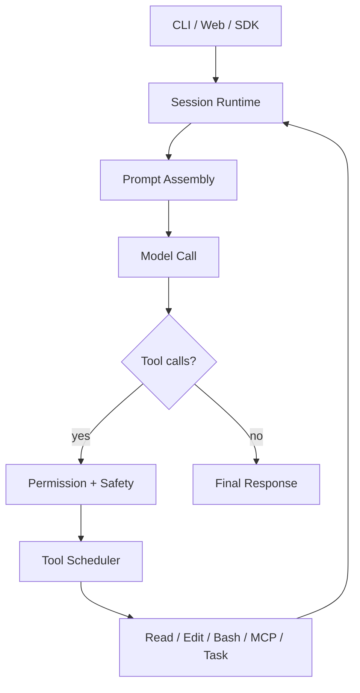
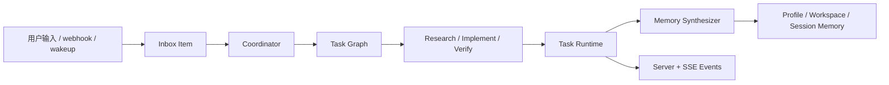

# OpenAGt

OpenAGt 是一个面向 CLI、Server 和 Web 工作流的本地优先 agentic coding 运行时。

它围绕编码模型建立了一个迭代式工具循环：读取文件、编辑代码、执行 Shell、调用 MCP 工具、管理任务，并把整个过程放在持久化 session 中，而不是一次性补全。

## 概览

OpenAGt 当前围绕四个核心思路构建：

- 以 session 为中心，而不是一次性 completion
- 通过权限系统控制工具调用，而不是静默执行高风险操作
- 以后端 runtime 为核心组织多步骤编码流程
- 在命名迁移阶段保留与 `opencode` 的兼容能力

当前稳定版支持范围：

- CLI / TUI
- 无头 server
- JavaScript SDK

当前稳定版不包含：

- Flutter 客户端分发

技术文档：

- [技术架构](docs/technical/architecture.md)
- [Windows 签名说明](docs/release/windows-signing.md)

## OpenCode vs OpenAGt

下面的对比基于 OpenCode 官方开源仓库和 README，而不是只看命名。

| 主题 | OpenCode | OpenAGt |
| --- | --- | --- |
| 运行时中心 | 以 client/server coding agent 为基础，并且明显强调 TUI 体验 | 以后端 session runtime 为中心，再向 CLI、TUI、server、SDK 暴露 |
| Agent loop | 通用编码代理，内置 `build` / `plan` agent，并带有 subagent 能力 | 以 session 为中心的迭代工具循环，并在其上扩展 task runtime、coordinator graph、personal-agent primitives |
| Provider 策略 | 官方文档明确强调 provider-agnostic，可接 Claude、OpenAI、Google、本地模型 | 多 provider runtime，带 provider fallback、server 暴露和生成式 JavaScript SDK |
| LSP 集成 | 官方 README 明确强调开箱即用的 LSP 支持 | LSP 作为工具运行时的一部分接入，可与 read/edit/bash/MCP/task 一起进入同一个 session loop |
| 安全模型 | agent mode 与 permission prompt 是 CLI 体验的重要组成部分 | 结构化审批与安全边界：`allow/confirm/block`、`shell_safety`、exec policy、sandbox policy |
| 编排重点 | 更偏 terminal-first 的编码流，并保留 client/server 远程驱动潜力 | 更偏 Coordinator Runtime v1、任务图调度、Inbox、Wakeup，以及 profile/workspace/session 持久记忆 |
| 前端形态 | TUI 优先，官方项目同时提供 desktop app beta | 当前稳定版以 CLI、TUI、headless server、JavaScript SDK 为主，Flutter 延后 |
| 迁移 / 兼容 | 原生源项目 | 在迁移阶段保留 `opencode` CLI alias 与 `.opencode` 配置兼容 |

## 发布

当前稳定版本：

- [v1.15.1](https://github.com/Yecyi/OpenAGt/releases/tag/v1.15.1)

当前发布资产：

- `OpenAGt-Setup-x64.msi`
- `openagt-windows-x64.zip`
- `openagt-linux-x64.tar.gz`
- `openagt-macos-arm64.tar.gz`
- `openagt-macos-x64.tar.gz`
- `SHA256SUMS.txt`

安装细节见：

- [稳定版安装说明](docs/install/stable.md)

## 核心技术

当前稳定版后端的核心能力包括：

- 迭代式 session runtime
- 针对 Shell 和工具调用的权限与安全封装
- Coordinator Runtime v1 的任务图编排
- Profile / Workspace / Session 三层持久化记忆
- Inbox、scheduler、wakeup 这些长时代理原语
- 无头 server 与生成式 JavaScript SDK
- 跨平台打包与 Windows MSI 分发

## 验证矩阵

| 能力 | 状态 |
| --- | --- |
| Session runtime 和工具循环 | 稳定 |
| Approval and Safety Envelope | 稳定，并带版本化 `shell_safety` |
| Coordinator Runtime | 已实现，v1.16 继续收口 |
| Personal Agent Core | 已实现，v1.16 继续收口 |
| Debug doctor / repro bundle | v1.16 诊断能力 |
| Flutter 前端 | 路线图；先稳定后端契约 |

## 关键能力

- 持久化 session 驱动的 agent loop
- 文件读取、编辑、patch、写入工具
- 带权限控制和结构化安全元数据的 Shell 执行
- MCP、搜索、LSP、任务委托能力
- Coordinator Runtime v1 的依赖感知任务图执行
- Personal Agent Core v1 的长期记忆和 inbox 能力
- Headless server + JavaScript SDK
- `opencode` 兼容别名

## 流程图

### 请求生命周期



### Coordinator + Personal Agent



完整技术拆解见：

- [技术架构](docs/technical/architecture.md)

## 安装

### Windows

推荐方式：

- 下载 `OpenAGt-Setup-x64.msi`
- 安装完成后重新打开一个终端
- 运行：

```powershell
openagt
```

兼容别名：

```powershell
opencode
```

便携方式：

- 解压 `openagt-windows-x64.zip`
- 运行 `bin\openagt.exe` 或 `bin\openagt.cmd`

注意：

- 当前 Windows 资产**未签名**
- Windows SmartScreen 可能显示 `Unknown publisher`
- 签名相关技术细节单独放在 [Windows 签名说明](docs/release/windows-signing.md)

### macOS / Linux

解压对应平台压缩包后运行：

```bash
./bin/openagt --help
./bin/opencode --help
```

### 校验下载

安装前请对照 `SHA256SUMS.txt` 校验下载文件。

## 快速开始

### 从源码运行

```bash
bun install
bun run --cwd packages/sdk/js script/build.ts
bun run --cwd packages/openagt src/index.ts --help
```

### 启动交互式 CLI

```bash
bun run --cwd packages/openagt src/index.ts
```

### 执行一次性任务

```bash
bun run --cwd packages/openagt src/index.ts run "Summarize the repository structure"
```

### 启动 Server

```bash
set OPENAGT_SERVER_PASSWORD=change-me
bun run --cwd packages/openagt src/index.ts serve --port 4096
```

### 启动 Web 流程

```bash
set OPENAGT_SERVER_PASSWORD=change-me
bun run --cwd packages/openagt src/index.ts web --port 4096
```

### 添加 Provider 凭据

```bash
bun run --cwd packages/openagt src/index.ts providers login
```

## 核心 Runtime Surface

当前稳定版后端暴露这些事件族：

- `coordinator.*`
- `inbox.*`
- `scheduler.*`
- `memory.updated`

Shell 权限请求还会带结构化的 `shell_safety` 元数据。

## 主要命令

| 命令 | 作用 |
| --- | --- |
| `openagt` | 启动默认交互式 CLI / TUI |
| `openagt run [message..]` | 运行一次性任务 |
| `openagt serve` | 启动无头 server |
| `openagt web` | 启动 server 和 web UI |
| `openagt session list` | 列出 session |
| `openagt providers login` | 添加或刷新 provider 凭据 |
| `openagt mcp list` | 查看 MCP 配置 |
| `openagt debug paths` | 打印有效路径 |

## 仓库结构

| 路径 | 作用 |
| --- | --- |
| `packages/openagt` | 核心 runtime、CLI、server、tools、session engine |
| `packages/app` | Solid/Vite Web 客户端 |
| `packages/sdk/js` | 生成式 JavaScript SDK |
| `packages/openagt_flutter` | Flutter 移动端 MVP |
| `packages/console/*` | 控制台与 control-plane 包 |
| `packages/opencode` | 兼容遗留目录，不是主 runtime |
| `.opencode/` | 本地 agents、commands、plugins、skills、tools、themes 示例 |
| `docs/` | 发布、安装、技术文档 |

## 兼容性

当前项目仍然保留与 OpenCode 的迁移兼容：

- `opencode` 仍然作为 CLI 别名存在
- 配置发现仍识别 `.opencode/`
- `OPENAGT_*` 普遍保留 `OPENCODE_*` 的兼容别名

这些都是当前真实行为，不是历史注释。

## 开发

### 依赖安装

```bash
bun install
bun run --cwd packages/sdk/js script/build.ts
```

fresh clone 后需要先生成 SDK。

### 本地运行

核心 runtime：

```bash
bun run --cwd packages/openagt src/index.ts
```

Web：

```bash
bun run --cwd packages/app dev
```

Flutter MVP：

```bash
cd packages/openagt_flutter
flutter pub get
flutter run
```

### 测试

不要在仓库根目录直接跑测试。

请使用 package 级命令：

```bash
cd packages/openagt
bun typecheck
bun test
```

## 配置与环境变量

常用环境变量：

| 变量 | 作用 |
| --- | --- |
| `OPENAGT_CONFIG` | 指定配置文件 |
| `OPENAGT_CONFIG_DIR` | 添加显式配置目录 |
| `OPENAGT_CONFIG_CONTENT` | 直接注入配置内容 |
| `OPENAGT_DISABLE_PROJECT_CONFIG` | 忽略项目本地配置 |
| `OPENAGT_SERVER_PASSWORD` | 保护 `serve` / `web` |
| `OPENAGT_SERVER_USERNAME` | server 基本认证用户名 |
| `OPENAGT_PERMISSION` | 通过环境变量注入权限规则 |
| `OPENAGT_PURE` | 禁用外部插件 |
| `OPENAGT_EXPERIMENTAL` | 启用实验特性包 |
| `OPENAGT_EXPERIMENTAL_PLAN_MODE` | 启用 plan-mode 特定工具 |
| `OPENAGT_DB` | 覆盖数据库路径 |

## 扩展 OpenAGt

你可以通过以下方式扩展系统：

- 在 `.opencode/agent` 或 `.opencode/agents` 下添加 agents
- 在 `.opencode/command` 或 `.opencode/commands` 下添加 commands
- 在 `.opencode/skill` 或 `.opencode/skills` 下添加 skills
- 在 `.opencode/tool` 或 `.opencode/tools` 下添加 tools
- 通过配置或本地目录加载 plugins

如果要调整运行时核心流程，建议先从这些位置开始看：

- `packages/openagt/src/session/prompt.ts`
- `packages/openagt/src/tool`
- `packages/openagt/src/agent`
- `packages/openagt/src/permission`

## 故障排查

### SDK 生成错误

如果提示缺少生成式 SDK 文件：

```bash
bun run --cwd packages/sdk/js script/build.ts
```

### Server 未加保护

如果要在 localhost 之外使用 `serve` 或 `web`，先设置凭据：

```bash
set OPENAGT_SERVER_PASSWORD=change-me
set OPENAGT_SERVER_USERNAME=openagt
```

### 配置没有生效

检查有效路径：

```bash
bun run --cwd packages/openagt src/index.ts debug paths
```

### MCP 认证问题

```bash
bun run --cwd packages/openagt src/index.ts mcp list
bun run --cwd packages/openagt src/index.ts mcp auth
bun run --cwd packages/openagt src/index.ts mcp debug <name>
```

### Provider 登录问题

```bash
bun run --cwd packages/openagt src/index.ts providers login
bun run --cwd packages/openagt src/index.ts providers list
```

## License

MIT。见 [LICENSE](LICENSE)。
