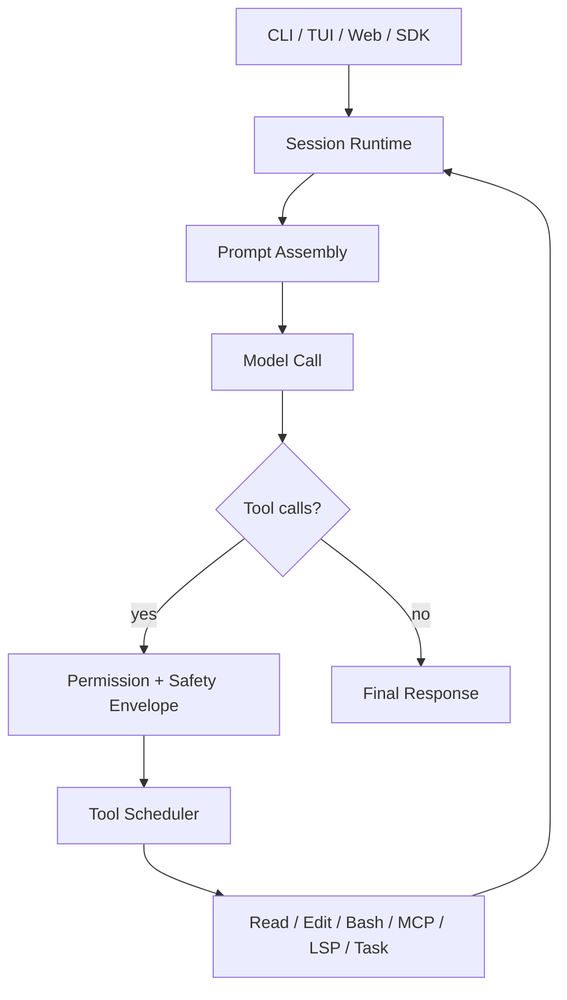
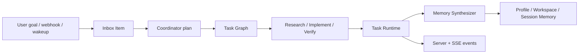

## Highlights

- OpenAGt now ships as a stable cross-platform CLI and server runtime for Windows, macOS, and Linux.
- Coordinator Runtime v1 turns task delegation into a real task-graph execution model with dependency ordering, `write_scope`, `read_scope`, acceptance checks, and execution priority.
- Personal Agent Core v1 adds durable backend primitives for profile/workspace/session memory, inbox items, wakeups, and normalized multi-entry ingestion.
- Approval and Safety Envelope v1 standardizes shell approval metadata with structured `shell_safety` payloads across runtime, TUI, server, and SDK surfaces.
- Stable packaging is now aligned around first-party release assets, checksum generation, and a Windows MSI that installs `openagt` into `PATH`.

## Key Features

- Interactive CLI / TUI runtime with iterative tool-use sessions
- Headless server mode plus JavaScript SDK integration
- Coordinator task graph orchestration for agentic coding workflows
- Personal memory ranking with SQLite FTS5-backed retrieval
- Inbox, scheduler, and wakeup primitives for long-running personal agent behavior
- Structured shell approvals with policy, boundary, and approval metadata
- Stable release artifacts for Windows, macOS, and Linux
- `opencode` compatibility alias retained for transition safety

## Architecture

### Runtime Flow



### Coordinator + Personal Agent



## New in v1.15.0

### Coordinator Runtime v1

- Adds DAG-style task planning and execution boundaries to the existing task runtime
- Supports `write_scope`, `read_scope`, `acceptance_checks`, `priority`, and `origin`
- Enforces dependency ordering and safer parallelism rules for agentic coding tasks
- Exposes new backend events through `coordinator.*`

### Personal Agent Core v1

- Adds durable backend entities for profile, workspace, and session memory
- Introduces inbox items and scheduled wakeups as first-class runtime concepts
- Adds normalized multi-entry ingestion from session, scheduled, and webhook-style sources
- Exposes new backend events through `inbox.*`, `scheduler.*`, and `memory.updated`

### Approval & Safety Envelope v1

- Unifies shell approval metadata as structured `shell_safety`
- Carries approval kind, policy reason, risk level, boundary state, and summary text
- Keeps TUI, runtime, server, and SDK consumers aligned on the same safety shape

### Packaging and Release Engineering

- Adds stable release workflow automation
- Standardizes asset naming across supported platforms
- Adds checksum generation and release note generation
- Adds a Windows MSI installer with embedded cabinet content
- MSI installs `openagt` into system `PATH`; `opencode` remains available as a compatibility alias

### Security and CI Hardening

- Removes the public website/share web surface from the supported release path
- Hardens MCP OAuth callback handling, redirect URI validation, timeout budgeting, and resumed transport lifecycle
- Replaces long-lived PTY WebSocket credential URLs with short-lived one-time tickets while keeping legacy compatibility for one transition cycle
- Tightens auth, secret, provider, proxy, read, and edit behavior around schema validation, atomic writes, scoped environment variables, header forwarding, binary size limits, and overwrite checks
- Vendors the current SolidStart snapshot with safe `h3`/`srvx` dependency metadata and blocks the old `pkg.pr.new` source through `check:audit-policy`

## Install / Upgrade

- Stable installs are shipped through GitHub Release assets
- Windows users should prefer `OpenAGt-Setup-x64.msi`
- macOS and Linux users should use the matching archive for their platform
- Portable Windows use remains available through `openagt-windows-x64.zip`
- Source builds still require SDK generation:

```bash
bun run --cwd packages/sdk/js script/build.ts
```

## Release Assets

- `OpenAGt-Setup-x64.msi`
- `openagt-windows-x64.zip`
- `openagt-linux-x64.tar.gz`
- `openagt-macos-arm64.tar.gz`
- `openagt-macos-x64.tar.gz`
- `SHA256SUMS.txt`

## Compatibility / Breaking Notes

- `openagt` is the primary release identity
- The `opencode` compatibility alias remains available for existing workflows
- This release line only covers CLI, server, and the JavaScript SDK
- Flutter is not part of the `v1.15.0` support matrix
- Stable packaging is distributed through GitHub Release assets, not npm, Homebrew, or winget

## Validation

- `bun run release:verify` passes and now covers SDK generation, source integrity, audit policy, `bun audit --json`, lint, package-level typechecks for runtime, app, shared, UI, plugin, enterprise, console, function, and SDK packages, plus focused runtime and security tests
- Additional release-critical split suites covering CLI smoke, session, tool, installation, MCP, provider, PTY, file, snapshot, storage, and supporting runtime modules pass on the release branch
- Cross-platform release artifacts have been generated locally and checksummed in `packages/openagt/dist`

## Known Issues

- Some legacy `opencode`-named scripts and compatibility paths remain in the repository during the OpenAGt naming transition
- Flutter client artifacts are not shipped in this release
- The following tests remain skipped:
  - `tool.bash abort > captures stderr in output`
  - `Worktree > createFromInfo > creates and bootstraps git worktree`
  - `unicode filenames modification and restore`

## Checksums / Assets

- Every published asset is accompanied by `SHA256SUMS.txt`
- Validate the downloaded artifact against the checksum file before installation
