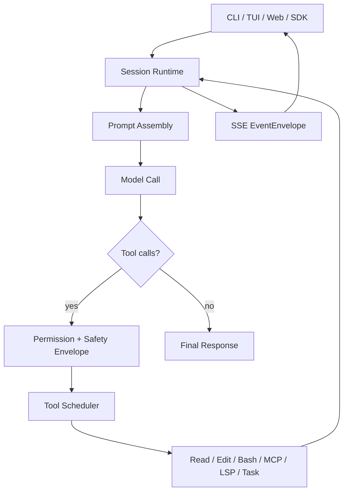
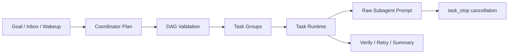

# OpenAGt v1.16.0 Release Notes

## Highlights

OpenAGt v1.16.0 is a stability, safety, and release-trust release for the CLI/server/SDK runtime.

The main theme is making the backend runtime easier to ship and diagnose: Coordinator dispatch is stricter, raw subagent cancellation is safer, SSE/OpenAPI contracts now match the emitted event envelope, SDK helpers preserve coordinator group data, and release verification has a single automated entrypoint.

Flutter is not included in the v1.16 stable artifact set. This release freezes the backend contracts Flutter will consume later.

## Key Features

- Coordinator Runtime hardening:
  - duplicate node ids are rejected before task graph execution
  - dispatch uses an atomic pending-to-running transition
  - missing prompt executor now fails tasks instead of leaving runs active forever
  - raw subagent prompts can be cancelled through `task_stop`
- SSE and SDK contract stability:
  - `/event` OpenAPI schema documents the actual event envelope
  - events include `schema_version`, `event_id`, `trace_id`, `timestamp`, `type`, and `properties`
  - `getCoordinatorProjection()` preserves `groups`
- Safety and approval metadata:
  - `shell_safety.version = 1`
  - stable approval kinds and boundary/policy metadata
  - high-risk shell regression coverage for remote scripts, destructive commands, privilege escalation, and git context redirection
- Debug and support:
  - `openagt debug doctor`
  - `openagt debug bundle --session <id>`
  - sanitized diagnostic output for support and reproduction
- Release automation:
  - `bun run verify:v1.16`
  - checksums and SBOM in release assets
  - Windows assets can ship unsigned when signing secrets are not configured; SmartScreen risk is documented below

## Technical Architecture





## Install / Upgrade

Stable release assets:

- `OpenAGt-Setup-x64.msi`
- `openagt-windows-x64.zip`
- `openagt-linux-x64.tar.gz`
- `openagt-macos-arm64.tar.gz`
- `openagt-macos-x64.tar.gz`
- `SHA256SUMS.txt`
- SBOM

Windows:

```powershell
openagt
opencode
openagt --version
openagt debug doctor
```

macOS / Linux:

```bash
./bin/openagt --help
./bin/openagt --version
./bin/openagt serve --help
```

Verify downloaded assets against `SHA256SUMS.txt` before installation.

## Compatibility / Breaking Notes

- Existing `opencode` aliases remain available.
- `.opencode` config compatibility remains available.
- Existing clients can continue reading SSE events by `type` and `properties`.
- New clients should validate the full EventEnvelope.
- Flutter is not part of the stable support matrix for v1.16.

## Verification Matrix

| Area | Command / Coverage |
| --- | --- |
| OpenAGt typecheck | `bun typecheck` in `packages/openagt` |
| Coordinator / task runtime | focused coordinator, task runtime, task tool, and event envelope tests |
| Security | `bun test test/security/*.test.ts --timeout 30000` |
| SDK | `bun typecheck`, SDK helper tests, and SDK generation |
| Release | `bun run release:verify` |
| Full v1.16 gate | `bun run verify:v1.16` |

## Known Issues

- Windows SmartScreen may warn on unsigned Windows assets with `Unknown publisher`.
- Windows signing is optional for this release; signed assets require Azure Trusted Signing secrets.
- Flutter remains a backend-contract consumer target, not a released v1.16 client.

## Checksums / Assets

Checksums are published in `SHA256SUMS.txt` alongside release assets. The release verification flow also writes `.artifacts/v1.16/verification-report.json` and `.artifacts/v1.16/verification-report.md` for local auditability.
