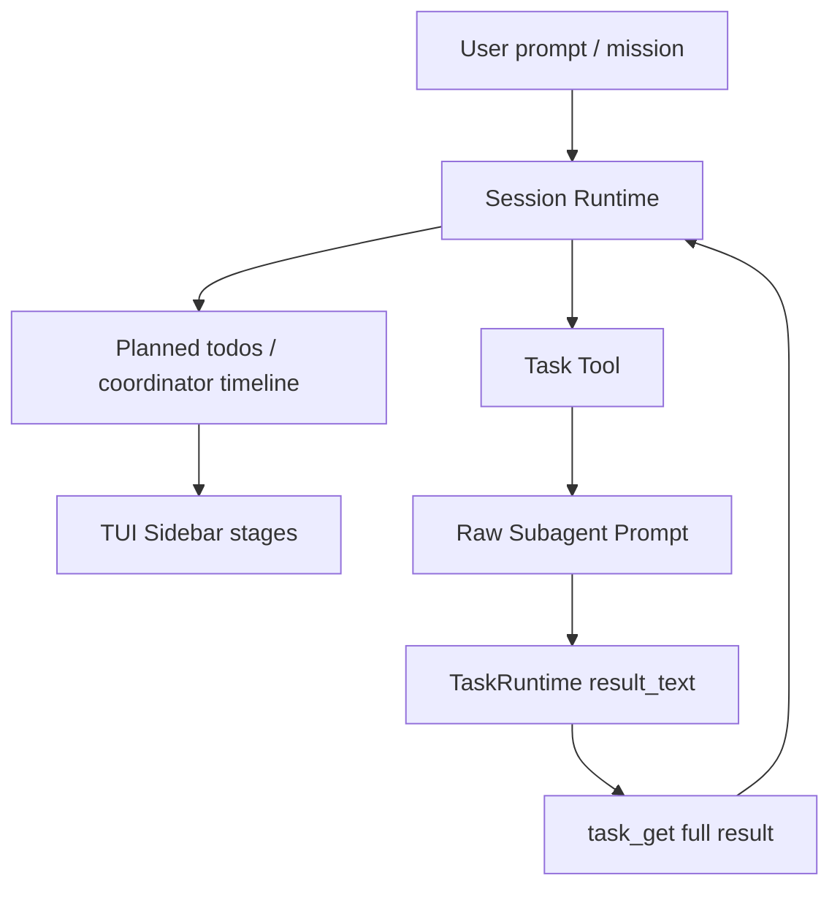
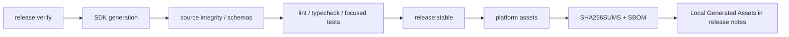

# OpenAGt v1.17.0 Release Notes

## Highlights

OpenAGt v1.17.0 is a task/subagent visibility and release-correctness release for the CLI/server/SDK runtime.

The main theme is making broad project analysis and long-running task delegation easier to trust: task results are persisted with full retrievable content, `task_get` returns useful output instead of status-only summaries, the TUI sidebar exposes planned stages before execution, and release notes now distinguish full platform matrices from the assets generated by a local platform run.

Flutter is not included in the v1.17 release artifact set. This release continues to freeze backend contracts for later Flutter consumption.

## Key Features

- Task and subagent result retrieval:
  - completed task output is stored as full `result_text` metadata
  - `task_get` returns structured full or partial content in a `<task_result>` envelope
  - retryable partial task results remain distinguishable from completed results
  - parent agents are steered toward `task_get` for existing results instead of resuming completed tasks
- TUI planning visibility:
  - sidebar stages can show planned session todos and coordinator timeline items before execution graph updates arrive
  - current task status, stages, and subagent overview remain visible during broad analysis runs
- Exploration reliability:
  - broad repository analysis prompts now prefer read-only inventory tools over shell directory listing
  - bash tool descriptions explicitly discourage using Bash for routine repository file discovery when safer tools are available
- Release automation:
  - `bun run verify:v1.17`
  - `release:stable` appends a local generated asset list to `packages/openagt/dist/release-notes.md`
  - checksums and SBOM remain generated with release assets
  - Windows assets can ship unsigned for RC builds; SmartScreen risk is documented below
- Windows installer flow:
  - newer MSI versions upgrade previous OpenAGt installs with the same upgrade identity
  - users can choose the installation folder during setup
  - `GETTING_STARTED.txt` is installed and exposed from the Start Menu
  - the WiX build now fails hard if the MSI cannot be produced
- Continued v1.16 hardening baseline:
  - Coordinator duplicate node rejection
  - atomic pending-to-running task startup
  - EventEnvelope schema alignment
  - SDK coordinator projection group preservation
  - raw subagent cancellation through `task_stop`

## Technical Architecture





## Install / Upgrade

Full release matrix assets when all platform jobs are run:

- `OpenAGt-Setup-x64.msi`
- `openagt-windows-x64.zip`
- `openagt-linux-x64.tar.gz`
- `openagt-macos-arm64.tar.gz`
- `openagt-macos-x64.tar.gz`
- `SHA256SUMS.txt`
- SBOM

A local `bun run release:stable` run appends a `Local Generated Assets` section to `packages/openagt/dist/release-notes.md` with the exact files produced on the current platform.

Windows:

- `OpenAGt-Setup-x64.msi` supports choosing the install folder.
- A newer MSI upgrades the previous OpenAGt install; rerunning the same MSI version uses the standard Windows repair / maintenance flow.
- After installation, open a new terminal so PATH changes are loaded.
- The installer writes `GETTING_STARTED.txt` and a Start Menu shortcut named `OpenAGt Getting Started`.

```powershell
openagt
opencode
openagt --version
openagt debug doctor
```

macOS / Linux:

```bash
./bin/openagt --help
./bin/openagt --version
./bin/openagt serve --help
```

Verify downloaded assets against `SHA256SUMS.txt` before installation.

## Compatibility / Breaking Notes

- Existing `opencode` aliases remain available.
- `.opencode` config compatibility remains available.
- Existing clients can continue reading SSE events by `type` and `properties`.
- New clients should validate the full EventEnvelope.
- Flutter is not part of the stable support matrix for v1.17.

## Verification Matrix

| Area                       | Command / Coverage                                                     |
| -------------------------- | ---------------------------------------------------------------------- |
| OpenAGt typecheck          | `bun typecheck` in `packages/openagt`                                  |
| Full OpenAGt tests         | `bun test --timeout 30000` in `packages/openagt`                       |
| Coordinator / task runtime | focused coordinator, task runtime, task tool, and event envelope tests |
| Security                   | `bun test test/security/*.test.ts --timeout 30000`                     |
| SDK                        | `bun typecheck`, SDK helper tests, and SDK generation                  |
| Release                    | `bun run release:verify`                                               |
| Full v1.17 gate            | `bun run verify:v1.17`                                                 |

## Known Issues

- Windows SmartScreen may warn on unsigned Windows assets with `Unknown publisher`.
- Windows signing is optional for this RC; signed assets require Azure Trusted Signing secrets.
- Flutter remains a backend-contract consumer target, not a released v1.17 client.

## Checksums / Assets

Checksums are published in `SHA256SUMS.txt` alongside release assets. The release verification flow also writes `.artifacts/v1.17/verification-report.json` and `.artifacts/v1.17/verification-report.md` for local auditability.
