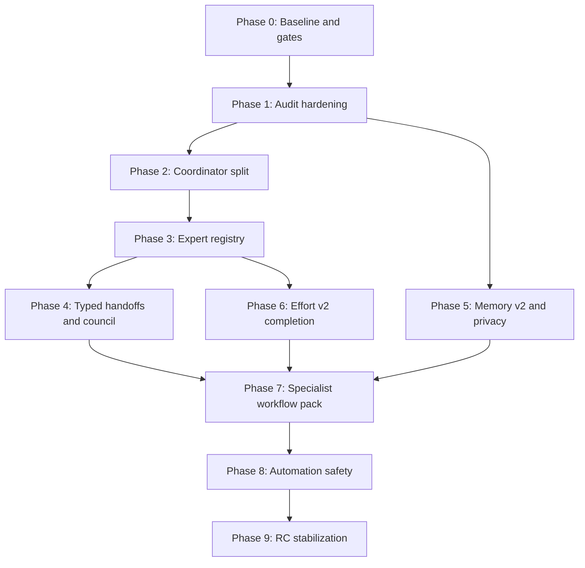

# OpenAGt v1.20.0 Execution Plan: Expert Mesh & Knowledge

## Version Note

Use `v1.20.0`, not `v1.20.00`. SemVer numeric identifiers must not use leading zeroes, so `1.20.00` is not a valid release version.

## Source Investigated

Primary local spec:

- `.claude/worktrees/mystifying-herschel-732175/specs/v1.20-release.md`

The spec is useful and correctly frames v1.20 as a non-coding-only "Expert Mesh & Knowledge" release. It should not be copied blindly:

- Some audit anchors are stale after v1.17 hardening.
- Some items are already implemented and should become regression gates, not implementation tasks.
- The spec is too large for a single PR or a single stabilization pass.
- `.claude/` is local ignored state, so this tracked document is the release source of truth.

## Release Positioning

OpenAGt v1.20.0 should be the first GA-quality release of the general expert-agent runtime:

- General-purpose expert system, not only agentic coding.
- Experts are explicit runtime objects, not implicit prompt names.
- Expert work can disagree, cite, hand off typed artifacts, and write durable knowledge.
- Memory becomes searchable, linkable, privacy-aware, and useful across sessions.
- Automation gains dry-run and rollback discipline.
- Effort controls become real runtime governance and provider routing.

Out of scope:

- Flutter GA client.
- IDE clone features such as autocomplete, inline diff viewers, or lint pipeline ownership.
- Vector database or embeddings.
- Cloud sync and multi-user workspaces.
- New OS-native sandbox implementation.

## Release Strategy

v1.17.x remains the RC/stabilization line. v1.20.0 is the next GA line.

| Milestone | Tag shape | Goal |
| --- | --- | --- |
| Foundation alpha | `v1.20.0-alpha.1` | Audit hardening plus coordinator split compiles and passes focused tests. |
| Expert substrate alpha | `v1.20.0-alpha.2` | Expert registry, typed handoffs, and basic council dispatch land behind flags. |
| Knowledge beta | `v1.20.0-beta.1` | Memory v2, FTS5, edges, privacy filters, and citations are usable. |
| Workflow beta | `v1.20.0-beta.2` | Writing, research, personal-admin, data-analysis, and file-organization workflows have golden tests. |
| Release candidate | `v1.20.0-rc.1` | Full validation, release notes, assets, checksums, and SBOM pass. |
| GA | `v1.20.0` | No open P0/P1, no untriaged full-test failures, and all GA gates pass. |

## Current Baseline

Already handled in v1.17 and should become regression tests:

- Coordinator duplicate id rejection.
- Coordinator dangling dependency rejection.
- Coordinator cycle rejection.
- Subagent max-step and timeout results as retryable partial.
- Full task `result_text` persistence and retrieval.
- Anthropic cache token double-count fix in task runtime.
- Permission deny precedence.
- Permission audit ring buffer.
- Chinese/bilingual classifier mojibake cleanup.
- AsyncQueue close/abort/capacity.
- Read/truncate CRLF byte accounting.
- `.claude/` removed from release baseline.

Already shipped on the v1.20 line (must not be re-implemented):

- `packages/openagt/src/effort/index.ts` core resolver: `EffortValue`, `EffortLevel`, `parseEffort`, `getEnvOverride`, `toPersistable`, `modelSupportsEffort`, `modelSupportsDeep`, `resolveApplied`, `describeResolution`, `Event.Changed` bus event. Env var `OPENAGT_EFFORT_LEVEL` and owner gate `OPENAGT_OWNER`. Phase 6 wires this into mission CLI / Task tool / provider variant — it does NOT redefine the API.
- `Config.effort_level` schema field added. Phase 6 reads it; spec doc treats it as ground truth.
- `tool/task.ts:taskStepBudget` audit fix: explicit `effort` no longer silently overridden by the broad-explore widener. Phase 1 verifies it has a regression test; the fix itself is in.
- `agent/task-classifier.ts` re-exports `EFFORT_LEVELS` and `parseEffort` from `effort/`; the duplicate `EffortLevelValue` array is gone.

Still open for v1.20 (Phase 1):

- Coordinator split and module boundaries.
- Revise insertion topo regression coverage.
- Full budget ceiling enforcement across wallclock, model calls, tool calls, tokens, phases, todos, and checkpoint reserve.
- WebFetch redirect SSRF guard.
- TUI/tool ANSI and OSC sanitization.
- Server body limit, JSON depth guard, local bearer auth, and localhost CORS default.
- Compaction epoch/CAS and circuit-breaker hard stop.
- Compaction key-file truncation marker (silent data loss in `compaction/full.ts:291`).
- System prompt cache-control and provider tokenizer estimates.
- Sandbox fail-closed enforcement and process-sandbox labeling.
- Path canonicalization for grants and path overlap (shared helper).
- Trace ID per-event uniqueness (`server/routes/instance/event.ts:51` collapses to sessionID, breaking concurrent-event correlation).
- MCP/provider/plugin/LSP/bus scalability.
- Storage snapshots, event indexes, fsync policy.
- Personal memory SQL pushdown and wakeup claim semantics.

## Dependency Graph



## Phase 0: Baseline and Release Gates

Purpose: make sure v1.20 work starts from a clean baseline and does not mix with v1.17 RC repair.

Tasks:

- Create branch `release/v1.20.0` from the selected release base.
- Confirm whether the release base is `main`, `dev`, or a dedicated stabilization branch.
- Keep `.claude/` ignored and out of the index.
- Keep this document as the tracked source of truth.
- Add a `docs/releases/v1.20.0.md` release-notes draft only after beta scope is stable.
- Add a `docs/releases/v1.20.0-known-risks.md` file for deferred items.

Gate:

- `git status --short` clean.
- `bun run release:verify` passes.
- `bun typecheck` passes in `packages/openagt`.
- `bun typecheck` passes in `packages/sdk/js`.

## Phase 1: Audit Hardening

Purpose: close runtime/security gaps before adding the expert mesh.

Tasks:

- Server security:
  - Add request body size limit in server middleware.
  - Add JSON depth guard.
  - Default CORS to loopback/configured origins only.
  - Require local bearer token for state-changing local server endpoints.
- WebFetch:
  - Disable automatic redirect following.
  - Resolve every redirect target host/IP.
  - Block loopback, private, link-local, and metadata IPs by default.
  - Add explicit trusted-domain override.
- TUI/tool output:
  - Strip C0/C1 controls.
  - Strip OSC 52 clipboard writes.
  - Strip screen clear and cursor movement.
  - Allow only safe style ANSI subset.
- Sandbox/shell:
  - Enforce `failure_policy: "closed"` on backend init failure.
  - Label process backend as process-level sandbox only.
  - Add second-pass classifier for `bash -c`, `/bin/sh -c`, and PowerShell encoded commands.
- Auth/env:
  - Strip `OPENAGT_AUTH_CONTENT` and `OPENCODE_AUTH_CONTENT` from child process env by default.
  - Enforce auth `expires` validation and surface refresh hook.
- Path safety:
  - Add shared canonical path helper based on `realpath`.
  - Use it in external directory grants and path-overlap checks.
- Compaction/session:
  - Add compaction epoch/CAS.
  - Add hard stop when compaction circuit breaker is open and context is unsafe.
  - Add `[truncated N lines]` marker for file compaction.
- Bus:
  - Add replay last-N for critical topics.
  - Add per-topic token bucket for chatty producers.
  - Make trace ids unique per concurrent request, not just session.

Tests:

- WebFetch redirect to `169.254.169.254` is blocked.
- ANSI/OSC malicious output cannot clear TUI or write clipboard.
- Server rejects oversized body and excessive JSON depth.
- Local browser request without bearer token is rejected.
- Sandbox closed failure returns denied metadata.
- Child env excludes auth content.
- Symlink path-overlap regression.
- Compaction stale overflow race regression.
- Bus late subscriber receives critical replay.

Gate:

- `bun test test/security/*.test.ts --timeout 30000` in `packages/openagt`.
- Focused server/runtime tests pass.
- No new public API breakage.

## Phase 2: Coordinator Split

Purpose: reduce risk in the current large coordinator implementation before introducing new behavior.

Target modules:

- `packages/openagt/src/coordinator/intent.ts`
- `packages/openagt/src/coordinator/effort.ts`
- `packages/openagt/src/coordinator/budget.ts`
- `packages/openagt/src/coordinator/validation.ts`
- `packages/openagt/src/coordinator/projection.ts`
- `packages/openagt/src/coordinator/dispatch.ts`
- `packages/openagt/src/coordinator/runtime-state.ts`
- `packages/openagt/src/coordinator/templates/*.ts`
- `packages/openagt/src/coordinator/service.ts`
- Keep `coordinator.ts` as a thin facade/re-export.

Rules:

- No behavior change in the first split PR.
- Move tests with behavior, not after behavior.
- Keep scheduling conservative. Avoid recursive async dispatch patterns.
- Regenerate SDK only if schema changes.

Tests:

- Existing coordinator tests pass unchanged.
- `orderPlan`, `validatePlan`, budget math, and projection each have direct focused tests.
- Add deep revise insertion topo regression.

Gate:

- `coordinator.ts` under 400 lines after facade conversion.
- No test timeouts in coordinator suites.

## Phase 3: Expert Registry

Purpose: make experts first-class runtime objects.

New service:

- `packages/openagt/src/expert/index.ts`

Core schema:

- `ExpertDefinition`
- `ExpertID`
- `ExpertSource = "builtin" | "plugin" | "user"`
- `permission_overlay`
- `memory_namespace`
- `prompt_version`
- `output_schema`
- `required_inputs`
- `effort_floor`

Storage:

- Add `expert_definition` table.
- Built-ins register idempotently by `(id, prompt_hash)`.
- Plugin/user experts can register but must declare permission overlay.

Coordinator integration:

- Coordinator nodes gain additive `expert_id`.
- Existing `role` stays for compatibility.
- Every built-in expert has a role bridge.
- Role enum members are classified as `active` or `reserved`.

Tests:

- Register/list/get/unregister.
- Conflict on same id with different source rules.
- Built-in registration is idempotent.
- Permission overlay is required for plugin/user experts.
- Every active role has at least one expert definition.

Gate:

- Existing workflows behave the same when expert registry is enabled.
- Registry can be disabled with `OPENAGT_EXPERT_REGISTRY=0` during alpha.

## Phase 4: Typed Handoffs and Council

Purpose: stop passing unstructured text between expert stages.

Typed handoffs:

- Add `coordinator/handoff.ts`.
- Define handoff schemas for:
  - research synthesis
  - plan
  - draft
  - verification
  - automation plan
  - organization plan
  - memory summary
  - rollback plan
  - dry-run report
- Producer output is parsed before downstream dispatch.
- Parse failure creates `handoff_revise`, not silent success.

Council:

- Add council node kind as additive coordinator schema.
- Council members run in parallel group `council:<artifact>`.
- Votes produce structured verdicts:
  - `pass`
  - `revise`
  - `reject`
- Synthesizer resolves votes.
- Divergence emits `expert.disagreement`.
- If tie-break is `user`, run pauses for approval.

Effort mapping:

- `low`: no council.
- `medium`: council on highest-risk artifact only.
- `high`: council on reviewable critical artifacts.
- `deep`: larger council plus synthesizer cross-check.

Tests:

- 3-expert council with planted disagreement.
- Synthesizer resolves majority.
- Tie-break `user` pauses run.
- Invalid handoff triggers `handoff_revise`.
- Council timeout still returns partial vote set with clear metadata.

Gate:

- No coordinator run can proceed from invalid required handoff.
- Disagreement is visible in projection and SSE.

## Phase 5: Memory v2 and Privacy

Purpose: make long-running expert work accumulate useful knowledge without privacy leaks.

FTS5:

- Add `personal_memory_fts` virtual table.
- Backfill existing memory notes.
- Add insert/update/delete triggers.
- Keep legacy lexical search behind fallback flag.

Knowledge edges:

- Add `personal_memory_edge`.
- Edge kinds:
  - `supports`
  - `contradicts`
  - `elaborates`
  - `supersedes`
  - `cites`
- Add indexes for source and target traversal.

Consolidation:

- Add `personal_memory_consolidation_log`.
- Add `memory-curator` expert.
- Consolidate clusters into workspace notes.
- Never delete source notes in first release; only decay and link.

Privacy:

- Add `sensitivity` to memory notes:
  - `none`
  - `pii`
  - `health`
  - `financial`
  - `secret`
- Default memory search excludes sensitive notes.
- Add per-node sensitive unlock with audit event.
- Push project/scope filters into SQL `WHERE`.
- Wakeup dispatch claims due items with atomic update.
- `synthesizeOnce` uses unique constraint and insert-on-conflict.

Tests:

- FTS insert/update/delete sync.
- 10k-note search p95 target test or benchmark.
- Cross-project memory leak regression.
- Sensitive note absent by default.
- Unlock expires per node.
- Consolidation creates new note plus supersedes edges.
- Wakeup double-daemon race does not double-dispatch.

Gate:

- FTS search remains below agreed p95 on local benchmark.
- Privacy regression tests are mandatory for RC.

## Phase 6: Effort v2 Completion

Purpose: make effort affect model/runtime behavior consistently.

Tasks:

- `openagt mission --effort` remains optional; default comes from config/runtime.
- Add `openagt config effort <low|medium|high|deep|auto>`.
- Add `/effort` slash command in TUI.
- Add `variantFromEffort(model, reasoning_effort)` using provider variants.
- Emit `effort.changed` on:
  - env detection
  - config write
  - mission flag
  - TUI slash command
- Enforce expert `effort_floor`.
- Surface applied effort in projection, task metadata, and TUI status.

Tests:

- Env/config/CLI/TUI effort precedence.
- Provider reasoning effort variant resolution.
- Unsupported provider effort falls back with metadata warning.
- Low effort skips or downgrades experts with higher floor.

Gate:

- Effort is no longer prompt-only.
- Applied effort is observable in events and SDK.

## Phase 7: Specialist Workflow Pack

Purpose: make OpenAGt specialized across domains, not broad but shallow.

Workflows to implement first:

- Writing v2:
  - audience clarifier
  - outliner
  - drafter
  - style editor
  - factuality checker
  - structure reviewer
- Research v2:
  - research planner
  - parallel researchers
  - adversarial researcher
  - contradiction checker
  - synthesis reducer
  - citation auditor
- Personal admin v2:
  - inbox classifier
  - priority sorter
  - scheduler
  - privacy reviewer
  - follow-up planner
- Data analysis v2:
  - schema profiler
  - analyst
  - stats verifier
  - anomaly checker
- File/data organization v2:
  - inventory agent
  - organizer
  - safety verifier
  - executor

Rules:

- Every workflow has adapter-owned prompts, tools, permissions, memory namespace, and output schema.
- `general-operations` remains fallback only.
- Every public workflow must have one golden-path integration test.
- Dead roles are either activated or marked reserved with a deprecation note.

Tests:

- Writing factuality fail triggers revise.
- Research planted contradiction is found.
- Personal admin privacy block works.
- Data analysis caveat is preserved in final output.
- File organization safety verifier blocks risky moves.

Gate:

- No workflow can route to generic path without marking `specialization_fallback`.

## Phase 8: Briefing, Agenda, Journal

Purpose: add user-facing personal-agent consumption surfaces.

Commands:

- `/briefing`
- `/agenda`
- `/journal`
- `/privacy`

Implementation:

- `coordinator.briefer` expert reads inbox, wakeups, memory, disagreements.
- `/agenda` supports filters by project, workflow, priority, due, blocked.
- `/journal` writes append-only markdown under `.opencode/journal/`.
- Journal writes are disabled for personal/privacy-sensitive sessions unless explicitly allowed.

Tests:

- Briefing deterministic snapshot.
- Agenda filter snapshot.
- Auto-journal listener writes once per completed run.
- Privacy mode blocks journal write.

Gate:

- `/briefing` p95 target is below 2 seconds on benchmark data.

## Phase 9: Trigger Library and Dry-Run Safety

Purpose: make automation safe enough for GA.

Triggers:

- schedule
- file-change
- git-pull
- inbox-arrival
- memory-tag
- calendar-event
- webhook

Safety gates:

- `dry-run-verifier` before executor for high-risk or automation-plan nodes.
- `rollback-planner` required for every executor-capable run.
- Executor failure dispatches rollback path.
- Dry-run report is rendered before approval.

Tests:

- Each trigger type fires once with idempotency key.
- Dry-run blocks high-risk run.
- User approval resumes run.
- Executor failure rolls back file state.

Gate:

- No executor node can run without dry-run and rollback metadata.

## Phase 10: Release Stabilization

Required commands:

From `packages/openagt`:

```bash
bun typecheck
bun test --timeout 30000
```

From `packages/sdk/js`:

```bash
bun typecheck
./script/build.ts
```

From repo root:

```bash
bun run release:verify
bun run release:stable
```

Required smoke:

- `openagt --version`
- `openagt --help`
- `openagt run --help`
- `openagt serve --help`
- `openagt mission --help`
- `openagt config effort --help`
- TUI starts and displays effort/stages/sidebar.
- Server SSE includes new additive fields and remains backward compatible.

Release assets:

- Windows zip.
- Windows MSI if WiX is available.
- Linux tar.gz from CI.
- macOS x64/arm64 tar.gz from CI.
- `SHA256SUMS.txt`.
- `sbom.spdx.json`.
- Full release notes.

GA blockers:

- Any P0/P1 runtime bug.
- Any untriaged full-test hang.
- Missing security tests for local server auth, WebFetch redirect, and TUI ANSI sanitization.
- Missing privacy regression tests.
- Missing checksums or SBOM.
- Release notes claiming unsupported assets or unsupported workflows.

## Suggested PR Sequence

Phase 1 splits into four PRs because the items have different review owners
(security vs runtime vs cost) and the cache-control change is high-ROI
enough to land standalone with a hit-rate benchmark:

1. `v1.20-audit-net`: server body/auth/CORS, WebFetch redirect, TUI ANSI/OSC sanitizer, trace_id per-event uniqueness.
2. `v1.20-audit-runtime`: compaction CAS + circuit breaker hard stop, compaction key-file truncation marker, prompt timeout, auth env stripping for child processes.
3. `v1.20-audit-cost`: Anthropic prompt `cache_control` on static system-prompt prefix + provider tokenizer estimates. Lands with a measured cache-hit-rate benchmark in CI.
4. `v1.20-audit-paths`: shared `Path.canonical()` helper, external-directory grants, path-overlap canonicalization, sandbox fail-closed labeling.
5. `v1.20-coordinator-split`: no behavior change.
6. `v1.20-expert-registry`: service, table, built-in registry.
7. `v1.20-handoffs-council`: typed handoffs, council, disagreement event.
8. `v1.20-memory-fts`: FTS5, SQL filtering, memory search benchmark.
9. `v1.20-memory-graph`: edges, consolidation, curator.
10. `v1.20-effort-v2`: provider reasoning variant wiring, slash/config command, event emission. (Core module already shipped in v1.19; this PR is wiring only.)
11. `v1.20-workflows-writing-research`: writing and research workflow pack.
12. `v1.20-workflows-personal-data-file`: personal-admin, data-analysis, file organization.
13. `v1.20-triggers-safety`: trigger library, dry-run, rollback.
14. `v1.20-briefing-agenda-journal`: user-facing personal-agent surfaces.
15. `v1.20-rc-polish`: docs, release notes, packaging, full matrix.

## Success Metrics

| Area | Metric | Target |
| --- | --- | --- |
| Expert registry | Built-in experts register idempotently | 100% |
| Role coverage | Active role has expert or reserved marker | 100% |
| Council | Disagreement visible in projection/SSE | 100% |
| Handoffs | Invalid required handoff cannot unlock downstream node | 100% |
| Memory | 10k-note search p95 | below 50 ms target or documented threshold |
| Privacy | Sensitive notes hidden by default | 100% |
| Server security | Local state-changing request without bearer token blocked | 100% |
| WebFetch | Redirect to metadata/private IP blocked | 100% |
| TUI safety | OSC 52/control output sanitized | 100% |
| Effort | Applied effort reaches provider variant when supported | 100% |
| Automation | High-risk executor requires dry-run and rollback | 100% |

## Risk Register

| Risk | Impact | Mitigation |
| --- | --- | --- |
| Expert registry slips | Blocks council and workflows | Land registry before workflow work; keep workflows behind flags. |
| Coordinator split destabilizes dispatch | Runtime hangs | No behavior change in split PR; keep conservative dispatch model. |
| FTS5 migration issues | Memory search or data corruption | Backfill tests, trigger tests, fallback to legacy lexical search. |
| Council increases model cost | User surprise | Effort-gated council size and visible cost/progress metadata. |
| Privacy unlock leaks sensitive memory | High trust damage | Per-node unlock, audit event, default deny. |
| Automation executor causes unwanted changes | High trust damage | Dry-run verifier, rollback plan, approval gate. |
| v1.20 scope expands indefinitely | Release slip | Ship incomplete tracks behind `OPENAGT_EXPERIMENTAL_*` flags or move to v1.20.x. |

## Final Go / No-Go Checklist

- All public workflows either specialized or explicitly marked fallback.
- All active roles have expert definitions.
- All new schema changes are additive.
- SDK regenerated after schema changes.
- Release notes match actual assets.
- Windows installer upgrades previous OpenAGt install.
- Full package tests pass or every residual failure is documented and non-blocking.
- Security/privacy regression suite passes.
- `v1.20.0-rc.1` has at least one clean install smoke before GA.
