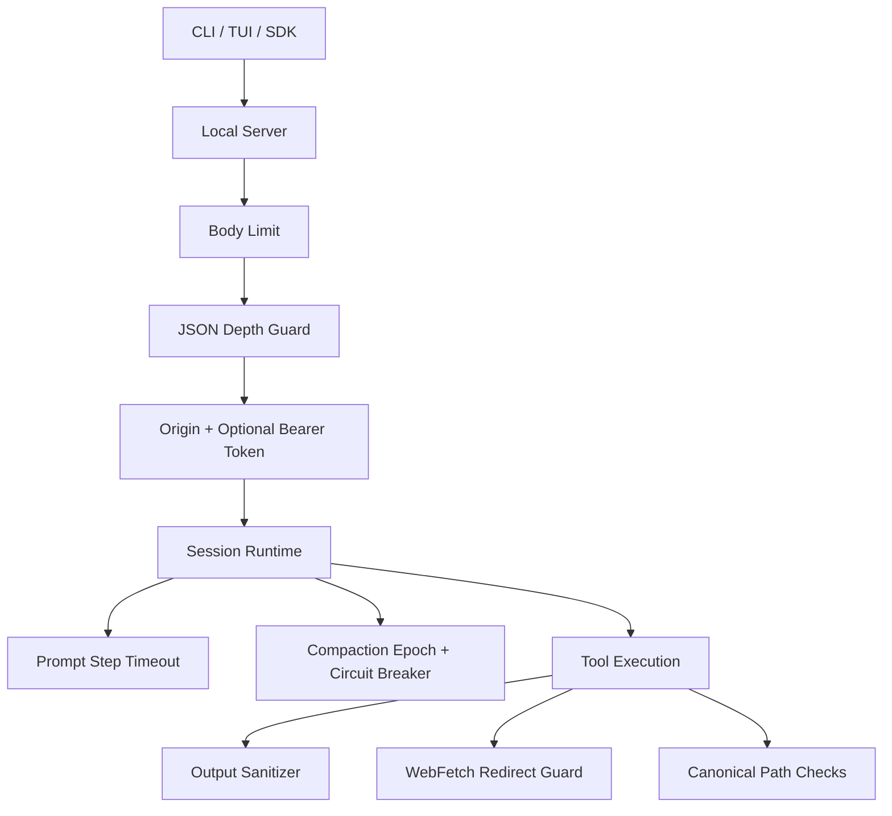
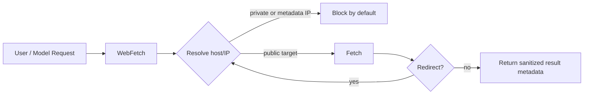
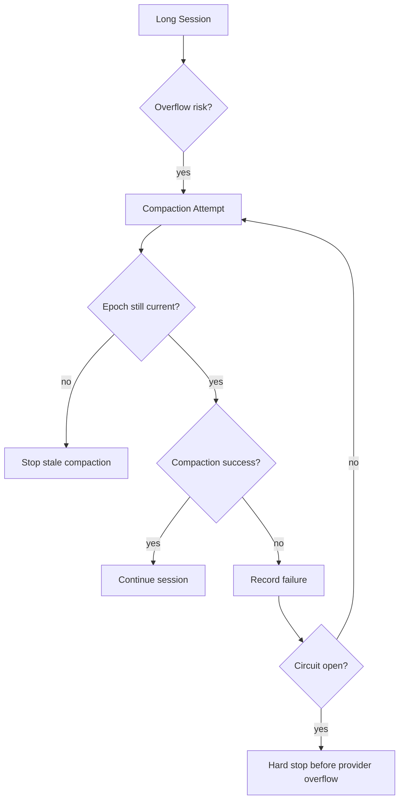

## Highlights

OpenAGt v1.20.0 is a stable security and runtime-hardening release for the CLI/server/SDK runtime.

This release promotes the v1.20 audit foundation to GA: local server request hardening, redirect-safe WebFetch, sanitized terminal output, compaction reliability guards, child-process secret stripping, stronger path canonicalization, and release verification updates. It is intentionally scoped to the stable foundation layer. The larger Expert Mesh roadmap, including expert registry, typed handoffs, council review, Memory v2, and expanded specialist workflow packs, remains planned work and is not claimed as shipped in this GA.

Flutter is not included in the v1.20 stable artifact set. This release continues to stabilize backend contracts for future desktop/mobile clients.

## Key Features

- Local server security:
  - request body size limit for state-changing requests
  - JSON depth guard for deeply nested request bodies
  - stricter local origin checks
  - optional local bearer-token protection for local state-changing requests via `OPENAGT_SERVER_LOCAL_TOKEN`
- WebFetch SSRF protection:
  - redirects are followed manually
  - every redirect target is checked before fetch
  - private, loopback, link-local, and cloud metadata IP targets are blocked by default
  - local/private fetches require explicit opt-in with `OPENAGT_ALLOW_PRIVATE_WEBFETCH=1`
- TUI and tool-output safety:
  - OSC 52 clipboard sequences are stripped before display
  - screen clear, cursor movement, DCS, and unsafe control sequences are removed before TUI render
  - raw output remains available to lower-level debug paths, but unsafe controls are not rendered directly
- Runtime reliability:
  - prompt loop steps have local timeouts derived from runtime/task budget
  - compaction uses an epoch guard to avoid stale compaction decisions
  - compaction circuit-breaker failures hard-stop instead of continuing into guaranteed context overflow
  - key-file truncation adds explicit `[truncated ... chars]` markers
- Cost and token accounting:
  - static, semi-static, and dynamic system-prompt zones are marked for provider cache-control transforms
  - token estimation handles non-ASCII text more conservatively while preserving existing ASCII estimates
  - compaction metrics track static prompt cache hit/miss ratio
- Process and path hardening:
  - child process environments strip `OPENAGT_AUTH_CONTENT` and `OPENCODE_AUTH_CONTENT`
  - external-directory grants and path-overlap checks use canonical path comparison
  - process sandbox status now labels process-level enforcement clearly instead of implying OS-native isolation
- Continued v1.17 runtime baseline:
  - coordinator DAG validation rejects duplicate ids, dangling dependencies, and cycles
  - subagent max-step and timeout paths produce retryable partial results instead of false success
  - task result retrieval persists full `result_text`
  - permission deny rules override allow rules
  - bilingual broad-task/risk classification is less over-eager and no longer contains mojibake terms

## Technical Architecture







## Install / Upgrade

Full release matrix assets when all platform jobs are run:

- `OpenAGt-Setup-x64.msi`
- `openagt-windows-x64.zip`
- `openagt-linux-x64.tar.gz`
- `openagt-macos-arm64.tar.gz`
- `openagt-macos-x64.tar.gz`
- `SHA256SUMS.txt`
- `sbom.spdx.json`

A local `bun run release:stable` run appends a `Local Generated Assets` section to `packages/openagt/dist/release-notes.md` with the exact files produced on the current platform.

Windows:

- `OpenAGt-Setup-x64.msi` supports choosing the install folder.
- A newer MSI upgrades previous OpenAGt installs that use the same upgrade identity.
- After installation, open a new terminal so PATH changes are loaded.

```powershell
openagt
opencode
openagt --version
openagt debug doctor
```

macOS / Linux:

```bash
./bin/openagt --help
./bin/openagt --version
./bin/openagt serve --help
```

Verify downloaded assets against `SHA256SUMS.txt` before installation.

## Compatibility / Breaking Notes

- Existing `opencode` aliases remain available.
- Existing clients can continue reading SSE events by `type` and `properties`.
- New local-server bearer-token enforcement is opt-in unless `OPENAGT_SERVER_LOCAL_TOKEN` or `OPENCODE_SERVER_LOCAL_TOKEN` is configured.
- WebFetch now blocks private/local/metadata-network targets by default. Set `OPENAGT_ALLOW_PRIVATE_WEBFETCH=1` only in trusted local workflows.
- Windows release assets may be unsigned. SmartScreen can show `Unknown publisher` until signed assets are available.
- Flutter is not part of the stable support matrix for v1.20.

## Verification Matrix

| Area | Command / Coverage |
| --- | --- |
| OpenAGt typecheck | `bun typecheck` in `packages/openagt` |
| Focused security | WebFetch redirect guard, server body/depth/origin guard, sanitizer tests |
| Tool/runtime regression | task, webfetch, path overlap, child env stripping, compaction tests |
| Package test shards | server, tool, session, agent/security/sandbox/permission, provider/storage/workspace, and remaining package directories |
| SDK | `bun typecheck` in `packages/sdk/js` and SDK generation through `release:verify` |
| Release | `bun run release:verify` and `bun run release:stable` |

## Known Issues / Roadmap

- Expert Registry, Typed Handoffs, Council Review, Memory v2, specialist workflow packs, and trigger rollback safety remain roadmap items from the v1.20 execution plan.
- Linux/macOS/Windows OS-native sandboxing is still not implemented as a new backend in this release; process-level sandbox semantics are labeled more clearly.
- Windows assets can be unsigned; verify checksums before installation.
- Flutter remains a backend-contract consumer target, not a released v1.20 client.

## Checksums / Assets

Checksums are published in `SHA256SUMS.txt` alongside release assets. SBOM data is published in `sbom.spdx.json`.
