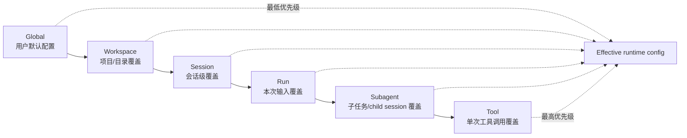
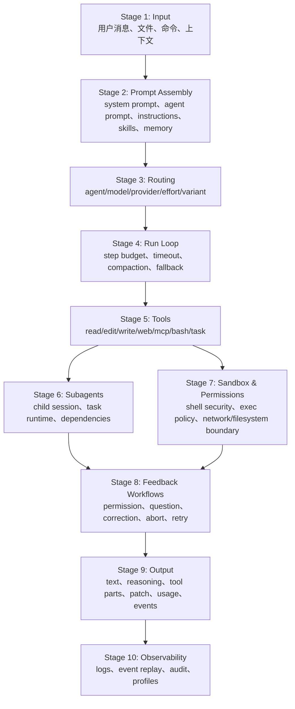
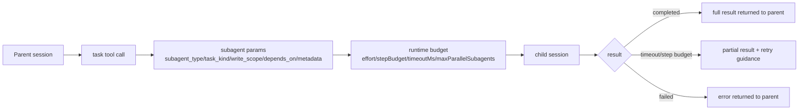
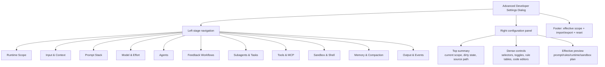

# 高级开发者设置界面范围设计

目标：提供一个高级开发者设置界面，让用户能在不直接编辑 JSON/Markdown 的情况下，最大化控制 OpenAGt 从 `input` 到 `output/feedback` 的完整执行范围。这个界面不应该只是“偏好设置”，而应该是一个按运行 stage 分组的 runtime control surface。

## 设计原则

1. 按执行阶段组织，而不是按底层配置文件组织。
2. 每个设置项都显示生效 scope：Global、Workspace、Session、Run、Subagent、Tool。
3. 默认值保守，高级开关明确标记风险和覆盖范围。
4. 同一个能力只保留一个主入口，避免在多个设置页重复出现同一控制。
5. 允许导入/导出 profile，方便用户在不同项目之间复用开发者配置。

## Scope 层级

优先级建议：`Tool > Subagent > Run > Session > Workspace > Global`。界面必须显示“当前值来自哪里”，否则高级用户无法判断为什么某个行为被覆盖。

## Stage Flowchart

## 设置界面信息架构

建议左侧导航使用 stage 分组，右侧为密集但可扫描的配置面板。

| Tab | 面向的 Stage | 应允许自定义的模块 | 主要配置来源 |
| --- | --- | --- | --- |
| Runtime Scope | 全局入口 | scope 优先级、profile、global/workspace/session/run 覆盖预览 | `config.jsonc`、workspace config、session metadata |
| Input & Context | Stage 1 | context roots、文件/图片/PDF 附件策略、paste summary、instructions include、tools enable map | `instructions`、`tools`、`experimental.disable_paste_summary` |
| Prompt Stack | Stage 2 | system prompt、agent prompt、memory section、skills injection、prompt templates、structured output policy | `agent.*.prompt`、`instructions`、`skills`、`experimental.memory` |
| Model & Effort | Stage 3 | default model、small model、provider routing、variant、effort、temperature/top_p、fallback chain | `model`、`small_model`、`provider`、`agent.*.variant/options` |
| Agents | Stage 3/6 | primary agents、subagents、hidden agents、agent colors、steps、agent-level permission | `agent`、`.opencode/agent/*.md` |
| Feedback Workflows | Stage 8 | permission workflow、question workflow、reject/correct behavior、continue-on-deny、auto-approve profiles | `permission`、`experimental.continue_loop_on_deny`、session permission |
| Subagents & Tasks | Stage 6 | task kinds、subagent_type mapping、dependencies、write scope、step/timeout budgets、partial result policy | `task` tool params、`TaskRuntime` records、agent config |
| Tools & MCP | Stage 5 | tool availability、primary-only tools、MCP servers、MCP timeout、tool quality weights | `tools`、`mcp`、`experimental.primary_tools`、`experimental.toolQuality` |
| Sandbox & Shell | Stage 7 | exec policy rules、sandbox backend、failure policy、report-only、filesystem/network policy, shell family hints | `exec_policy`、`permission.bash/shell_execute/shell_network`、`experimental.sandbox` |
| Memory & Compaction | Stage 2/4 | memory template、trigger thresholds、max tokens、auto compaction、prune/reserved tokens | `experimental.memory`、`compaction` |
| Output & Events | Stage 9/10 | reasoning visibility、tool part expansion、patch display、event replay, audit log access | desktop settings、`Bus` / `SyncEvent` / audit logs |

## 每个 Stage 应开放的自定义范围

### Stage 1: Input & Context

应该允许用户配置：

| 模块 | 控制项 | Scope | UI 控件 |
| --- | --- | --- | --- |
| Context roots | 当前 workspace、额外 include/exclude 路径、外部目录默认策略 | Workspace/Session | folder picker + path list |
| Attachments | 图片/PDF 允许、最大尺寸、SVG 按文本还是附件处理 | Global/Workspace | toggles + numeric inputs |
| Tools map | 本次 run 启用/禁用哪些工具 | Run | searchable checklist |
| Input mode | normal / shell / command | Run | segmented control |

不要把 context roots 分散在多个页面。它应该是 Input & Context 的唯一主入口。

### Stage 2: Prompt Stack

应该允许用户配置：

| 模块 | 控制项 | Scope | UI 控件 |
| --- | --- | --- | --- |
| Base system prompt | 默认 system prompt、追加 instruction files | Workspace/Session | code editor + file list |
| Agent prompt | 每个 agent/subagent 的 prompt、description、mode | Workspace | agent editor |
| Skills | skill paths、启用/禁用、注入顺序 | Global/Workspace | ordered list |
| Memory | memory template、max tokens、trigger thresholds | Workspace/Session | form + preview |
| Structured output | JSON schema、required tool choice 行为 | Run | schema editor |

Prompt Stack 必须提供“Effective Prompt Preview”：显示最终拼接顺序和每段来源。

### Stage 3: Model & Effort

应该允许用户配置：

| 模块 | 控制项 | Scope | UI 控件 |
| --- | --- | --- | --- |
| Model | default model、small model、agent-specific model | Global/Workspace/Agent | provider/model selector |
| Effort | low/medium/high、自定义 reasoning budget、provider variant 映射 | Global/Workspace/Run/Subagent | segmented control + advanced mapping |
| Sampling | temperature、top_p、provider options | Agent/Run | sliders + JSON advanced editor |
| Fallback | provider fallback order、retry policy、circuit breaker | Global/Workspace | ordered table |

推荐把 `effort` 设计成高级别意图，把 provider-specific `variant` 作为展开项。用户选 `high` 时，界面应显示实际写入的 `variant` 或 runtime budget。

### Stage 4: Run Loop

应该允许用户配置：

| 模块 | 控制项 | Scope | UI 控件 |
| --- | --- | --- | --- |
| Step budget | agent steps、run stepBudget、last-step behavior | Agent/Run/Subagent | numeric stepper |
| Timeout | prompt step timeout、subagent timeout floor/cap | Global/Agent/Subagent | duration input |
| Compaction | auto compaction、prune、reserved tokens | Workspace/Session | toggles + numeric inputs |
| Retry | retry count、fallback-on-error、partial result handling | Workspace/Run | policy selector |

Run Loop 页面应显示“为什么会停止”：step budget、timeout、finish reason、compaction、manual abort。

### Stage 5: Tools & MCP

应该允许用户配置：

| 模块 | 控制项 | Scope | UI 控件 |
| --- | --- | --- | --- |
| Built-in tools | read/edit/write/bash/web/task/todo/skill 是否启用 | Global/Agent/Run | searchable matrix |
| Primary-only tools | 哪些工具只给 primary agents | Global/Workspace | multi-select |
| MCP servers | server config、enabled/disabled、timeout、quality weights | Global/Workspace | server cards + detail editor |
| Tool scheduling | safe parallel tools、path overlap conflict policy | Workspace/Run | policy selector |

工具矩阵需要按 agent 展示，因为“某个工具是否开放”通常是 agent-specific，而不是全局布尔值。

### Stage 6: Subagents & Tasks

应该允许用户配置：

| 模块 | 控制项 | Scope | UI 控件 |
| --- | --- | --- | --- |
| Subagent definitions | `subagent_type`、prompt、model、mode、hidden、color | Workspace | agent editor |
| Task runtime | `task_kind`、`group_id`、`depends_on`、priority | Run/Subagent | task builder |
| Write scope | read-only / allowed write paths | Subagent | path chips |
| Runtime budget | effort、stepBudget、timeoutMs、maxParallelSubagents | Subagent | budget panel |
| Result policy | full result、partial result、retry instruction | Subagent | policy selector |

Subagent 页面应该展示 DAG：任务依赖、状态、child session、partial/full result。

### Stage 7: Sandbox & Permissions

应该允许用户配置：

| 模块 | 控制项 | Scope | UI 控件 |
| --- | --- | --- | --- |
| Permission rules | ask/allow/deny for read/edit/bash/shell_execute/shell_network/task | Global/Workspace/Session/Agent | rule table |
| Exec policy | command prefix patterns、allow/confirm/block、justification | Workspace | ordered rules editor |
| Sandbox backend | auto/process/seatbelt/windows_native/landlock | Global/Workspace | backend selector |
| Sandbox behavior | enforcement、failure_policy、report_only、broker TTL | Global/Workspace | policy panel |
| Boundaries | allowedPaths、writablePaths、networkPolicy | Tool/Run | path list + network toggle |

Windows note: packaged Windows builds include the `openagt-sandbox-win.exe` helper and expose `openagt sandbox windows probe --json` / `openagt sandbox windows setup --status --json` for diagnostics. Treat `process` as advisory/audit-only (`policy_advisory.enforced=false`). Treat `windows_native` as capability-gated: it is selected only when the helper reports restricted-token, Job Object, and filesystem enforcement support. `network_policy=none` is WFP setup-gated and should stay labeled experimental until admin integration tests pass; `network_policy=loopback` remains deferred.

必须把危险设置分成两层：权限审批和 sandbox 执行边界。`allow bash` 不应该被理解为“关闭 sandbox”。

### Stage 8: Feedback Workflows

应该允许用户配置：

| 模块 | 控制项 | Scope | UI 控件 |
| --- | --- | --- | --- |
| Permission prompts | once / always / reject 默认行为、自动展开详情 | Global/Session | segmented controls |
| Corrected feedback | 拒绝时是否允许输入修正说明 | Global/Session | toggle + text field |
| Question prompts | 问题展示、答案模板、超时策略 | Global/Session | template editor |
| Deny behavior | deny 后停止还是继续 loop | Workspace/Session | switch |
| Abort | 单击/双击中断、是否保留 partial tool output | Global | behavior selector |

Feedback Workflows 的关键不是“批准/拒绝按钮”，而是让用户定义拒绝后模型如何继续：stop、retry with correction、continue loop、fork new attempt。

### Stage 9: Output & Events

应该允许用户配置：

| 模块 | 控制项 | Scope | UI 控件 |
| --- | --- | --- | --- |
| Transcript | reasoning 可见性、timestamps、assistant metadata | Global/Session | toggles |
| Tool parts | shell/edit/write 是否默认展开、generic tool output 是否显示 | Global/Session | toggles |
| Patch output | patch summary、diff wrap、revert buttons | Global/Session | toggles |
| Usage | token/cost/latency 是否显示 | Global/Session | toggles |
| Events | raw SSE/event replay、filter by session/tool | Session | event console |

## 推荐界面布局

## MVP 切分

Phase 1 应优先做能直接改变运行行为的控制：

| Phase | 范围 | 必做项 |
| --- | --- | --- |
| Phase 1 | Runtime + Prompt + Model + Feedback + Sandbox | Runtime Scope、Prompt Stack、Model & Effort、Feedback Workflows、Sandbox & Shell |
| Phase 2 | Subagents + Tools + Memory | Subagents & Tasks、Tools & MCP、Memory & Compaction |
| Phase 3 | Observability + Profiles | Output & Events、event replay、audit viewer、profile import/export |

最小可用实现建议：

1. 增加 `Advanced` tab 到现有 settings dialog。
2. 先只读取并展示 effective config，不立即支持所有字段写入。
3. 对安全关键字段实现写入：`permission`、`exec_policy`、`experimental.sandbox`。
4. 对 prompt/agent 支持打开对应 `.md` 或 inline 编辑。
5. 对 subagent/task 先做可视化和模板生成，再做完整任务编排编辑器。

## 与当前代码的落点

| UI 能力 | 当前代码落点 |
| --- | --- |
| Settings dialog 外壳 | `packages/app/src/components/dialog-settings.tsx` |
| 本地 UI 设置存储 | `packages/app/src/context/settings.tsx` |
| 全局/工作区 OpenAGt 配置 schema | `packages/openagt/src/config/config.ts` |
| Agent/subagent 配置 | `packages/openagt/src/config/agent.ts` |
| Permission 配置 | `packages/openagt/src/config/permission.ts` |
| Shell exec policy | `packages/openagt/src/config/exec-policy.ts` |
| Sandbox 实际执行参数 | `packages/openagt/src/tool/bash.ts`、`packages/openagt/src/shell/runner.ts` |
| Task/subagent runtime | `packages/openagt/src/tool/task.ts`、`packages/openagt/src/session/task-runtime.ts` |
| Prompt/run loop | `packages/openagt/src/session/prompt.ts` |
| Event output | `packages/openagt/src/server/routes/instance/event.ts`、`packages/openagt/src/session/session.ts` |

