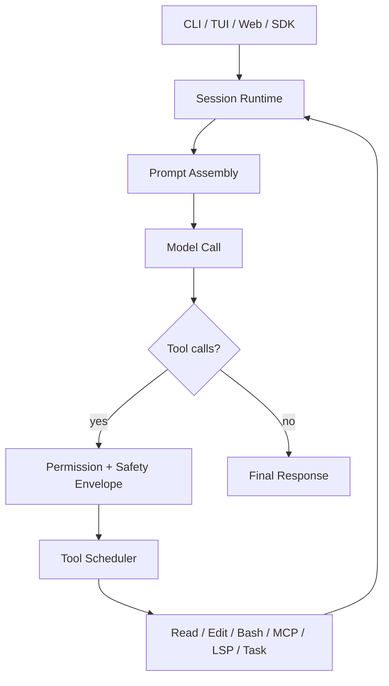
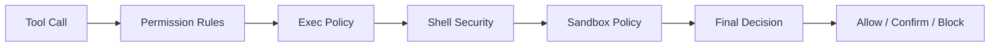
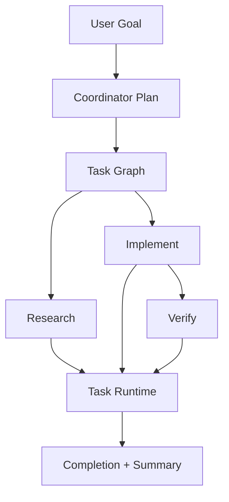
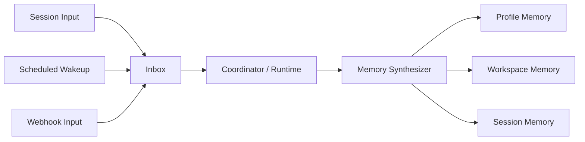

# OpenAGt Technical Architecture

## Summary

OpenAGt is a backend-first agentic coding runtime. The core design is session-centric: a request becomes a persistent runtime session, the model emits tool calls inside that session, and tool output feeds back into the same loop until the task reaches a terminal state.

The system is organized around five backend pillars:

- session runtime
- tool and permission system
- coordinator and task graph execution
- personal agent memory and inbox primitives
- server, SSE, and SDK integration

This document focuses on the current stable backend and release-facing architecture.

## System Overview

## Core Runtime

### Session Model

The session layer is the main execution boundary.

Responsibilities:

- store message history
- assemble prompt context
- inject memory
- resolve tools
- execute the model loop
- compact context when the conversation grows
- preserve run state across iterative calls

Primary implementation area:

- `packages/openagt/src/session`

Important subareas:

- `prompt.ts`
- `compaction.ts`
- `processor.ts`
- `task-runtime.ts`

### Prompt Assembly

Prompt assembly combines:

- system instructions
- agent instructions
- project and user config
- skills and plugins
- prior session messages
- session memory and summaries

The prompt layer is not a separate planner service. It is a continuation-oriented runtime that repeatedly executes model calls inside one session.

## Tooling and Permissions

### Tool Model

OpenAGt treats coding work as tool-mediated execution.

Built-in capabilities include:

- file read and search
- edit and patch operations
- shell execution
- MCP access
- LSP access
- task delegation
- TODO writing

Primary implementation area:

- `packages/openagt/src/tool`

### Safety Envelope

Tool calls pass through a safety model before execution.

Key concepts:

- permission decision: `allow`, `confirm`, `block`
- shell safety metadata: `shell_safety`
- policy source: permission rules and exec policy
- boundary state: sandbox, filesystem, and network constraints
- approval kind: why the user is being asked

Security-related implementation areas:

- `packages/openagt/src/permission`
- `packages/openagt/src/security`
- `packages/openagt/src/sandbox`

## Coordinator Runtime v1

Coordinator Runtime extends task delegation into a task graph model.

Task graph metadata includes:

- `depends_on`
- `write_scope`
- `read_scope`
- `acceptance_checks`
- `priority`
- `origin`

Scheduling rules:

- dependency graph must be acyclic
- `research` tasks may run in parallel
- `implement` tasks may run in parallel only when `write_scope` does not overlap
- read-only `verify` tasks may run in parallel with safe `implement` work

Primary implementation areas:

- `packages/openagt/src/coordinator`
- `packages/openagt/src/session/task-runtime.ts`
- `packages/openagt/src/tool/task*.ts`

## Personal Agent Core v1

Personal Agent Core adds longer-lived backend state beyond a single session.

The design has three memory scopes:

- profile memory
- workspace memory
- session memory

It also adds:

- inbox items
- scheduled wakeups
- normalized multi-entry ingestion
- memory synthesis from durable backend events

Retrieval model in the current backend:

- scope-aware lookup
- SQLite-backed persistence
- FTS5 for text retrieval
- ranking by scope, recency, and importance

Primary implementation areas:

- `packages/openagt/src/personal`
- `packages/openagt/src/coordinator`
- `packages/openagt/src/storage`

## Server and SDK

The same backend can be consumed through:

- CLI / TUI
- server routes
- SSE events
- generated JavaScript SDK

Stable backend-facing event families:

- `coordinator.*`
- `inbox.*`
- `scheduler.*`
- `memory.updated`

Primary implementation areas:

- `packages/openagt/src/server`
- `packages/sdk/js`

## Repository Map

| Path | Role |
| --- | --- |
| `packages/openagt` | Core runtime, tools, providers, CLI, server |
| `packages/app` | Web client |
| `packages/sdk/js` | Generated JavaScript SDK |
| `packages/openagt_flutter` | Flutter MVP |
| `packages/console/*` | Control-plane packages |
| `packages/web` | Docs/site package |

## Release Architecture

Stable release packaging currently targets:

- Windows MSI
- Windows portable zip
- macOS tarballs
- Linux tarball

Packaging and release behavior:

- `openagt` is the primary CLI identity
- `opencode` remains as a compatibility alias
- `SHA256SUMS.txt` is published with assets
- Windows signing is a separate release concern, not part of the runtime model itself

Windows signing details are documented separately in [C:\Users\Administrator\Desktop\OpenAG\docs\release\windows-signing.md](C:\Users\Administrator\Desktop\OpenAG\docs\release\windows-signing.md).

## Current Limitations

- naming transition is still incomplete in parts of the repo
- Flutter is not part of the stable release support matrix
- some compatibility paths still refer to historical `opencode` naming
- Windows release signing requires Azure Trusted Signing configuration and is not yet always present on shipped assets

## Reading Guide

If you are new to the codebase, start in this order:

1. `packages/openagt/src/index.ts`
2. `packages/openagt/src/session`
3. `packages/openagt/src/tool`
4. `packages/openagt/src/permission`
5. `packages/openagt/src/security`
6. `packages/openagt/src/coordinator`
7. `packages/openagt/src/personal`
