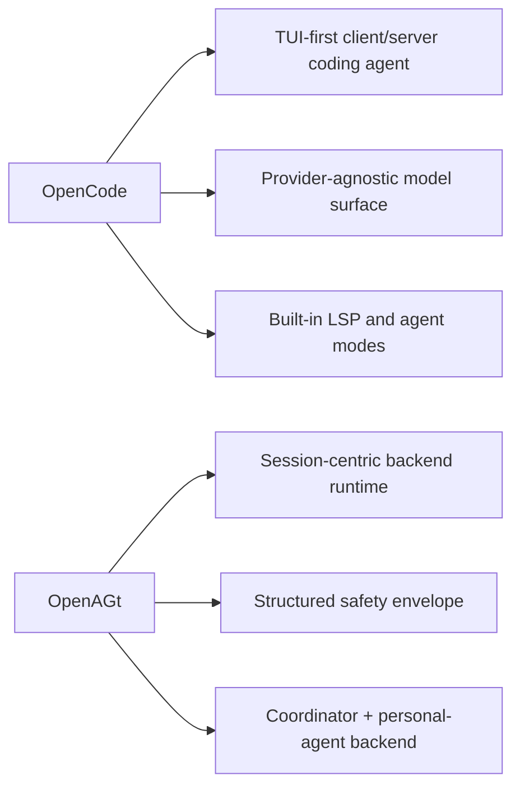
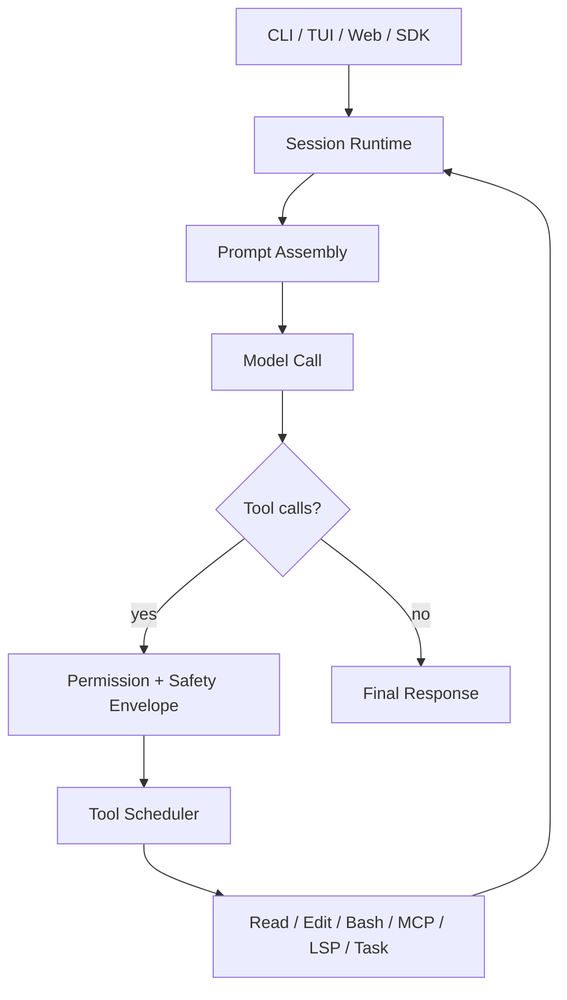
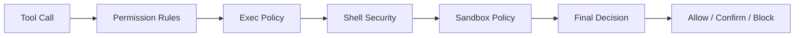
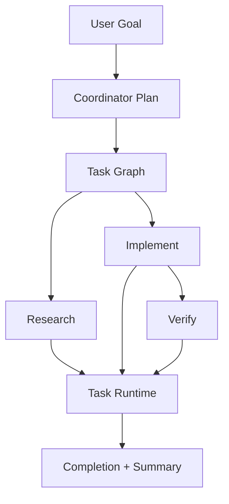
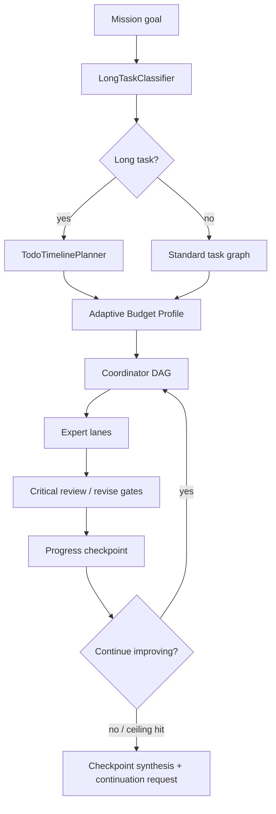
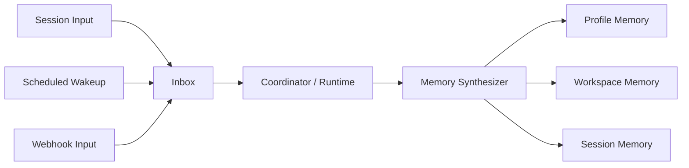
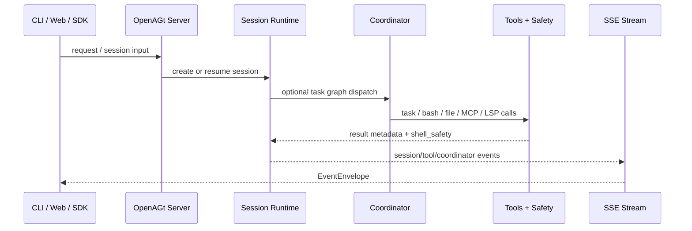

# OpenAGt Technical Architecture

## Summary

OpenAGt is a backend-first agentic coding runtime. The core design is session-centric: a request becomes a persistent runtime session, the model emits tool calls inside that session, and tool output feeds back into the same loop until the task reaches a terminal state.

The system is organized around five backend pillars:

- session runtime
- tool and permission system
- coordinator and task graph execution
- personal agent memory and inbox primitives
- server, SSE, and SDK integration

This document focuses on the current stable backend and release-facing architecture.

For v1.16, the stable backend surface is CLI/TUI, headless server, SSE event envelopes, and the generated JavaScript SDK. Flutter remains a future control panel over these backend contracts.

## OpenCode Comparison

The comparison below uses the public OpenCode repository and README as the source baseline, then compares that baseline with the current OpenAGt codebase.

| Topic                    | OpenCode                                                                          | OpenAGt                                                                                                              |
| ------------------------ | --------------------------------------------------------------------------------- | -------------------------------------------------------------------------------------------------------------------- |
| Architectural emphasis   | TUI-first coding agent with explicit client/server architecture                   | Backend-first runtime where CLI, TUI, server, and SDK are clients of the same session engine                         |
| Session model            | Interactive coding agent loop with built-in agent modes                           | Persistent session runtime with prompt assembly, compaction, memory, and tool scheduling in one loop                 |
| Tooling emphasis         | Official docs emphasize LSP, agent modes, provider choice, and terminal workflows | Local runtime emphasizes tool mediation across file I/O, shell, MCP, LSP, tasking, and safety metadata               |
| Safety / approvals       | Permission prompts are part of the user-facing agent flow                         | Safety is modeled as a first-class backend layer with approval kinds, policy sources, and boundary metadata          |
| Multi-step orchestration | Subagent support is part of the coding workflow                                   | Coordinator Runtime v1 turns work into task graphs with dependency checks, write scopes, verify stages, and dispatch |
| Long-running agent state | README emphasis is remote-driving and terminal workflows                          | Personal Agent Core adds durable profile/workspace/session memory, inbox items, scheduled wakeups, and synthesis     |
| Client surfaces          | TUI-first, client/server, desktop beta                                            | CLI/TUI, headless server, SSE, generated JS SDK, and deferred Flutter frontend                                       |

## System Overview

## Core Runtime

### Session Model

The session layer is the main execution boundary.

Responsibilities:

- store message history
- assemble prompt context
- inject memory
- resolve tools
- execute the model loop
- compact context when the conversation grows
- preserve run state across iterative calls

Primary implementation area:

- `packages/openagt/src/session`

Important subareas:

- `prompt.ts`
- `compaction.ts`
- `processor.ts`
- `task-runtime.ts`

### Prompt Assembly

Prompt assembly combines:

- system instructions
- agent instructions
- project and user config
- skills and plugins
- prior session messages
- session memory and summaries

The prompt layer is not a separate planner service. It is a continuation-oriented runtime that repeatedly executes model calls inside one session.

## Tooling and Permissions

### Tool Model

OpenAGt treats coding work as tool-mediated execution.

Built-in capabilities include:

- file read and search
- edit and patch operations
- shell execution
- MCP access
- LSP access
- task delegation
- TODO writing

Primary implementation area:

- `packages/openagt/src/tool`

### Safety Envelope

Tool calls pass through a safety model before execution.

Key concepts:

- permission decision: `allow`, `confirm`, `block`
- shell safety metadata: `shell_safety`
- policy source: permission rules and exec policy
- boundary state: sandbox, filesystem, and network constraints
- approval kind: why the user is being asked

Security-related implementation areas:

- `packages/openagt/src/permission`
- `packages/openagt/src/security`
- `packages/openagt/src/sandbox`

## Coordinator Runtime v1

Coordinator Runtime extends task delegation into a task graph model.

Task graph metadata includes:

- `depends_on`
- `write_scope`
- `read_scope`
- `acceptance_checks`
- `priority`
- `origin`

Scheduling rules:

- dependency graph must be acyclic
- `research` tasks may run in parallel
- `implement` tasks may run in parallel only when `write_scope` does not overlap
- read-only `verify` tasks may run in parallel with safe `implement` work

Primary implementation areas:

- `packages/openagt/src/coordinator`
- `packages/openagt/src/session/task-runtime.ts`
- `packages/openagt/src/tool/task*.ts`

## Dynamic Expert Runtime v1.2

Dynamic Expert Runtime extends Coordinator from a fixed task graph into an adaptive expert execution loop.

The model separates two concerns:

- `workflow`: chooses the specialized adapter, expert roles, allowed tools, verifier rules, and memory namespace.
- `effort`: chooses governance strength, review density, budget, checkpoint frequency, and continuation behavior.

Effort semantics:

| Effort   | Runtime behavior                                                                                            |
| -------- | ----------------------------------------------------------------------------------------------------------- |
| `low`    | Fast path with minimal review and no forced timeline                                                        |
| `medium` | Standard path with critical review of key conclusions and final output                                      |
| `high`   | Multi-round planning, multi-expert lanes, reducer/reviewer, and critical-path revise gates                  |
| `deep`   | Long-task mode with todo timeline, full artifact review, checkpoint synthesis, and larger adaptive ceilings |

Long-task runs add these projection fields for UI, SDK, and future Flutter clients:

- `long_task`
- `todo_timeline`
- `budget_profile`
- `budget_state`
- `progress_snapshot`
- `checkpoint_memory`
- `continuation_request`

Budgeting is split into layered ceilings:

- `mission_ceiling`: normal automatic work budget
- `phase_ceiling`: per-phase guardrail
- `todo_budget`: weighted budget per timeline item
- `checkpoint_reserve`: reserved budget for synthesis and user-facing status
- `absolute_ceiling`: non-bypassable hard ceiling

When a ceiling or checkpoint is reached, the runtime does not silently stop. It creates a checkpoint synthesis with completed, partial, blocked, and not-started work, then exposes a continuation request when more budget needs user approval.

Primary implementation areas:

- `packages/openagt/src/coordinator/schema.ts`
- `packages/openagt/src/coordinator/coordinator.ts`
- `packages/openagt/src/cli/cmd/mission.ts`
- `packages/openagt/src/cli/cmd/tui/feature-plugins/sidebar/mission.tsx`
- `packages/sdk/js/src/v2/runtime-helpers.ts`

## Personal Agent Core v1

Personal Agent Core adds longer-lived backend state beyond a single session.

The design has three memory scopes:

- profile memory
- workspace memory
- session memory

It also adds:

- inbox items
- scheduled wakeups
- normalized multi-entry ingestion
- memory synthesis from durable backend events

Retrieval model in the current backend:

- scope-aware lookup
- SQLite-backed persistence
- FTS5 for text retrieval
- ranking by scope, recency, and importance

Primary implementation areas:

- `packages/openagt/src/personal`
- `packages/openagt/src/coordinator`
- `packages/openagt/src/storage`

## Server and SDK

The same backend can be consumed through:

- CLI / TUI
- server routes
- SSE events
- generated JavaScript SDK

Stable backend-facing event families:

- `coordinator.*`
- `inbox.*`
- `scheduler.*`
- `memory.updated`

SSE events use a stable envelope:

- `schema_version`
- `event_id`
- `trace_id`
- `timestamp`
- `type`
- `properties`

SDK helpers expose stable runtime metadata:

- `getShellSafety(metadata)`
- `getCoordinatorProjection(eventOrResponse)`
- `getInboxOverview(response)`

Primary implementation areas:

- `packages/openagt/src/server`
- `packages/sdk/js`

## Verification Matrix

| Capability                                                                                  | Status                                                                                |
| ------------------------------------------------------------------------------------------- | ------------------------------------------------------------------------------------- |
| Session runtime and tool loop                                                               | stable in v1.16                                                                       |
| Approval and Safety Envelope with `shell_safety.version`                                    | stable in v1.16                                                                       |
| Windows signed-GA release policy                                                            | stable in v1.16 when signing secrets are configured                                   |
| Packaged binary smoke tests                                                                 | stable in v1.16                                                                       |
| `openagt debug doctor` and `debug bundle`                                                   | stable in v1.16                                                                       |
| Coordinator Runtime projection and dispatch                                                 | stable in v1.16 for graph projection, duplicate-id rejection, retry, and cancellation |
| Dynamic Expert Runtime `effort`, long-task timeline, adaptive budget, checkpoint projection | implemented for v1.2 backend contracts                                                |
| Personal Agent inbox and memory primitives                                                  | implemented; backend contracts stabilized in v1.16                                    |
| SSE EventEnvelope                                                                           | stable in v1.16                                                                       |
| JavaScript SDK runtime helpers                                                              | stable in v1.16; extended for Dynamic Expert Runtime projection                       |
| Flutter control panel                                                                       | roadmap; backend contracts only in v1.16                                              |

## Repository Map

| Path                       | Role                                        |
| -------------------------- | ------------------------------------------- |
| `packages/openagt`         | Core runtime, tools, providers, CLI, server |
| `packages/app`             | Web client                                  |
| `packages/sdk/js`          | Generated JavaScript SDK                    |
| `packages/openagt_flutter` | Flutter MVP                                 |
| `packages/console/*`       | Control-plane packages                      |

## Release Architecture

Stable release packaging currently targets:

- Windows MSI
- Windows portable zip
- macOS tarballs
- Linux tarball

Packaging and release behavior:

- `openagt` is the primary CLI identity
- `opencode` remains as a compatibility alias
- `SHA256SUMS.txt` is published with assets
- Windows signing is a separate release concern, not part of the runtime model itself

Windows signing details are documented separately in [Windows Signing](../release/windows-signing.md).

## Current Limitations

- naming transition is still incomplete in parts of the repo
- Flutter is not part of the stable release support matrix
- some compatibility paths still refer to historical `opencode` naming
- Windows release signing requires Azure Trusted Signing configuration and is not yet always present on shipped assets

## Reading Guide

If you are new to the codebase, start in this order:

1. `packages/openagt/src/index.ts`
2. `packages/openagt/src/session`
3. `packages/openagt/src/tool`
4. `packages/openagt/src/permission`
5. `packages/openagt/src/security`
6. `packages/openagt/src/coordinator`
7. `packages/openagt/src/personal`
