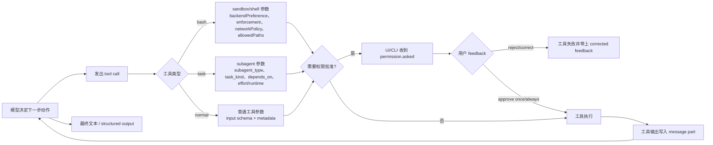

# OpenAGt 用户输入到执行再到输出/反馈流程图

本文档展示用户从输入 `input`，到 OpenAGt 执行，再到拿到 `output` / `feedback` 的完整路径。流程基于当前 `packages/openagt` 实现整理，并把 `effort`、`feedback`、`subagent`、`sandbox` 等运行参数显式放进端到端主流程。

## 端到端主流程

```mermaid
flowchart TD
  user(["用户"])

  subgraph entry["输入入口"]
    tui["TUI 输入框\nPrompt component"]
    run["CLI 一次性运行\nopenagt run"]
    api["HTTP / SDK 客户端\nsession.prompt / command / shell"]
  end

  subgraph client["客户端准备"]
    normalize["整理输入\n文本、文件、图片/PDF、shell 模式、斜杠命令"]
    inputParams["Input payload 参数\nmessage/parts/files/command/system/format/tools"]
    modelAgent["解析当前 agent、model、variant"]
    effortParams["Effort / variant 参数\nlow/medium/high、provider variant、reasoning budget"]
    runtimeParams["Runtime 参数\nstepBudget、timeoutMs、maxParallelSubagents"]
    sessionPick{"是否已有 session?"}
    createSession["创建 session\n写入初始 permission rules"]
    reuseSession["继续 / fork / 指定 session"]
    subscribe["订阅事件流\n/event SSE"]
  end

  subgraph server["服务端路由"]
    routes["SessionRoutes\n/prompt, /prompt_async, /command, /shell, /abort"]
    routeParams["Route 参数\nsessionID、messageID、agent、model、variant、runtime"]
    service["SessionPrompt.Service"]
  end

  subgraph prompt["Prompt 接收与入库"]
    cleanup["清理 revert 状态"]
    userMsg["创建 user message\n解析 parts、附件、资源、agent/model"]
    persistUser["持久化用户消息和 parts\nSyncEvent message.updated / part.updated"]
    updatePerms{"本次输入是否覆盖工具权限?"}
    setPerms["合并 / 设置 session permission rules"]
    noReply{"noReply?"}
  end

  subgraph loop["执行循环"]
    runState["确保同一 session 只有一个活跃 run\nSessionRunState"]
    statusBusy["设置 session.status = busy"]
    history["读取压缩后的消息历史"]
    exitCheck{"是否已经完成?"}
    tasks{"是否有 subtask 或 compaction?"}
    subtask["运行 subtask / child session"]
    compact["执行 compaction / prune history"]
    activeModel["解析 provider model\n准备 fallback state"]
    loopBudget["应用执行预算\nmax steps、prompt timeout、effort-derived runtime"]
    assistantMsg["创建 assistant message\n记录 cost/tokens/path/variant 元数据"]
    processor["SessionProcessor.create\n准备 snapshot 与 stream 状态"]
  end

  subgraph llm["LLM 请求"]
    tools["解析本地工具 + MCP 工具\nschema transform + tool scheduler"]
    toolSchedule["工具调度参数\nsafe parallelism、path overlap、maxParallelSubagents"]
    system["构建 system context\nagent prompt、环境、skills、memory、instructions"]
    transform["插件 hooks\nsystem/messages/params/headers"]
    stream["LLM.stream -> ai streamText\n发起 provider 请求"]
  end

  subgraph events["流式事件处理"]
    streamEvents{"stream event 类型"}
    text["文本 / reasoning delta\n更新 part 并发布增量"]
    step["step start/finish\nusage、cost、snapshot、patch"]
    toolCall["tool call\n创建 pending/running tool part"]
    toolResult["tool result/error\n完成或失败 tool part"]
    providerError["provider/session error\n发布 session.error"]
  end

  subgraph toolExec["工具执行路径"]
    toolSelect{"工具类型"}
    readWrite["Read/Edit/Write/Glob/Grep/Web 等\n执行具体工具实现"]

    taskTool["Task / Subagent tool"]
    subagentParams["Subagent 参数\nsubagent_type、task_id、group_id、depends_on、task_kind、write_scope、priority、metadata"]
    subagentRuntime["Subagent runtime\nstepBudget、timeoutMs、effort、maxParallelSubagents、read-only/write tools"]
    taskRuntime["TaskRuntime\nrecord/status/dependencies/result/partial"]
    childSession["创建或恢复 child session\nparentSessionID -> subagent session"]

    bash["Bash tool"]
    bashParams["Shell 参数\ncommand、description、workdir/cwd、timeout、shell family"]
    bashSafety["解析命令 + shell security + exec policy\nrisk_level、decision、matchedRules"]
    sandboxPolicy["解析 sandbox policy\nbackend、filesystem、network"]
    sandboxParams["Sandbox 执行参数\nbackendPreference、enforcement、filesystemPolicy、allowedPaths、writablePaths、networkPolicy、reportOnly、failurePolicy、riskLevel、env_policy=sanitize"]
    hardBlock{"决策为 block?"}
    blocked["返回 blocked command result"]
    needsApproval{"是否需要用户批准?"}
    askPerm["Permission.ask\n发布 permission.asked"]
    feedbackReply{"用户 feedback / permission reply"}
    reject["reject / corrected feedback\n工具调用失败"]
    approve["approve once / always\n继续执行"]
    shellRunner["ShellRunner.run\n持续更新 metadata/output preview"]
    broker["SandboxBroker.exec\nbroker process / backend"]
    outputBuf["捕获 stdout/stderr\n截断或写入 full-output path"]
  end

  subgraph feedback["输出 / 反馈表面"]
    bus["Bus + SyncEvent"]
    sse["EventRoutes /event SSE"]
    feedbackParams["Feedback 参数\npermission: once/always/reject、corrected message、question answer、abort"]
    tuiRender["TUI 渲染 transcript、工具状态、\npermission prompt、question、status"]
    runRender["openagt run 渲染文本、工具摘要、\nJSON events、错误"]
    apiReturn["HTTP / SDK 返回创建的 message\n并可继续查询 session/messages"]
    idle["session.status = idle\n最终 assistant message 可读取"]
    abort["中断路径\nsession.abort -> cancel active run/tools"]
  end

  user --> tui
  user --> run
  user --> api

  tui --> normalize
  run --> normalize
  api --> routes
  normalize --> inputParams
  inputParams --> modelAgent
  modelAgent --> effortParams
  effortParams --> runtimeParams
  runtimeParams --> sessionPick
  sessionPick -- 否 --> createSession
  sessionPick -- 是 --> reuseSession
  createSession --> subscribe
  reuseSession --> subscribe
  subscribe --> routes

  routes --> routeParams
  routeParams --> service
  service --> cleanup
  cleanup --> userMsg
  inputParams --> userMsg
  effortParams --> userMsg
  runtimeParams --> userMsg
  userMsg --> persistUser
  persistUser --> updatePerms
  updatePerms -- 是 --> setPerms
  updatePerms -- 否 --> noReply
  setPerms --> noReply
  noReply -- 是 --> apiReturn
  noReply -- 否 --> runState

  runState --> statusBusy
  statusBusy --> history
  history --> exitCheck
  exitCheck -- 是 --> idle
  exitCheck -- 否 --> tasks
  tasks -- subtask --> subtask --> childSession --> runState
  tasks -- compaction --> compact --> history
  tasks -- 无 --> activeModel
  activeModel --> loopBudget
  loopBudget --> assistantMsg
  assistantMsg --> processor
  processor --> tools
  tools --> toolSchedule
  runtimeParams --> toolSchedule
  toolSchedule --> system
  system --> transform
  transform --> stream
  stream --> streamEvents

  streamEvents -- text/reasoning --> text --> bus
  streamEvents -- step --> step --> bus
  streamEvents -- tool-call --> toolCall --> toolSelect
  streamEvents -- tool-result/tool-error --> toolResult --> bus
  streamEvents -- error --> providerError --> bus

  toolSelect -- 普通工具 --> readWrite --> toolResult
  toolSelect -- task/subagent --> taskTool
  taskTool --> subagentParams
  subagentParams --> subagentRuntime
  subagentRuntime --> taskRuntime
  taskRuntime --> childSession
  childSession --> toolResult

  toolSelect -- bash --> bash
  bash --> bashParams
  bashParams --> bashSafety
  bashSafety --> sandboxPolicy
  sandboxPolicy --> sandboxParams
  sandboxParams --> hardBlock
  hardBlock -- 是 --> blocked --> toolResult
  hardBlock -- 否 --> needsApproval
  needsApproval -- 是 --> askPerm --> bus
  askPerm --> feedbackReply
  feedbackReply -- reject/correct --> reject --> toolResult
  feedbackReply -- approve --> approve --> shellRunner
  needsApproval -- 否 --> shellRunner
  sandboxParams --> shellRunner
  shellRunner --> broker
  broker --> outputBuf
  outputBuf --> toolResult

  persistUser --> bus
  bus --> sse
  sse --> feedbackParams
  feedbackParams --> tuiRender
  feedbackParams --> runRender
  sse --> tuiRender
  sse --> runRender
  routes --> apiReturn
  streamEvents -- finish --> idle
  idle --> bus
  user --> abort --> routes
  routes --> abort
  abort --> feedbackParams
```

## 核心反馈循环

## 关键参数点

| 参数区域 | 典型字段 | 进入流程的位置 | 影响 |
| --- | --- | --- | --- |
| Input payload | `message`、`parts`、`files`、`command`、`system`、`format`、`tools` | 客户端整理后进入 `SessionRoutes` / `SessionPrompt` | 决定用户消息内容、附件、结构化输出和工具启用/禁用。 |
| Effort / variant | `effort`、`variant`、provider model variant | TUI prompt 本地选择，提交时写入 `variant` | 影响模型 reasoning/预算配置，也会透传到 user/assistant message。 |
| Runtime budget | `stepBudget`、`timeoutMs`、`maxParallelSubagents` | `PromptInput.runtime` 或 subagent runtime metadata | 控制 run loop 最大步数、超时和 subagent 并行度。 |
| Feedback | `once`、`always`、`reject`、corrected message、question answer、abort | `Permission.reply`、question prompt、`session.abort` | 决定继续执行、永久授权、拒绝并把修正反馈写回模型上下文，或取消当前 run。 |
| Subagent | `subagent_type`、`task_id`、`group_id`、`depends_on`、`task_kind`、`write_scope`、`priority`、`metadata` | `task` tool / `SubtaskPart` / `TaskRuntime` | 创建或恢复 child session，记录任务依赖、范围、状态、partial/full result。 |
| Sandbox | `backendPreference`、`enforcement`、`filesystemPolicy`、`allowedPaths`、`writablePaths`、`networkPolicy`、`reportOnly`、`failurePolicy`、`riskLevel` | Bash tool -> `SandboxPolicy` -> `ShellRunner` -> `SandboxBroker` | 决定命令是否 block、是否 ask、使用哪个 backend、文件/网络边界和失败降级策略。 |

## 源码对应关系

| 流程区域 | 主要源码 |
| --- | --- |
| CLI 启动与命令分发 | `packages/openagt/src/index.ts` |
| `openagt run` 输入、事件订阅、输出渲染 | `packages/openagt/src/cli/cmd/run.ts` |
| TUI session 页面与 prompt 挂载 | `packages/openagt/src/cli/cmd/tui/routes/session/index.tsx` |
| TUI prompt 提交、effort、附件、shell mode、中断 | `packages/openagt/src/cli/cmd/tui/component/prompt/index.tsx` |
| HTTP session routes | `packages/openagt/src/server/routes/instance/session.ts` |
| SSE event route | `packages/openagt/src/server/routes/instance/event.ts` |
| Prompt 入库、runtime 参数与 run loop | `packages/openagt/src/session/prompt.ts` |
| LLM 请求组装与 provider streaming | `packages/openagt/src/session/llm.ts` |
| stream event 持久化与 tool state | `packages/openagt/src/session/processor.ts` |
| session/message/part 事件发布 | `packages/openagt/src/session/session.ts` |
| Permission ask/reply 与 corrected feedback | `packages/openagt/src/permission/index.ts` |
| Task/subagent 参数与 child session | `packages/openagt/src/tool/task.ts` |
| Task record、依赖、状态与结果 | `packages/openagt/src/session/task-runtime.ts` |
| Bash 风险分析与 policy gate | `packages/openagt/src/tool/bash.ts` |
| Shell 执行与 sandbox/output metadata | `packages/openagt/src/shell/runner.ts` |
| Sandbox broker 执行边界 | `packages/openagt/src/sandbox/broker.ts` |
